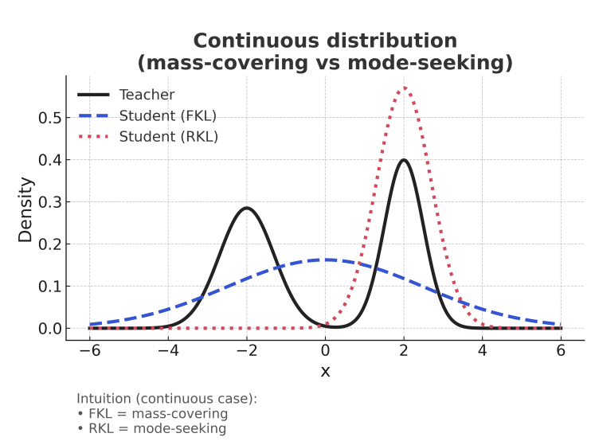

# 从知识蒸馏到 On-Policy Distillation：OPD 原理、目标函数与现代技术路线

> 本文首先讨论算法原理，不从某个框架的配置或代码路径出发。最后一部分才把这些原理映射到 verl、ms-swift、Miles、slime、NeMo-RL 和 KDFlow 中常见的实现选择。
>
> 写作时间：2026-08-14。OPD 仍在快速发展，文中会明确区分已经较成熟的主干方法和 2026 年仍偏研究前沿的变体。

建议分三遍读，不要第一次就从头硬啃到尾：

1. **第一遍只读第 1 节**：不推公式，只弄懂为什么从 KD 走到 OPD；
2. **第二遍读第 2～8 节**：把直觉逐步换成正式定义和主要 loss；
3. **第三遍再读第 9 节以后**：研究异步误差、多 teacher、框架实现和前沿变体。

全文的压缩地图和核心结论放在最后。第一次阅读时不必先背结论，只需要跟着第 1 节的例子往下走。

## 1. 从最简单的知识蒸馏开始

这一节只做一件事：建立直觉。

第一次读时，不需要提前理解 KL、policy gradient、importance sampling 或 state distribution。它们会在后文逐一出现。现在只需要知道：

```text
teacher：能力更强、但推理昂贵的模型
student：我们真正想训练和部署的模型
```

### 1.1 第一步：为什么要有知识蒸馏

假设我们有一个很强的 72B teacher，但线上只能部署一个 7B student。我们希望 7B 模型尽可能学会 72B 模型的行为。

最直接的做法是：

```text
准备问题和标准答案
    -> 让 student 学这些答案
```

这就是普通监督学习/SFT 的基本思路。

例如问题是：

```text
2 + 3 等于多少？
```

训练数据给出的下一个 token 是 `5`。student 做错时，我们只告诉它：

```text
正确答案是 5。
```

这相当于一位老师批改选择题时，只在正确选项上打勾。它能训练模型，但没有利用强 teacher 对其他选项的判断。

### 1.2 第二步：teacher 知道的不只是一个正确 token

面对同一个前缀，teacher 内部不是只保存一个答案，而是会对整个词表给出概率。例如为了便于说明，假设候选只有四个：

| 下一个 token | teacher 概率 |
| --- | ---: |
| `5` | 0.80 |
| `五` | 0.15 |
| `4` | 0.04 |
| `不知道` | 0.01 |

这张概率表比“正确答案是 `5`”多告诉了我们很多东西：

- `5` 是 teacher 最认可的表达；
- `五` 也基本正确，只是格式不如 `5` 合适；
- `4` 是数学错误；
- `不知道` 与当前任务更加不匹配。

如果 student 当前给出的概率是：

| 下一个 token | student 概率 |
| --- | ---: |
| `5` | 0.30 |
| `五` | 0.05 |
| `4` | 0.55 |
| `不知道` | 0.10 |

那么 teacher 可以给 student 一个比 hard label 更细致的学习目标：

```text
大幅降低 4
提高 5
适当提高 五
也降低 不知道
```

**让 student 拟合 teacher 的概率分布，而不只是拟合一个答案，这就是知识蒸馏最核心的想法。**

teacher 的概率分布常被称为 soft target。一个标准答案则可以看成只有正确 token 概率为 1、其他 token 都为 0 的 hard target。

### 1.3 第三步：语言模型的蒸馏不是只做一次选择

语言模型生成一段话时，不是一次性把整段 response 吐出来，而是不断重复：

```text
读取 prompt + 已有前缀
    -> 预测下一个 token
    -> 把选中的 token 接到前缀后面
    -> 再预测下一个 token
```

例如：

```text
问题：23 × 17 等于多少？

位置 1 前缀：问题本身
位置 2 前缀：问题 + “我们”
位置 3 前缀：问题 + “我们可以”
位置 4 前缀：问题 + “我们可以计算”
...
```

每一个不同前缀，都是一个新的 next-token 问题。于是 LLM 知识蒸馏可以理解为：

```text
在一条 response 的每一个位置，
都让 student 的 next-token 分布接近 teacher。
```

这比只检查最终答案稠密得多。一条 1000-token 的推理轨迹，理论上可以产生约 1000 个位置的 teacher 监督。

### 1.4 第四步：最容易实现的 KD——先让 teacher 写完整轨迹

一个自然方案是先把 prompt 交给 teacher，让 teacher 像正常推理一样逐 token 生成完整回答：

```text
prompt：23 × 17 等于多少？

teacher response：
23 × 17
= 23 × (10 + 7)
= 230 + 161
= 391
```

这条完整 response 就叫作一条 **teacher trace** 或 teacher trajectory。严格来说，trace 首先指 teacher 实际选择出来的 token 序列；它本身并不自动包含完整词表概率。teacher 分布是可以在这条 trace 上额外取得的监督信息。

#### 第一步：把一条完整轨迹拆成很多 next-token 训练位置

假设 teacher response 的 token 是：

```text
y₁, y₂, y₃, ..., y_T
```

它可以展开为 `T` 个训练样本：

| 位置 | student 看到的输入 | 当前位置的 hard target |
| --- | --- | --- |
| 1 | `prompt` | `y₁` |
| 2 | `prompt + y₁` | `y₂` |
| 3 | `prompt + y₁ + y₂` | `y₃` |
| ... | ... | ... |
| T | `prompt + y₁ + ... + y_{T-1}` | `y_T` |

因此，一条长度为 `T` 的 teacher trace 不是只产生一个最终答案标签，而是产生大约 `T` 个 next-token 监督位置。

训练时通常不需要真的把它们拆成 `T` 条独立数据。把 `prompt + 完整 teacher response` 一次送进 causal LM，通过 teacher forcing，就可以并行计算所有位置的 next-token loss。

这里的 teacher forcing 是指：预测第 `t` 个 token 时，无论 student 自己本来会生成什么，都把 teacher 已经生成的 `y₁...y_{t-1}` 作为前缀喂给 student。

#### 第二步：决定每个位置向 student 提供多少 teacher 信息

有了 teacher trace 后，至少有三种训练方式。

**方式 A：只使用 teacher 实际生成的 token。**

在第 `t` 个位置，只告诉 student：

```text
teacher 最后选择了 y_t，请提高 y_t 的概率。
```

这与普通 SFT 使用相同的 token cross-entropy loss。区别只在数据来源：普通 SFT 的答案可能来自人工标注或原始数据集，这里的答案由 teacher 合成。这种做法经常叫作 sequence-level KD、hard distillation 或 teacher-generated SFT。

**方式 B：使用 teacher 在每个位置的 soft distribution。**

除了告诉 student teacher 最后选了什么，还在每个 teacher 前缀上取得 teacher 对候选 token 的概率。例如：

| 候选 token | teacher 概率 |
| --- | ---: |
| `391` | 0.86 |
| `答案是391` | 0.08 |
| `390` | 0.04 |
| 其他 token | 0.02 |

student 在完全相同的前缀上计算自己的概率分布，然后通过 KD loss 让自己的分布接近 teacher。teacher 可以提供 full-vocab 分布，也可以只提供 top-k 等压缩后的分布。

**方式 C：hard target 与 soft target 一起使用。**

实际训练也可以同时使用两种信号：

```text
一部分 loss：提高 teacher 实际生成 token 的概率
另一部分 loss：拟合 teacher 对各个 token 的相对概率
```

因此，“teacher-trace distillation”不必然代表某一个固定 loss。它可能只使用 teacher 生成文本做普通 token CE，也可能使用 soft KD loss，还可能把二者组合起来。

#### 第三步：teacher 分布不一定要在生成时全部保存

获得 soft distribution 有两种常见做法：

```text
做法 1：teacher 自回归生成时，顺便保存每一步的 logits/logprobs

做法 2：先只保存完整 teacher response
        再把 prompt + response 送回 teacher
        用一次 teacher-forcing forward 得到所有位置的 logits
```

第二种方式很常见，因为完整词表 logits 的体积远大于文本，没必要在生成服务中长期保存。具体系统也可能只保存 top-k logprobs，以减少存储和传输成本。

把三种情况放在一起，就很清楚了：

| 训练方式 | 轨迹/答案来源 | 每个位置的监督 | loss |
| --- | --- | --- | --- |
| 普通 SFT | 人工标注或已有数据 | 一个目标 token | token CE |
| teacher-generated SFT / hard SeqKD | teacher trace | teacher 选中的 token | token CE |
| soft teacher-trace KD | teacher trace | teacher 的 full/top-k 分布 | KD loss |
| hybrid teacher-trace KD | teacher trace | 目标 token + teacher 分布 | CE + KD loss |

这一节最需要记住的是：

> teacher 先生成完整轨迹；这条轨迹决定每一步使用什么前缀。之后既可以只学习 teacher 真正选中的 token，也可以在相同前缀上进一步学习 teacher 的 soft distribution。

### 1.5 第五步：问题出在 student 推理时不会永远走 teacher 的路

训练时，student 一直看到 teacher 写出的正确前缀。但真正推理时，前面的 token 是 student 自己生成的。

假设 student 生成了：

```text
23 × 17
= 23 × (10 + 7)
= 230 + 151
```

它把 `23 × 7` 错算成了 `151`。

接下来 student 必须在这个错误前缀上继续生成：

```text
“23 × 17 = 23 × (10 + 7) = 230 + 151” 之后应该写什么？
```

但 teacher 预生成的正确训练数据里从来没有这个前缀。训练数据只教过：

```text
“... = 230 + 161” 之后怎么写。
```

这就是自回归模型中的核心困难：

```text
训练时看到的是 teacher/标准答案走到的地方；
推理时到达的是 student 自己走到的地方。
```

早期一个小错误会让后面所有前缀都偏离训练数据。后文会把这种问题正式称为 exposure bias 或 state-distribution mismatch。

### 1.6 第六步：有 full logits 也没有自动解决这个问题

你可能会想：如果 teacher 在正确 response 的每个位置都提供完整词表概率，不是已经给了很丰富的监督吗？

确实很丰富，但它只回答了这些问题：

```text
在正确前缀 A 上，teacher 怎么预测？
在正确前缀 B 上，teacher 怎么预测？
在正确前缀 C 上，teacher 怎么预测？
```

它仍然没有回答：

```text
在 student 实际产生的错误前缀 X 上，teacher 会怎么办？
```

所以这里有两个完全不同的“信息是否充分”：

1. **一个前缀上看多少 token 信息**：只看正确 token、看 top-k，还是看 full vocab；
2. **训练覆盖哪些前缀**：teacher 的前缀，还是 student 真正会访问的前缀。

full logits 主要改善第一个问题；它不会自动覆盖 student 从未在训练中出现的错误前缀。

### 1.7 第七步：让 student 先生成，再请 teacher 到现场指导

解决思路其实很自然：不要永远让 teacher 先写标准答案，而是让 student 先自己生成。

```text
第 1 步：student 对训练 prompt 生成 response
第 2 步：收集 student 实际经过的每一个前缀
第 3 步：让 teacher 在这些 student 前缀上给 next-token 意见
第 4 步：student 根据 teacher 意见更新
第 5 步：用更新后的 student 重新生成，再重复
```

回到刚才的错误前缀：

```text
23 × 17 = 23 × (10 + 7) = 230 + 151
```

OPD 不会假装这个错误没有发生。它会把这个真实 student 前缀交给 teacher，然后问：

```text
“如果你已经看到了这个前缀，下一步你会如何分配概率？”
```

teacher 可能提高“这里算错了”“应为 161”“重新计算”等恢复动作的概率，降低继续把错误结果当正确答案的概率。

这就是 On-Policy Distillation 最核心的直觉：

> student 负责决定训练会访问哪些前缀，teacher 负责在这些前缀上提供下一步监督。

“On-policy”最先描述的是**数据从哪里来**，不是某个固定 loss，也不意味着一定要使用 RL。

### 1.8 第八步：teacher 的意见可以有三种详细程度

student rollout 已经解决了“在哪些前缀上学习”。到了每个 student 前缀，还要决定向 teacher 索取多少信息。

#### 方式 A：teacher 给完整概率表

```text
teacher 给整个 vocab 的概率
student 也算整个 vocab 的概率
直接让两个分布靠近
```

优点是信息最丰富：teacher 不仅能说 student 选中的 token 不好，还能明确指出哪些其他 token 更好。缺点是大词表、长 response 下显存和传输成本很高。

#### 方式 B：teacher 只评价 student 实际采样的 token

假设 student 在某个位置真的采样了 token `4`：

```text
student 对 4 的概率：0.55
teacher 对 4 的概率：0.04
```

看到这个差距，我们就知道 student 过度偏爱 `4`，应降低它的概率。

工程里通常保存的是 logprob，也就是概率的自然对数 `log(p)`。所以后文看到 `student_logp-teacher_logp` 时，本质上仍是在比较双方对同一个 token 的认可程度，并没有突然换成另一种信息。

这种做法每个位置只需要 teacher 返回一个 logprob，非常便宜，也容易接入 PPO/GRPO 训练。但它在这一个样本上没有直接告诉 student：释放出来的概率究竟应该给 `5` 还是 `五`。

#### 方式 C：teacher 评价多个候选 token

可以让 student 或 teacher 每个位置先选出 `k` 个高概率候选，再比较这些候选的概率。这就是 top-k 路线，成本和信息量介于前两者之间。

到这里先记住：

| teacher 每个位置返回什么 | 信息量 | 成本 |
| --- | --- | --- |
| sampled token 的一个 logprob | 最少 | 最低 |
| k 个候选的 logprobs | 中等 | 中等 |
| full-vocab distribution | 最完整 | 最高 |

### 1.9 第九步：teacher 信号怎样用于训练，也有两条路

即使拿到了 teacher 概率，仍有两种不同用法。

#### 直接当作分布学习目标

teacher 给出多个 token 的目标概率，student 直接通过普通反向传播拟合这张概率表。后文会把这种主干路线叫作 direct distribution distillation 或 GKD-style OPD。

#### 把 teacher 的评价当作 token advantage

如果 teacher 只评价 student 已采样 token，可以把“teacher 比 student 更认可还是更不认可”变成这个 token 的正负学习信号，再通过 policy-gradient/PPO 类 loss 更新。后文会把它叫作 sampled-token PG-OPD。

这两条路线都可以是 OPD，因为它们都在 student 自己生成的前缀上学习。区别只在 teacher 信息怎样进入梯度。

### 1.10 第十步：OPD 与 RL 的区别和联系

RLVR 通常是：

```text
student 自己生成整条 response
    -> verifier 检查最终答案
    -> 整条 response 得到 0/1 或一个总分
```

它的优点是直接优化正确率等真实目标；缺点是信号比较稀疏。答案错了，并没有直接指出哪一步错了。

OPD 通常是：

```text
student 自己生成整条 response
    -> teacher 在每个 token 位置给意见
    -> 得到稠密的逐 token 信号
```

teacher 信号更稠密，但 teacher 不等于真理：它可能犯错，也可能只是在模仿自己的行为。

因此二者可以组合：

```text
任务 reward：告诉 student 最后有没有真正解决问题
teacher OPD：告诉 student 每个局部位置应该更像什么行为
```

### 1.11 第一章小结：只记住这条演化路线

```text
SFT / hard-label imitation
  只学习一个目标 token
          |
          v
普通 KD / soft-label distillation
  学 teacher 在一个前缀上的概率分布
          |
          v
off-policy / teacher-trace distillation
  在 teacher 或固定数据提供的前缀上学习
  问题：student 推理会进入自己的前缀
          |
          v
On-Policy Distillation
  student 自己 rollout
  teacher 在 student 实际访问的前缀上指导
          |
          +--> full/top-k distribution 直接反传：GKD-style OPD
          |
          +--> sampled-token logprob 作为 advantage：PG-OPD
          |
          +--> 再叠加 task reward：OPD + RL
```

如果这条路线已经清楚，后面的术语和公式只是把这幅图说得更精确。

---

## 2. 第二遍：用公式重新理解知识蒸馏

第 1 节已经建立了 KD 的直觉。本节只是把同一件事写成严格公式。第一次阅读如果觉得 2.2 的温度或 2.3 的 sequence KL 太抽象，可以先只读 2.1，然后直接进入第 3～6 节；等理解 OPD 后再回来读 2.2 和 2.3。

这一节暂时只需要三个记号：

- `s_t`：生成第 `t` 个 token 前已经看到的内容，也就是 `prompt + response 前缀`；
- `π_θ(v|s_t)`：student 在前缀 `s_t` 上给 token `v` 的概率；
- `ν(v|s_t)`：teacher 在同一个前缀上给 token `v` 的概率。

其他符号遇到时再解释，不需要先背。

### 2.1 SFT 是 one-hot teacher 的特殊蒸馏

对标注 token `y_t^*`，SFT 的交叉熵是：

$$
\mathcal L_{\mathrm{SFT},t}
=-\log \pi_\theta(y_t^*|s_t).
$$

令 one-hot 分布 `δ_{y_t^*}` 在正确 token 上概率为 1，则：

$$
\mathcal L_{\mathrm{SFT},t}
=
\mathrm{KL}\left(\delta_{y_t^*}\Vert\pi_\theta(\cdot|s_t)\right).
$$

普通 logit KD 把 one-hot target 换成 teacher 的软分布：

$$
\mathcal L_{\mathrm{KD},t}
=
\mathrm{KL}\left(\nu(\cdot|s_t)\Vert\pi_\theta(\cdot|s_t)\right).
$$

去掉对 student 梯度无关的 teacher entropy 后，它等价于 soft-label cross entropy：

$$
\mathcal L_{\mathrm{KD},t}
\equiv
-\sum_{v\in V}\nu(v|s_t)\log\pi_\theta(v|s_t).
$$

soft target 比 one-hot 多提供了两类信息：

- teacher 认为哪些替代 token 也合理；
- 不同错误 token 的相对严重程度。

例如 teacher 对 `A/B/C` 给出 `[0.70,0.20,0.10]`，hard label 只保留 `A`；soft target 还告诉 student：`B` 比 `C` 更接近 teacher 的行为。

### 2.2 温度是什么，为什么 OPD 中经常固定为 1

经典 KD 会用温度 `τ` 软化分布：

$$
p_\tau(v|s)=\frac{\exp(z_v/\tau)}{\sum_u\exp(z_u/\tau)}.
$$

- `τ>1`：分布更平，暴露更多暗知识；
- `τ<1`：分布更尖，更接近 argmax imitation；
- 经典分类 KD 常在 loss 前乘 `τ^2`，补偿 softmax 梯度随温度缩小的量级。

LLM OPD 中要区分三个不同“温度”：

1. **student rollout temperature**：决定 behavior policy `μ` 怎样采样；
2. **student training distribution temperature**：决定 loss 中的 `π_θ`；
3. **teacher scoring temperature**：决定 target `ν`。

它们不必相同，但改变任一个都会改变数学目标。多数实现让 teacher scoring 与 student training logprob 都使用原始 `temperature=1` 分布，只允许 rollout temperature 控制探索。如果 rollout 用 `temperature=0.7/top-p`，而训练用原始 `π_θ`，严格说采样分布 `μ` 已不等于 loss 中的 `π_θ`，需要把它当 behavior-policy mismatch，而不能仅凭“模型权重相同”就称为严格 on-policy。

### 2.3 从单步分布到完整序列：Forward KL 与 Reverse KL

第 2.1 节把经典 KD 写成了 forward KL，但 KL 为什么还分 forward 和 reverse？二者只是把公式左右交换一下，为什么会产生不同训练行为？先从一个固定前缀上的两张概率表开始。

在这一节中：

```text
ν：teacher 分布，是我们希望逼近的目标
π：student 分布，是受到模型容量限制的近似
```

#### 2.3.1 KL 的方向决定“由谁来标记重要区域”

Forward KL 是：

$$
\mathrm{KL}(\nu\Vert\pi)
=
\sum_v \nu(v)\log\frac{\nu(v)}{\pi(v)}
=
\mathbb E_{v\sim\nu}
\left[
\log\nu(v)-\log\pi(v)
\right].
$$

Reverse KL 是：

$$
\mathrm{KL}(\pi\Vert\nu)
=
\sum_v \pi(v)\log\frac{\pi(v)}{\nu(v)}
=
\mathbb E_{v\sim\pi}
\left[
\log\pi(v)-\log\nu(v)
\right].
$$

二者最关键的差异不是分子分母的书写顺序，而是求和时使用谁的概率作为权重：

| loss | 哪一方决定什么位置重要 | 最在意的错误 |
| --- | --- | --- |
| Forward KL `KL(teacher || student)` | teacher | teacher 认为重要，student 却漏掉的区域 |
| Reverse KL `KL(student || teacher)` | student | student 给了高概率，teacher 却不认可的区域 |

因此，可以先用两句话建立直觉：

```text
Forward KL：不要漏掉 teacher 认为可能的东西。
Reverse KL：不要把概率放在 teacher 认为不可能的东西上。
```

它们分别也常被称为 inclusive KL 与 exclusive KL。

#### 2.3.2 逐步读懂双峰分布图



> 图中黑线是双峰 teacher，蓝色虚线是最小化 forward KL 得到的 student，红色点线是最小化 reverse KL 得到的 student。图片由读者提供，来源链接：[OpenReview PDF](https://openreview.net/pdf?id=yp3Y9WSEk5)。

这张图有一个必须先说清的前提：**teacher 是双峰分布，但 student 被限制成一个单峰分布。** student 没有能力原样复制 teacher，只能在不完美的近似中做选择。

先看 forward KL。它的期望由 teacher 分布 `ν` 加权：

$$
\mathrm{KL}(\nu\Vert\pi)
=
\mathbb E_{x\sim\nu}
\left[
\log\nu(x)-\log\pi(x)
\right].
$$

teacher 在 `x≈-2` 和 `x≈2` 附近都有大量概率。如果 student 在左峰附近给出接近 0 的密度，那么左峰样本中的 `-log π(x)` 会非常大；漏掉右峰也一样昂贵。单峰 student 为了不漏掉任意一个 teacher mode，只能把均值放在中间并增大方差，于是形成图中的蓝色宽分布：

```text
代价：在 teacher 概率很低的中间谷地也放了一些概率
收益：teacher 的左右两个 mode 都没有被完全漏掉
```

这就是 **mass-covering / mode-covering**。Forward KL 对“teacher 有概率而 student 接近零”的情况非常敏感，因此也常被描述为 **zero-avoiding**：student 尽量避免在 teacher 有质量的地方给出零概率。

再看 reverse KL。它的期望由 student 分布 `π` 加权：

$$
\mathrm{KL}(\pi\Vert\nu)
=
\mathbb E_{x\sim\pi}
\left[
\log\pi(x)-\log\nu(x)
\right].
$$

如果 student 像蓝线一样横跨两个峰，它就会在中间谷地采到很多样本；但 teacher 在谷地的密度很低，因此这些位置的 `-log ν(x)` 代价很大。student 可以通过收窄分布、停在某一个 teacher mode 上来避开谷地。至于另一个没有覆盖的 mode，因为那里 `π(x)` 已经接近零，几乎不会进入由 student 加权的期望：

```text
代价：放弃了 teacher 的另一个合理 mode
收益：student 自己产生的样本几乎都处在 teacher 高密度区域
```

这就是 **mode-seeking**。Reverse KL 对“student 有概率而 teacher 接近零”的情况非常敏感，因此也常被描述为 **zero-forcing**：student 尽量不在 teacher 近零的区域留下概率。

图中红线选择了右峰，但“右峰”不是 reverse KL 的固定偏好。在完全对称的例子中，左右峰通常都是等价解；初始化、优化噪声或微小的不对称会决定最后选择哪一个。

#### 2.3.3 把连续分布直觉翻译成 LLM token

假设在同一个推理前缀上，teacher 认为有两种合理的下一步：

```text
路线 A：“使用代数展开……”
路线 B：“先做分解……”
```

- Forward KL 由 teacher 概率加权，会同时推动 student 提高路线 A 和路线 B 的概率，更强调覆盖 teacher 的多种合理表达或推理分支。
- Reverse KL 由 student 概率加权，会优先检查 student 当前真正偏爱的路线。如果 student 已经倾向路线 A，它更可能把概率继续集中到 teacher 认可的路线 A，而不是主动发现 student 几乎从不选择的路线 B。

这也解释了二者和稀疏监督形式的自然搭配：

| divergence | 期望从谁采样 | 自然的低成本近似 |
| --- | --- | --- |
| Forward KL | teacher | teacher samples / teacher top-k，再让 student 对相同 token 打分 |
| Reverse KL | student | student sampled token / student top-k，再让 teacher 对相同 token 打分 |

但是，`mass-covering` 和 `mode-seeking` 不是无条件成立的定理，至少有三点限制：

1. **它描述的是受限近似。** 如果 student 有足够容量并且优化能到达全局最优，两种 KL 都在 `π=ν` 时达到最小值 0。
2. **一个 token 的 mode 不等于一整条推理模式。** 自回归模型中的长期 reasoning mode 是许多条件概率共同形成的序列分支，不能只看某一个位置的 top token。
3. **mode-seeking 不等于一定更正确。** Reverse KL 可能集中到一个好的 teacher mode，也可能因为初始化和采样支持不足而停在一个次优 mode；Forward KL 覆盖更多 teacher 行为，也可能把有限 student 容量摊得过薄。

#### 2.3.4 扩展到完整 response distribution

用 `x` 表示 prompt，用 `y=(y_1,...,y_T)` 表示完整 response。因为每一步都依赖之前的 token，自回归模型的序列概率是：

$$
\pi_\theta(y|x)
=
\prod_{t=1}^{T}
\pi_\theta(y_t|x,y_{<t}).
$$

常见蒸馏可以分成：

1. **Sequence-level KD / teacher trace SFT**：teacher 生成一条或多条完整 response，student 对这些 token 做 NLL；
2. **Token-level logit KD**：给定某条前缀轨迹，teacher 在每个位置提供 soft distribution；
3. **Sequence-distribution KL**：在整个可能 response 空间比较 teacher 与 student。

前两者是可直接计算的训练方法，第三个更像统一理论目标。链式分解揭示它们之间的关系。

#### 2.3.5 Sequence forward KL

$$
\mathrm{KL}\big(\nu(y|x)\Vert\pi_\theta(y|x)\big)
=
\mathbb E_{y\sim\nu}
\left[
\sum_t
\log\nu(y_t|s_t)-\log\pi_\theta(y_t|s_t)
\right].
$$

这里完整 response `y` 从 teacher 采样，因此公式访问的是 teacher 轨迹上的前缀。从 teacher 采样完整序列再做 hard-token SFT，是 sequence forward KL 交叉熵部分的 Monte Carlo 估计。full-logit KD 则能在每个 teacher state 上对 token 维度精确或近似求和，通常具有更低的 action-sampling variance。

直觉上，sequence forward KL 希望 student 不要漏掉 teacher 具有明显概率的完整序列模式。但可能的 response 数量指数级增长，实际系统通常无法枚举整个 sequence distribution，只能通过 teacher traces 和逐位置 logits 近似。

#### 2.3.6 Sequence reverse KL

$$
\mathrm{KL}\big(\pi_\theta(y|x)\Vert\nu(y|x)\big)
=
\mathbb E_{y\sim\pi_\theta}
\left[
\sum_t
\log\pi_\theta(y_t|s_t)-\log\nu(y_t|s_t)
\right].
$$

这里完整 response `y` 从 student 采样，因此公式访问的是 student 自己走过的前缀。这正是“student rollout + teacher 对 sampled tokens 打分”与 reverse KL 自然结合的原因：采样来源和 reverse-KL 期望的权重分布正好一致。

直觉上，sequence reverse KL 主要检查 student 实际会生成的序列是否也被 teacher 认可。student 几乎不会生成的 teacher-only 序列，对这次训练的直接贡献很小，这既带来低成本，也形成 support limitation。

不过，理论公式与实际训练之间还有一个容易忽略的距离。

完整的 sequence KL 比较的是“student 可能生成的所有完整回答”和“teacher 可能生成的所有完整回答”。这个空间大到无法枚举。实际 OPD 通常采用更可行的做法：

```text
1. 先让 student 生成一条具体回答；
2. 暂时把这条回答及其所有前缀固定下来；
3. teacher 在这些已经出现的前缀上逐位置指导 student。
```

可以把它理解成：**先让 student 交一份完整答卷，再让 teacher 沿着这份答卷逐步批改。** 训练不会在同一时刻枚举“如果前面换一个 token，后面所有内容会怎样变化”的全部分支。

因此，实际 OPD 是一种可计算的逐位置训练方式，可以受到 sequence reverse KL 的启发，但不需要把它理解成真的枚举并精确计算了整个 response 空间的 sequence KL。第一次阅读只要记住：

> reverse KL 的期望来自 student，因此它和“student 先 rollout、teacher 再评价”自然匹配；实际系统则在采到的 student 轨迹上进行逐 token 训练。

---

## 3. 自回归模型为什么会有 exposure bias

### 3.1 teacher forcing 改变了训练时访问的状态

离线 SFT/KD 中，训练状态通常是：

$$
s_t^{\mathrm{train}}=(x,y_{<t}^{\mathrm{data/teacher}}).
$$

推理状态却是：

$$
s_t^{\mathrm{test}}=(x,y_{<t}^{\mathrm{student}}).
$$

即使 student 在数据前缀上的单步错误率很低，一个早期偏差也可能把它带到训练集从未覆盖的前缀。此后每一步都在 out-of-distribution state 上预测，错误可能级联。

这就是 exposure bias 的核心：**训练时被暴露给 expert/data states，推理时被暴露给自己的 states。**

它不是简单的“训练用 teacher forcing、推理不用”这一实现现象，而是 imitation learning 中的 state occupancy mismatch。

### 3.2 soft logits 没有自动解决 state mismatch

假设 teacher 在固定数据的每个 token 上都给 full-vocab 分布。监督确实比 one-hot 丰富，但 teacher 仍只在 `d_data(s)` 上回答。若 student 推理进入 `d_student(s)` 中数据从未覆盖的区域，full logits 并不能穿越时空替那些状态提供监督。

所以要分开两种“dense”：

- **action-space dense**：在一个状态上看到多个/全部 token 的 teacher 概率；
- **state-space coverage**：训练是否覆盖 student 真正会访问的前缀。

标准 logit KD 改善第一项；OPD 主要改善第二项，并可同时保留第一项。

### 3.3 OPD 与 DAgger 的关系

DAgger 的思想是：让 learner 自己访问状态，再让 expert 给这些 learner states 标注动作，然后反复更新 learner。OPD 可以看成自回归 LLM 上的 soft-label DAgger：

```text
student rollout -> 收集 student states
teacher query   -> 在这些 states 上给 next-token 分布/打分
student update  -> 模仿 teacher
repeat
```

这也解释了为什么 OPD 的“on-policy”首先是一种**数据收集协议**，而不必然意味着它采用 RL loss。

---

## 4. 什么是 off-policy distillation

### 4.1 定义

如果训练前缀不是由当前 student policy 产生，则相对当前 student 来说是 off-policy distillation。典型来源包括：

- 人工答案；
- teacher 预生成 trajectories；
- 另一个模型生成的数据；
- 旧 student checkpoint 的 rollout；
- replay buffer；
- 当前 student 生成但缓存很久、等 student 已更新很多步后再训练的数据。

“在线请求 teacher”不等于 on-policy。如果固定拿数据集 response，请 teacher 现场算 logits，计算是 online 的，但 state distribution 仍是 off-policy。

### 4.2 主要形式

#### Hard off-policy distillation

只保存 teacher 生成文本，对 student 做 SFT：

$$
\mathcal L=-\sum_t\log\pi_\theta(y_t^{T}|x,y_{<t}^{T}).
$$

优点是数据可复用、可使用闭源 teacher、训练最简单。缺点是丢掉 soft distribution，并且 states 完全由 teacher 决定。

#### Soft off-policy distillation

在固定前缀上保存/在线获取 teacher logits：

$$
\mathbb E_{s\sim d_{\mathrm{fixed}}}
[D(\nu(\cdot|s),\pi_\theta(\cdot|s))].
$$

这里 `d_fixed` 只是“固定训练数据会提供哪些前缀、各出现多少次”的简写。整个式子的意思仍然只是：在固定数据前缀上，让 teacher/student 分布靠近。它保留丰富的 action-space 信号，但仍有 state mismatch。

#### Mixed distillation

GKD 用 `λ` 控制 student-generated batch 比例：

$$
\mathcal L_{\mathrm{GKD}}
=(1-\lambda)\mathbb E_{s\sim d_{\mathrm{fixed}}}[D_s]
+\lambda\mathbb E_{s\sim d_{\pi}}[D_s].
$$

- `λ=0`：纯 off-policy；
- `λ=1`：纯 on-policy；
- `0<λ<1`：混合。

其中 `d_π` 表示 student 自己生成的前缀，`λ` 表示训练中使用 student 前缀的比例。它不是理论上的妥协品而已。off-policy teacher traces 能把 student 带入原本几乎没有概率访问的 teacher modes；on-policy batches 再负责修复 student 自己的状态分布。

### 4.3 off-policy 并不“落后”，它与 OPD 解决不同问题

off-policy 的优势：

- teacher 轨迹可以离线生产并反复使用；
- 易于注入 student 当前 support 外的新知识、新格式和新思维模式；
- 可进行筛选、拒绝采样和质量控制；
- teacher 不必与训练流水同步在线运行；
- 对极弱 student，先提供可模仿的正确轨迹通常更稳定。

它的代价：

- state mismatch / exposure bias；
- student 可能机械拟合不适合其容量的 teacher 轨迹；
- 固定有限样本会带来采样噪声，重复 epoch 后越来越 stale；
- hard trace 不表达 teacher 的不确定性和替代动作。

因此一个常见而合理的现代 recipe 是：

```text
off-policy teacher trace / SFT cold start
    -> 提升 teacher-student support 与思维模式重合
on-policy distillation
    -> 在 student 自己的状态上持续修正
optional RLVR
    -> 用真实任务结果约束 teacher imitation 的上限和偏差
```

---

## 5. OPD 的定义与基本训练循环

### 5.1 定义

On-Policy Distillation 的核心目标用自然语言说就是：

> 对 student 自己生成的 response，在每一个 student 前缀上比较 teacher 与 student，然后更新 student。

把这句话压缩成公式是：

$$
\mathcal L_{\mathrm{OPD}}(\theta)
=
\mathbb E_{x\sim D,\,y\sim\pi_{\mathrm{rollout}}(\cdot|x)}
\left[
\frac{1}{|y|}\sum_{t=1}^{|y|}
D_t\big(\nu(\cdot|s_t),\pi_\theta(\cdot|s_t),y_t\big)
\right].
$$

逐项翻译：`x` 是 prompt，`y` 是 student rollout，`s_t` 是 rollout 在第 `t` 步的前缀，`D_t` 是这个位置上的 teacher-student 差异。`D_t` 可以比较 full distribution，也可以只使用 sampled token 构造估计量。

定义 OPD 的不是 `D_t` 的某个固定选择，而是 `s_t` 来自 student rollout。第一次阅读不必记住这个公式，只需记住上面的自然语言定义。

#### 到这里再与 teacher-trace distillation 对比

第 1.4 节中的 teacher-trace distillation 与 OPD 都可以使用 hard token、top-k 或 full-vocab teacher 分布。二者最根本的分界不是“有没有 logits”，而是谁生成了训练前缀：

| 方法 | 先由谁生成轨迹 | teacher 在哪些前缀上提供监督 |
| --- | --- | --- |
| teacher-trace distillation | teacher | teacher 自己生成的前缀 |
| OPD | student | student 实际生成的前缀 |

例如，teacher-trace distillation 会在正确前缀

```text
... = 230 + 161
```

上训练 student；如果 student rollout 实际产生了

```text
... = 230 + 151
```

OPD 则会把后一个 student 前缀交给 teacher，让 teacher 在 student 已经到达的这个状态上提供下一步意见。

所以可能同时存在以下四种组合：

| 状态来源 | teacher 信号 | 例子 |
| --- | --- | --- |
| teacher/fixed trace | hard token | teacher-generated SFT / hard SeqKD |
| teacher/fixed trace | soft distribution | soft off-policy KD |
| student trace | full/top-k distribution | direct GKD-style OPD |
| student trace | sampled-token logprob | sampled-token PG-OPD |

这张表也说明：soft distribution 并不自动等于 OPD，student 在线生成轨迹也不自动等于某一种固定 KL loss。

### 5.2 标准循环

```text
1. prompt x ~ D
2. student/behavior policy μ rollout: y ~ μ(.|x)
3. 对每个 s_t=(x,y_<t)，teacher 计算需要的 logprobs/logits
4. student 在这些 s_t 上计算自己的分布或 sampled-token logprob
5. 用 direct KD 或 policy-gradient surrogate 更新 student
6. 刷新 rollout policy，重复
```

### 5.3 OPD 为什么比 outcome RL 稠密

RLVR 常给整条 response 一个标量 `R(y)`。如果答案错误，模型只知道整条轨迹不理想，不知道是哪个 token 首先破坏了推理。

OPD 在每个 `s_t` 都产生 teacher-student 差异，理论上每条长度为 `T` 的轨迹有 `O(T)` 个监督位置。因此其优势是：

- 无需学习 reward model 才能得到 token-level 信号；
- 即使最终答案错误，前半段合理步骤仍可获得局部 teacher 指导；
- teacher scoring 只需 forward，不需要 teacher 自己完成昂贵 rollout；
- 可对 partial rollout 训练，不一定等整条长推理完成。

但“每 token 一个数”不等于每 token 都有高质量 causal credit。第 12 节会讨论它的局限。

---

## 6. 到这里再引入统一记号和三条分析轴

前五节已经用自然语言完成了这条推理：

```text
soft KD 比 hard label 信息丰富
    -> 固定 teacher 前缀与 student 推理前缀不一致
    -> 让 student 自己 rollout 可以覆盖真实前缀
    -> teacher 信号还可以通过 direct loss 或 policy gradient 使用
```

现在再引入数学记号，就能知道每个符号具体对应训练流程中的什么，而不是先背一张符号表。

### 6.1 一次只认识一个符号

首先取一个 prompt：

$$
x\sim D.
$$

这里 `D` 只是 prompt 数据集。例如 `x` 可以是“23 × 17 等于多少？”。

student 对它生成一条 response：

$$
y=(y_1,y_2,\ldots,y_T).
$$

在准备生成第 `t` 个 token 时，模型已经看到 prompt 和前 `t-1` 个 response tokens。把这段上下文简写成：

$$
s_t=(x,y_{<t}).
$$

`s_t` 就是前文一直说的“当前前缀”或“当前状态”。它没有额外的神秘含义。

在同一个 `s_t` 上：

- `π_θ(v|s_t)`：student 给 token `v` 的概率；
- `ν(v|s_t)`：teacher 给 token `v` 的概率；
- `V`：双方共享的词表。

例如：

```text
π_θ("5" | s_t) = 0.30
ν("5" | s_t)   = 0.80
```

表示在相同前缀下，student 给 `5` 的概率是 0.30，teacher 给 `5` 的概率是 0.80。

最后还有一个稍后在异步训练中很重要的符号：

- `μ`：真正生成本批 rollout 的 behavior policy；
- `d_μ(s)`：沿着 `μ` 生成时，会以多大频率访问各种前缀。

同步训练时 `μ` 通常就是刚才的 student。异步训练时，它可能是稍旧的 student 快照。

### 6.2 把蒸馏写成一个通用式子

现在可以把 token-level 蒸馏抽象成：

$$
\mathcal L(\theta;\mu)
=
\mathbb E_{x\sim D,\,s\sim d_\mu(\cdot|x)}
\left[
D\big(\nu(\cdot|s),\pi_\theta(\cdot|s)\big)
\right].
$$

不要被这个式子吓到。逐段翻译就是：

```text
从数据集取 prompt x；
用 μ 生成，因此访问到一些前缀 s；
在每个 s 上，计算 teacher 分布 ν 与 student 分布 π 的差异 D；
把这些差异平均起来训练 student。
```

这个式子最关键的地方不是 `D` 长什么样，而是 `s` 到底来自谁。

- `s` 来自固定答案/teacher：off-policy distillation；
- `s` 来自当前 student：on-policy distillation；
- 两种 `s` 混合：mixed distillation。

### 6.3 以后分析任何 OPD，只问三个问题

#### 问题一：训练前缀来自谁

| 前缀来源 | 常见名称 | 直觉 |
| --- | --- | --- |
| 人工/固定数据 | SFT / supervised KD | 沿数据给定的路学习 |
| teacher rollout | teacher-trace / SeqKD | 沿 teacher 的路学习 |
| 历史 student/replay | stale/replay distillation | 沿旧 student 的路学习 |
| 当前 student rollout | OPD | 沿当前 student 的路学习 |
| 固定数据与 student 混合 | mixed GKD | 两类道路都覆盖 |

#### 问题二：每个前缀上看多少 teacher 信息

| teacher 信息 | 每个位置的数据量 | 直觉 |
| --- | ---: | --- |
| hard token | `O(1)` | 只给一个目标答案 |
| sampled-token logprob | `O(1)` | 评价 student 已选 token |
| sparse top-k logprobs | `O(k)` | 评价多个候选 |
| full-vocab distribution | `O(|V|)` | 给完整概率表 |
| hidden representations | 依模型而定 | 不只模仿输出概率 |

#### 问题三：teacher 信号怎样进入梯度

| 梯度路径 | 做法 | 直觉 |
| --- | --- | --- |
| direct/backprop | 直接最小化 KL/JSD | 拿 teacher 概率表当软标签 |
| policy gradient | teacher gap 作为 advantage | 根据 teacher 对 sampled token 的评价奖惩 |
| 混合 | direct KD、teacher PG、task PG 组合 | 同时利用多类目标 |

到这里，“三个轴”才是对前面具体故事的总结，而不是需要预先记忆的概念清单。

---

## 7. Forward KL、Reverse KL 与 JSD 到底在做什么

第 2.3 节已经通过双峰图解释了 mass-covering 与 mode-seeking，并把两种 sequence KL 展开。本节回到一个固定状态 `s` 上的 next-token distribution，重点看具体 token 的权重和 student 梯度，最后再引入 JSD。

KL 可以先理解成一把“衡量两张概率表差多少”的尺子。它有方向，是因为计算平均差异时，必须决定**由谁的概率来决定哪些 token 更重要**。

继续使用第 1 节的例子：

| token | teacher `ν` | student `π` |
| --- | ---: | ---: |
| `5` | 0.80 | 0.30 |
| `五` | 0.15 | 0.05 |
| `4` | 0.04 | 0.55 |
| `不知道` | 0.01 | 0.10 |

- **Forward KL `KL(teacher || student)`**：以 teacher 概率为权重。teacher 很看重 `5`，student 却只给 0.30，因此这是一个重要错误。它倾向于让 student 覆盖 teacher 认可的候选。
- **Reverse KL `KL(student || teacher)`**：以 student 概率为权重。student 很看重 `4`，teacher 却只给 0.04，因此这是一个重要错误。它倾向于清理 student 自己高概率但 teacher 不认可的候选。

先有这两个直觉，再看求和公式会容易很多。

### 7.1 Forward KL：teacher 到 student

$$
\mathrm{KL}(\nu\Vert\pi_\theta)
=
\sum_{v\in V}\nu(v|s)
\left[\log\nu(v|s)-\log\pi_\theta(v|s)\right].
$$

student 梯度为：

$$
\nabla_\theta\mathrm{KL}(\nu\Vert\pi_\theta)
=-\mathbb E_{v\sim\nu}[\nabla_\theta\log\pi_\theta(v|s)].
$$

直觉：teacher 认为可能的 token，student 都应给概率。容量受限、多峰 target 下，它倾向于 **mode covering**；优点是能把 teacher-only modes 推进 student，缺点是 student 可能被迫覆盖太多长尾行为。

注意“forward KL 一定 mean-seeking、reverse KL 一定 mode-seeking”只是容量受限多峰近似下的有用直觉，不是脱离模型族和参数化后永远成立的定理。

### 7.2 Reverse KL：student 到 teacher

$$
\mathrm{KL}(\pi_\theta\Vert\nu)
=
\sum_{v\in V}\pi_\theta(v|s)
\left[\log\pi_\theta(v|s)-\log\nu(v|s)\right].
$$

梯度为：

$$
\begin{aligned}
\nabla_\theta\mathrm{KL}(\pi_\theta\Vert\nu)
&=
\mathbb E_{v\sim\pi_\theta}
\left[
(\log\pi_\theta(v|s)-\log\nu(v|s)+1)
\nabla_\theta\log\pi_\theta(v|s)
\right] \\
&=
\mathbb E_{v\sim\pi_\theta}
\left[
(\log\pi_\theta(v|s)-\log\nu(v|s))
\nabla_\theta\log\pi_\theta(v|s)
\right],
\end{aligned}
$$

因为 score-function 恒等式给出：

$$
\mathbb E_{v\sim\pi_\theta}[\nabla_\theta\log\pi_\theta(v|s)]=0,
$$

所以 `+1` 可以视为 baseline 消去。

reverse KL 重点惩罚“student 给高概率、teacher 却不认可”的 token；对 teacher 有而 student 几乎没有的 mode，梯度很弱。因此它常表现为 mode seeking：从 student 已能访问的候选中选择 teacher 更认可的行为。

### 7.3 Generalized JSD：两端之间的可调折中

令：

$$
m_\beta=\beta\nu+(1-\beta)\pi_\theta,
$$

广义 JSD 可写为：

$$
D_{\mathrm{JSD}(\beta)}(\nu\Vert\pi_\theta)
=
\beta\mathrm{KL}(\nu\Vert m_\beta)
+(1-\beta)\mathrm{KL}(\pi_\theta\Vert m_\beta).
$$

它有界，并可在偏 mode-covering 与偏 mode-seeking 的行为之间折中。GKD 的实验表明最佳 divergence 与任务、student capacity 和推理采样温度有关，不存在所有场景统一最优的 KL 方向。

---

## 8. 三条主流 OPD 信号路线

### 8.1 路线 A：GKD/direct distribution OPD

student 先产生 states，teacher 和 student 再在每个 state 输出分布，直接最小化：

$$
\mathcal L_{\mathrm{direct}}
=
\mathbb E_{s\sim d_\mu}
[D(\nu(\cdot|s),\pi_\theta(\cdot|s))].
$$

常见 `D`：

- full-vocab forward KL；
- full-vocab reverse KL；
- generalized JSD；
- teacher-top-k forward-KL approximation；
- student-top-k reverse-KL approximation。

特点：

- 梯度可同时作用于多个 token logits；
- teacher 能明确告诉 student 概率应移向哪些 token；
- full-vocab 最忠实但显存、带宽和 serving API 成本高；
- top-k 更实用，但近似的 support 选择和是否重归一化会改变目标。

GKD 原论文的核心并不是固定使用 forward KL，而是把**状态采样比例 `λ`**和**divergence `D`**都开放为设计变量。

### 8.2 路线 B：sampled-token PG-OPD

由于 reverse KL 的期望在 student action distribution 下，可以对 student 已采样 token `y_t` 使用单样本：

$$
k_1(y_t,s_t)
=
\log\pi(y_t|s_t)-\log\nu(y_t|s_t),
\quad y_t\sim\pi(\cdot|s_t).
$$

其期望是 local reverse KL：

$$
\mathbb E_{y_t\sim\pi}[k_1]
=\mathrm{KL}(\pi\Vert\nu).
$$

取负值作为 token reward/advantage：

$$
A_t^{\mathrm{OPD}}
=
\operatorname{sg}
\left[
\log\nu(y_t|s_t)-\log\pi_{\mathrm{beh}}(y_t|s_t)
\right].
$$

然后用 policy-gradient surrogate：

$$
\mathcal L_{\mathrm{PG-OPD}}
=
-\mathbb E_t
\left[
A_t^{\mathrm{OPD}}\log\pi_\theta(y_t|s_t)
\right],
$$

或使用 PPO/CISPO 等 importance-ratio 形式。

它的主要优点：

- teacher 每个位置只返回一个标量；
- 可直接复用 RL rollout、old logprobs 和 policy loss；
- teacher 可通过远程 scoring API 部署；
- 非常容易与 GRPO/PPO task advantage 相加。

主要代价：

- 单样本方差高；
- 一次样本只直接更新 sampled token 的 `log π`；
- teacher 不能在该样本上直接分配梯度给未采样的更优 token；
- student 与 teacher support 差距大时，可能长期采不到 teacher 的关键 mode。

#### 8.2.1 为什么必须 stop-gradient

这是理解 PG-OPD 最关键的数学细节之一。

如果把：

$$
\ell=\log\pi_\theta(y|s)-\log\nu(y|s)
$$

当普通 loss 直接反传，而 `y` 被当作固定 token，则：

$$
\nabla_\theta\ell=\nabla_\theta\log\pi_\theta(y|s).
$$

teacher term 是常数，完全从梯度消失。这个梯度不能让 student 朝 teacher 学习。

正确的 PG 用法是把 log-ratio 当作 detached reward coefficient，再让梯度通过外层 `log π_θ(y|s)`：

$$
\ell_{\mathrm{surrogate}}
=
-\operatorname{sg}[\log\nu-\log\pi_{\mathrm{beh}}]
\log\pi_\theta(y|s).
$$

此时 teacher-student gap 决定 sampled token 梯度的方向和大小。

#### 8.2.2 “teacher 不喜欢 sampled token”为什么能学会其他 token

softmax 参数共享归一化。降低 sampled token 的 logit 会相对释放概率质量给其他 token；跨很多 student samples，teacher 更认可的 token 一旦被采到就会被增强。因此 sampled PG 在期望上能逼近 reverse-KL gradient。

但单次更新不知道质量该精确转移给哪个未采样 token，这就是它相比 full/top-k signal 方差更高、credit 更稀疏的原因。

### 8.3 路线 C：sparse candidate / top-k OPD

这是当前很重要的成本—信号折中。关键问题不是一句“top-k OPD”，而是 **top-k 由谁选**。

#### 8.3.1 Teacher top-k

teacher 返回：

$$
S_T(s)=\operatorname{TopK}(\nu(\cdot|s),k)
$$

及这些 token 的 teacher logprobs。student gather 同一批 token 的 logprobs，计算 teacher-supported partial forward KL：

$$
\sum_{v\in S_T}\nu(v|s)
[\log\nu(v|s)-\log\pi_\theta(v|s)].
$$

它天然保留 teacher 想让 student 增加的候选，因此适合 forward KL/GKD。

如果保留 teacher 在完整词表下的原始概率而不对 `S_T` 重归一化，上式只是 full KL 的 partial sum，甚至可能因局部项为负而得到负数；如果在 `S_T` 内重归一化，得到的是两个条件分布之间的 KL。两种实现都常被笼统称为“top-k KL”，但优化目标并不相同，tail mass 的处理必须写清楚。

#### 8.3.2 Student top-k

student 先产生：

$$
S_S(s)=\operatorname{TopK}(\pi(\cdot|s),k),
$$

teacher 再对这些**任意指定 token IDs**评分，计算 student-supported reverse-KL approximation：

$$
\sum_{v\in S_S}\bar\pi(v|s)
[\log\bar\pi(v|s)-\log\bar\nu(v|s)].
$$

其中横线表示在候选集合内重归一化；也可以不重归一化做 partial sum，但两者不是同一个目标。

重归一化尤其需要小心：如果 teacher 在 `S_S` 上总质量很低，但条件化到 `S_S` 后的相对比例恰好接近 student，conditional KL 仍可能很小。这会掩盖“student 的整个候选集合都不在 teacher 主 support 中”的事实。因此 student-top-k OPD 应同时监控 teacher mass/student mass，或引入一个显式的 tail/other bucket；不重归一化的 partial objective 保留了一部分 mass mismatch，却又不再保证是非负的正规 divergence。

Miles 2026 的 sparse scoring 路线属于这一类：每个 position 只把自己的 `k` 个 student candidate IDs 发给 teacher，而不是把所有位置候选的全局并集发给每个位置。这把 payload 从可能的 `O(T^2k)` 降回真正需要的 `O(Tk)`。

#### 8.3.3 Union 与 overlap top-k

还可以选：

- `S_T ∪ S_S`：coverage 更完整，但 scoring 成本更高；
- `S_T ∩ S_S`：只优化双方共同高概率区域；
- 按 entropy/disagreement/teachability 只选择少量 positions。

2026 年的机制研究发现，成功 OPD 中 teacher/student top-k 的 overlap 会逐步增加，重合 token 承载了双方约 97%–99% 的概率质量；只优化 overlap region 在其实验中几乎能复现完整 student-top-k OPD 的收益。不过这是重要经验发现，不应被误读成任何模型、任何阶段都只需 overlap token。若初始 overlap 很低，恰恰说明 OPD 可能缺少可学 signal。

#### 8.3.4 sampled-token、top-1 和 top-k 不要混为一谈

- **sampled-token**：`y_t ~ π`，可能不是概率最高 token；
- **student top-1**：`argmax_v π(v|s)`；
- **teacher top-1**：`argmax_v ν(v|s)`。

三者在 stochastic rollout 中通常不同。文档或日志写“top-1 OPD”时必须进一步确认它指实际 sampled token，还是 student argmax candidate。

---

## 9. “On-policy”在真实训练系统中有多严格

### 9.1 rollout policy、old policy 与 train policy

真实系统至少有三个 policy 概念：

- `μ`：rollout engine 真正采样 token 的 behavior policy；
- `π_old`：训练 batch 保存 old logprobs 时对应的策略；
- `π_θ`：当前做 forward/backward 的 train policy。

同步一步一更时三者很接近；异步 rollout、多个 train epoch、权重同步延迟或 serving/training kernel 差异都会让它们分离。

### 9.2 action-level importance sampling

若 `y_t~μ`，但希望估计当前 `π_θ` 下的 action expectation，可使用：

$$
\rho_t(\theta)=
\frac{\pi_\theta(y_t|s_t)}{\mu(y_t|s_t)}
=
\exp(\log\pi_\theta-\log\mu).
$$

PG surrogate 常写为：

$$
\mathcal L
=-\mathbb E_t[\rho_t A_t],
$$

PPO 再把 `ρ_t` clip 到一定范围。clip 提升稳定性，但引入 bias。

### 9.3 为什么 token ratio 没有完全修复 state off-policy

当前状态 `s_t` 本身由之前的 actions 生成。若要把 `d_μ(s_t)` 严格校正为 `d_{π_θ}(s_t)`，理论上需要 prefix cumulative ratio：

$$
\prod_{i<t}
\frac{\pi_\theta(y_i|s_i)}{\mu(y_i|s_i)},
$$

长序列下方差极高。大多数 LLM RL/OPD 系统不会完整这样做，而是：

- 保持 policy lag 较小；
- 限制每批更新次数；
- 使用 PPO/CISPO 等局部 ratio 控制；
- 监控 rollout/train KL、ratio 和 clip fraction；
- 接受“近似 on-policy”换取异步吞吐。

所以异步 OPD 更准确的表述是：**目标仍是在 student-like states 上蒸馏，但数据相对当前训练权重存在可控 staleness。**

### 9.4 direct GKD 是否需要 action importance ratio

若在固定 `s_t~d_μ` 上直接计算 full/top-k divergence，action 维度已经通过分布求和，不需要对 observed `y_t` 做 action-level IS。但是状态仍来自 `μ`，所以 state occupancy mismatch 仍存在，普通 token ratio 也不能解决。

这再次说明 direct GKD 与 sampled PG 的 off-policy 修正问题不同。

---

## 10. OPD 与 RL 怎样组合

### 10.1 纯 OPD

没有任务 reward，仅最小化 teacher divergence：

$$
\mathcal L=\mathcal L_{\mathrm{distill}}.
$$

它适合 teacher 行为就是目标本身的场景，例如压缩、风格迁移、恢复某个 post-trained checkpoint 的行为。

### 10.2 direct KD + RL

$$
\mathcal L
=
\mathcal L_{\mathrm{RL}}
+\lambda_{KD}\mathcal L_{\mathrm{direct-KD}}.
$$

两个 loss 分别反传。优势是 distributional teacher signal 保持完整；代价是需要同时处理 logits KD 和 RL 数据通路。

### 10.3 advantage-level OPD + RL

例如：

$$
A_t^{\mathrm{total}}
=
A_t^{\mathrm{task}}
+\alpha\operatorname{sg}
[\log\nu(y_t|s_t)-\log\pi_{\mathrm{beh}}(y_t|s_t)].
$$

然后统一进入 PPO/GRPO policy loss。Swift 的 OPD-RL、Thinking Machines 的简单 recipe，以及不少 slime/Miles 路线都可归入这一类。

### 10.4 OPD teacher 与 reference policy KL 不是一回事

RLHF 中常有 reference policy `π_ref`，用于限制 student 不要漂移太远：

$$
-\beta\mathrm{KL}(\pi_\theta\Vert\pi_{ref}).
$$

OPD teacher `ν` 则通常代表要主动学习的目标行为。若同时打开 reference KL 和 teacher OPD，student 会同时被两个 policy 拉动：

```text
task reward:        朝高任务分方向移动
teacher OPD:        朝 teacher 行为移动
reference KL:       朝初始/reference 行为拉回
```

这不是错误，但必须明确三者是否冲突，并分别监控尺度。不能把 `π_ref` 和 `ν` 只因为都提供 logprob 就当成同一个角色。

### 10.5 teacher 不是 ground truth

task reward 提供“结果是否正确”的外部约束，teacher 提供“怎样行动”的行为先验。若 teacher 本身有错误、风格偏差或能力盲区，纯 OPD 会忠实复制这些问题；OPD + RL 则可能超过 teacher，或至少避免被 teacher 的代理目标完全限制。

---

## 11. Multi-Teacher OPD（MOPD）

### 11.1 最常见定义：按样本/领域 routing

有 teacher 集合 `{ν_1,...,ν_M}`，routing key `z(x)` 决定当前样本使用哪个 teacher：

$$
\mathcal L_{\mathrm{MOPD}}
=
\mathbb E_{x,y\sim\pi}
\left[
\sum_t D(\nu_{z(x)}(\cdot|s_t),\pi_\theta(\cdot|s_t))
\right].
$$

例如：

```text
math prompt   -> math teacher
code prompt   -> code teacher
agent prompt  -> agent teacher
general chat  -> instruction teacher
```

它把多个专长 policy 合并到一个 student，同时保持每个领域的 student-state supervision。

### 11.2 MOPD 的主要风险

- routing key 错误或领域边界模糊；
- 不同 teacher 的格式、entropy、长度偏好相互冲突；
- 某些 teacher 数据占比过大造成遗忘；
- teacher 强弱不均，统一 distillation coefficient 不合适；
- tokenizer/action space 不一致。

因此 MOPD 的核心不只是“启动多个 teacher server”，而是定义一个可解释的 teacher-selection objective。

---

## 12. OPD 为什么会失败：原理层面的边界

### 12.1 support / thinking-pattern mismatch

sampled reverse-KL OPD 只在 student 采到的 states/actions 上看到 teacher。若 teacher 的关键推理 token 或完整思路在 student 下概率近乎零，student 很难偶然进入 teacher mode。

2026 年的系统研究总结了两个经验条件：

1. teacher 与 student 要有兼容的 thinking patterns；
2. teacher 还必须真的携带 student 训练中没有的新能力，而不仅是 benchmark 分更高或参数更大。

一个同家族更大的 teacher 可能在 student 已访问 states 上与 student 分布几乎不可区分，于是几乎没有新信号；另一个很强但思路完全不兼容的 teacher 又可能与 student support 几乎不重合，同样难学。

可用修复：

- teacher-generated off-policy cold start；
- 先 SFT/中训注入必要领域知识；
- 使用 forward KL 或 teacher top-k 增加 teacher-only modes 的梯度；
- teacher-aligned prompt selection，同时混合通用/OOD prompts 防止 entropy collapse；
- curriculum：从相近 teacher 到更强 teacher；
- 增加 student rollout exploration，但要控制噪声。

### 12.2 局部 teacher 评价不等于长程 credit assignment

考虑 student 在第 100 个 token 选错推理分支，第 1000 个 token 得到错误答案。teacher 在第 1000 个 token 也必须条件化于已经错误的 900-token prefix。它可能认为错误答案在这个前缀下完全合理，于是末尾 teacher-student gap 很小。

OPD 更容易惩罚“分叉 token”附近的局部分布差异，但它不能保证找到真正的因果分叉。若 teacher 在 student 错误前缀上也无法恢复，dense token signal 仍然是局部的。

改进方向包括：

- task outcome reward；
- process verifier；
- future-aware return/discount，而非只用 immediate token gap；
- 从关键位置重新 rollout/counterfactual branching；
- outcome-calibrated candidate target。

其中后几项在 2026 年仍更多属于研究前沿。

### 12.3 teacher forcing on bad states 的双刃剑

优点：teacher 能教 student 从自己犯下的错误状态中恢复。

风险：有些 student prefix 对 teacher 来说本身极不自然，teacher 在这个 OOD prefix 上的分布未必可靠。OPD 不是自动保证 teacher 对所有 student states 都是高质量 oracle。

### 12.4 reverse KL 的 mode collapse 与长度偏好

reverse KL 倾向选择 teacher 的少数高概率 modes，可能降低多样性。sequence/policy-gradient 形式还可能偏好短 response，因为少生成 token 往往意味着少累积 divergence。需要考虑：

- token mean vs sequence sum；
- EOS token 的 teacher/student gap；
- 长度归一化；
- task reward 对提前结束的约束；
- entropy bonus 或 JSD/forward-KL 混合。

### 12.5 teacher-student logprob 的数值语义不一致

OPD 的信号本质是两个 logprob 的差。若它们来自不同语义，gap 会混入系统误差：

- tokenizer 或 chat template；
- BOS/EOS 和 token shift；
- response mask；
- temperature/top-p；
- padded vocab；
- precision、quantization、fused kernels；
- training engine 与 rollout engine 权重不同步；
- RoPE、position ids、packed sequence、attention mask；
- checkpoint conversion。

最基本的 sanity check 是 teacher 与 student 使用同一 checkpoint：KL 应接近 0；若不接近，要先解决数值语义，而不是调 OPD coefficient。

---

## 13. full-vocab、top-k、sampled-token 的成本与信息量

假设 response 长度 `T`，词表 `V`，候选数 `k`。

| 信号 | teacher 输出量 | 梯度信息 | 典型目标 |
| --- | ---: | --- | --- |
| sampled token | `O(T)` | 每位置 1 个 action | PG reverse-KL estimator |
| sparse top-k | `O(Tk)` | 每位置 k 个 actions | partial/renormalized forward 或 reverse KL |
| full vocab | `O(TV)` | 完整 action distribution | exact local KL/JSD |

以 `T=32768, V≈150k, fp32` 为例，单条 response 的 raw full-vocab tensor 约：

$$
32768\times150000\times4\ \mathrm{bytes}\approx18.3\ \mathrm{GiB}.
$$

sampled-token fp32 只有约 128 KiB；`k=64` 的 logprob 本体约 8 MiB（若另带 int64 IDs 则更多）。这解释了为什么远程 teacher API 常先支持 sampled/top-k，而 colocated training 才更容易做 full-vocab。

但成本不只是 payload：

- teacher 无论返回几个 logprob，通常仍要完成 LM head/logsumexp 才得到归一化概率；
- arbitrary sparse token scoring 的 serving kernel/API 是否支持，决定 student-top-k 是否高效；
- full logits 在同卡用 CUDA IPC 可避免 CPU/网络复制，但不能消除 GPU buffer 本身；
- top-k 在 teacher 侧截断能省传输，未必等比例省 teacher forward compute；
- 长上下文 teacher scoring 的 prefix cache 能否复用，取决于需要返回 logprob 的起始位置。

所以“只传一个 logprob”主要降低存储、通信和 loss 侧开销，不等于 teacher forward 只计算了一个词表项。

---

## 14. tokenizer 不同为什么是另一个问题

前面的 token-level KL 默认 teacher/student 共享 `V`，且同一个 token ID 表示同一个 action。

若 tokenizer 不同：

- `V_S != V_T`；
- student token `s` 可能对应多个 teacher tokens；
- 同一文本的 prefix token 边界和长度不同；
- `ν(student_token_id|s_t)` 通常没有定义。

因此不能直接做：

$$
\mathrm{KL}(\nu(\cdot\text{ over }V_T)\Vert\pi(\cdot\text{ over }V_S)).
$$

可选思路：

1. **退回字符串/完整序列空间**：teacher 重新 tokenize student 生成文本，比较整段文本的 sequence log-likelihood；标量可比较，但 token-level credit 不自然；
2. **token span alignment + vocab projection**：对齐同一文本 span，并把一个 vocab 的概率投影到另一个 vocab；
3. **teacher candidate text expansion**：把候选 continuation 当字符串，在双方 tokenizer 下分别评分；成本较高；
4. **representation distillation**：绕过 LM-head action-space 对齐，但需要架构/层映射。

所以 cross-tokenizer KD/OPD 不是简单的工程兼容开关，它改变了 action space 和 divergence 的定义。你原来的 NeMo-RL x-token 分析更适合作为这一专题的实现篇，而不应反向用它定义普通 OPD。

---

## 15. 当前主流技术版图

### 15.1 已形成主干的路线

#### GKD / direct OPD

- student-generated states；
- teacher full/top-k distribution；
- direct forward KL、reverse KL 或 JSD；
- 可与固定数据通过 `λ` 混合；
- 优点是信号丰富、梯度直接；主要瓶颈是 full/top-k logits 的系统成本。

#### Sampled-token PG-OPD

- student rollout；
- teacher 只评分实际 sampled token；
- negative sampled-token logprob gap 作为 per-token advantage；
- PPO/GRPO/CISPO 等 policy loss 更新；
- 优点是系统简单、通信低、易与 RL 组合；主要问题是方差与 support mismatch。

#### Sparse student-top-k OPD

- rollout 时记录 student candidates；
- teacher 对每个位置指定的一组 token IDs 稀疏评分；
- 在 student high-probability support 上近似 reverse KL；
- 是 sampled-token 与 full-vocab 之间很有吸引力的折中。

#### Multi-teacher/domain-routed OPD

- 每个 domain/sample 选择专长 teacher；
- direct 或 PG 信号均可；
- 已成为多领域 reasoning/agent post-training 中的重要能力合并手段。

#### Hidden-state transport + training-side full-vocab reconstruction

- teacher inference engine 不传 `[T,V]` 完整 logits，而只导出 pre-`lm_head` hidden states `[T,H_T]`；
- student training worker 保存冻结的 teacher `lm_head`，在 loss 侧按 token chunk 重建 teacher full-vocab logits；
- 可保留精确 full-vocab Forward KL、Reverse KL 或 JSD，同时把跨进程通信从 `O(TV)` 降为 `O(TH_T)`；
- 它只压缩 teacher/student 之间的接口，并没有消除 teacher 长上下文 forward、teacher head 投影和 full-vocab loss 的 `O(TV)` 计算量；
- 多 teacher 与超长 agentic trajectory 下，还需要处理 hidden artifact 生命周期、teacher head 驻留和模型切换开销。

#### OPD + RL

- teacher 提供行为/process prior；
- verifier/environment 提供 outcome objective；
- 可做 additive losses 或 additive advantages；
- 是避免 teacher ceiling、同时提高样本效率的主流组合方向。

### 15.2 仍偏研究前沿的 2026 方向

- **Selective/token-budgeted OPD**：只在高 entropy、高 disagreement 或高 teachability positions 蒸馏；
- **Outcome-calibrated candidate OPD**：对候选 continuation 再 rollout 并用 verifier 校准 teacher target；
- **On-policy representation distillation**：对齐 hidden states 而非词表输出；
- **near-future/counterfactual guidance**：让局部 token signal 携带未来结果信息；
- **dynamic/self teacher**：周期性提升 teacher 或用带 privileged context 的同模型 teacher；
- **cross-tokenizer OPD**：在文本/action alignment 后做 distribution matching。

这些方向有 promising 结果，但还没有像 GKD 和 sampled reverse-KL PG 那样形成稳定、统一的工业 recipe。

---

## 16. 映射到几个框架：最后才谈实现

这一节只做“原理坐标系”映射，不展开源码调用链。

### 16.1 verl（当前仓库）

verl 当前 OPD 文档首先用梯度路径区分：

- **GKD OPD**：`use_policy_gradient=false`，把 teacher-student 分布差异当作 direct loss 直接反向传播；
- **PG OPD**：`use_policy_gradient=true`，把 sampled-token KL 信号的负值作为 advantage，再进入 PPO-style ratio loss；
- **MOPD**：按 sample 的 `teacher_key` 路由到一个 teacher；
- **OPD + task rewards**：policy task loss 与 distillation loss 组合；
- teacher/student 需要共享 tokenizer/vocab；
- teacher 使用独立 resource pool，按 student 完成 rollout 的时机异步 scoring。

`top-k` 不是 GKD 的定义条件，而是对分布信号的稀疏化。概念上，full-vocab direct KL 是 GKD，top-k direct KL 是它的低成本近似；当前 verl 已注册的主要 distribution-level direct recipe 是 `loss_mode=forward_kl_topk`，暂时没有独立的 `forward_kl_full` 模式，所以在 verl 示例中经常看到“GKD OPD”和“teacher top-k”同时出现。

当前仓库还注册了 sampled-token KL 计算形式，并允许其中一部分走 direct-backprop 分支。按照 verl 文档以 `use_policy_gradient` 为界的命名，它们也会落在 GKD OPD 一侧；但从原理上应把它们理解为 sampled direct approximation，而不是说“只要不是 PG 就自动获得了完整 GKD 分布信号”。判断具体算法时，要同时看梯度路径和 teacher 信号范围。

#### 16.1.1 `forward_kl_topk` 是怎样实现的

先给结论：当前 verl 使用的是 **teacher top-k**，不是让 student rollout engine 返回自己的 top-k。

完整数据流如下：

```text
student rollout engine
    生成 response token IDs
            |
            v
teacher inference engine
    读取 prompt + student response
    返回每个位置的 teacher top-k IDs + logprobs
            |
            v
student training engine
    对同一条 prompt + response 重新 forward
    计算 student logits
            |
            v
按 teacher top-k IDs gather student logprobs
            |
            v
计算 top-k forward KL，并直接反向传播
```

##### 第一步：student rollout 只负责产生轨迹

student rollout engine 正常生成 response：

$$
y\sim\pi_{\mathrm{rollout}}(\cdot|x).
$$

这条 response 产生训练所需的 student 前缀：

$$
s_t=(x,y_{<t}).
$$

`forward_kl_topk` 真正需要 rollout 侧提供的是 response token IDs；它既不要求 student top-k，也不使用 student sampled-token logprob。verl 的通用 rollout 数据结构可能仍附带 `rollout_log_probs`，但那是为 PPO/PG、rollout correction 和诊断等其他路径准备的字段，不是这个 direct GKD loss 的数学输入。

在纯 GKD 配置：

```text
loss_mode=forward_kl_topk
use_policy_gradient=false
use_task_rewards=false
```

中，更新 actor 时会设置 `distillation_only=true`。训练 forward 只保留 top-k distillation 所需输出，可以跳过 sampled-token student `log_probs` 的计算与保存。不过，外层 trainer 仍复用通用 PPO 数据流水，某些配置下可能继续生成或重算 `old_log_probs/rollout_log_probs`；这是当前统一训练框架的流程开销，不代表 forward-KL top-k loss 使用了它们。

##### 第二步：teacher inference engine 对整条 student 轨迹打分

student 完成 rollout 后，verl 把：

```text
prompt + 完整 student response
```

作为已有输入送给 teacher server。teacher 请求的核心参数相当于：

```text
max_tokens=1
temperature=1.0
prompt_logprobs=K
```

teacher 并不重新生成一条解答，而是通过一次 scoring forward，返回每个 student 前缀上的：

```text
teacher_ids       [sequence_length, K]
teacher_logprobs  [sequence_length, K]
```

也就是说，在状态 `s_t` 上，teacher 先选出候选集合：

$$
S_T(s_t)
=
\operatorname{TopK}_K\left(\nu(\cdot|s_t)\right).
$$

对应代码在 `verl/experimental/teacher_loop/teacher_manager.py`：`_get_teacher_sampling_params()` 设置 `prompt_logprobs=K`，`compute_teacher_logprobs_single()` 收集 teacher 返回的 token IDs 和 logprobs。

##### 第三步：student training engine 重新计算概率

训练 actor 随后对同一条 `prompt + student response` 再做一次 training forward，得到：

```text
student_logits  [batch, sequence_length, vocab_size]
```

默认路径先计算 student 的完整词表 log-softmax，再按照 `teacher_ids` 取出同一批候选 token 的 student logprob：

```text
student_log_probs
    = log_softmax(student_logits)

student_logprobs_on_teacher_topk
    = gather(student_log_probs, teacher_ids)
```

所以双方最后比较的是同一组 token：

| 候选集合 | token IDs 由谁选择 | teacher 概率来自哪里 | student 概率来自哪里 |
| --- | --- | --- | --- |
| `S_T(s_t)` | teacher | teacher server 返回 | training actor 重新 forward 后 gather |

即使某个 teacher top-k token 不在 student 自己的 top-k 中也没有关系；student 的完整 softmax 仍然为它定义了概率。

##### 第四步：计算 top-k partial forward KL

当前实现计算：

$$
\mathcal L_t^{\mathrm{topk}}
=
\sum_{v\in S_T(s_t)}
\nu(v|s_t)
\left[
\log\nu(v|s_t)-\log\pi_\theta(v|s_t)
\right].
$$

然后在 response mask 内聚合各位置 loss，并通过 `use_policy_gradient=false` 直接反向传播到 student。

这里 teacher 和 student 的 logprob 都是完整词表 softmax 下的原始概率，但求和只覆盖 teacher top-k，当前代码不会先在 top-k 内重新归一化。因此它是 full forward KL 的 partial sum，而不是严格的 top-k conditional KL。partial sum 可能为负，verl 当前会把最终逐位置 loss 截断到不小于 0，同时记录 teacher/student 在该候选集合上的 probability mass。

##### student top-k 在代码中只用于诊断

训练代码确实还会计算：

```text
student_topk_ids = topk(student_log_probs, K)
```

但它主要用于统计 teacher top-k 与 student top-k 的 overlap。真正计算 forward-KL loss 时，student 仍然按照 `teacher_ids` gather，因此 loss 的候选集合由 teacher 决定。

##### 默认路径与 chunked 路径

student 侧有两种实现：

1. **默认路径**：物化 `[B,T,V]` 的完整 student `log_softmax`，再 gather teacher top-k；
2. **`use_chunked_topk=true`**：分块计算 `teacher token logits - full-vocab logsumexp`，避免长期保存完整 `[B,T,V]` log-softmax buffer。

chunked 路径减少的是中间显存，不是把 student 分布改成未归一化的 top-k softmax。为了得到 teacher top-k token 的正确 student logprob，它仍然需要通过 full-vocab `logsumexp` 计算归一化项。

最后还要区分两个名字相似的配置：

```text
actor_rollout_ref.rollout.top_k
    控制 student rollout 怎样采样

distillation.distillation_loss.topk
    控制 teacher 每个 student 前缀返回多少个候选 token
```

`forward_kl_topk` 使用的是第二个配置。

#### 16.1.2 Student-top-k Reverse KL 正常应该怎样实现

Reverse-KL top-k 的自然候选集合来自 student：

$$
C_t
=
\operatorname{TopK}_K
\left(
\pi_{\mathrm{rollout}}(\cdot|s_t)
\right).
$$

这里必须区分 student rollout 同时产生的两类数据：

| 数据 | shape | 作用 |
| --- | --- | --- |
| `response_ids` | `[B,S]` | 保存 student 实际采样的轨迹，决定后续访问哪些前缀 |
| `student_topk_ids` | `[B,S,K]` | 保存每个前缀上的 student 候选，用于 sparse reverse-KL scoring |

student 在第 `t` 步实际采样的 `y_t` 不一定是 top-1，甚至不一定落在保存的 top-k 中。`response_ids` 必须记录真正采样的 `y_t`，不能从 top-k 猜测，也不能把 top-1 当作实际轨迹。需要时可以把候选集合定义为：

$$
C_t
=
\operatorname{TopK}_K(\pi_{\mathrm{rollout}})
\cup\{y_t\},
$$

以确保实际 sampled token 也被 teacher 评价。

完整实现流程应当是：

```text
student rollout engine
    生成实际 response_ids [B,S]
    同时保存每个位置的 student_topk_ids [B,S,K]
            |
            v
teacher scoring server
    input_ids = prompt_ids + response_ids
    candidate_ids = student_topk_ids
    对 student 实际轨迹 forward 一次
    对 candidate_ids 做逐位置 gather
    返回 teacher_candidate_logprobs [B,S,K]
            |
            v
student training engine
    对 prompt + response 重新 forward
    在相同 candidate_ids 上重算当前 student logprobs
            |
            v
计算 student-supported top-k reverse KL
并直接反向传播
```

##### Teacher input 与 candidate IDs 是两种不同输入

teacher transformer 的 `input_ids` 仍然是：

```text
prompt_ids + student 实际采样的 response_ids
```

这使 teacher 条件化在 student 真正走过的前缀上。`student_topk_ids [B,S,K]` 不会作为三维 token sequence 喂进 transformer，而是作为 forward 后的逐位置 gather 索引。

对 teacher 做一次 causal forward：

```text
teacher_logits = teacher(prompt + response)
# [B,L,V]
```

选出与 response 的 `S` 个预测位置对齐的 logits 后，在 teacher GPU 内计算：

```text
teacher_log_z
    = logsumexp(teacher_response_logits, dim=-1)

selected_teacher_logits
    = gather(teacher_response_logits, student_topk_ids)

teacher_candidate_logprobs
    = selected_teacher_logits - teacher_log_z
```

最终只需要返回 `[B,S,K]`，不需要把 `[B,S,V]` 的完整 teacher logits 传回训练端。

这里不能只对 gather 出来的 `K` 个 teacher logits 做 softmax。正确 logprob 的归一化项仍然来自完整词表：

$$
\log\nu(v|s_t)
=
z_T(v|s_t)
-
\log\sum_{u\in V}\exp z_T(u|s_t).
$$

##### Student training 侧为什么还要重新 forward

rollout 时保存的 student top-k 主要用于确定候选 token IDs。真正更新参数时，training actor 仍需在相同轨迹上重新计算当前：

$$
\pi_\theta(v|s_t),\qquad v\in C_t,
$$

因为反向传播必须穿过当前 student 的训练计算图。rollout engine 返回的旧 logprob 是普通数值，不能代替 training forward 的可微 student logprob。

在候选集合 `C_t` 上，一个直接的 partial reverse-KL loss 是：

$$
\mathcal L_t^{\mathrm{RKL-topk}}
=
\sum_{v\in C_t}
\pi_\theta(v|s_t)
\left[
\log\pi_\theta(v|s_t)
-
\log\nu(v|s_t)
\right].
$$

也可以先在 `C_t` 内重归一化双方概率，再计算 conditional reverse KL，或增加一个 `other/tail` bucket。三种定义处理候选集合外概率的方式不同，不能只写“reverse-KL top-k”而不说明 tail 与重归一化规则。

##### 为什么当前 verl 暂未实现

数学上，一次 teacher forward 加一次 gather 就足够；缺口主要在端到端 serving 数据流。

**第一，推理引擎已经能返回 output top-k，但 verl 的 student rollout adapter 尚未接通这条数据流。**

vLLM 可以在生成请求中设置 `logprobs=K`，SGLang 也支持通过 `return_logprob=true` 和 `top_logprobs_num=K` 返回每个 decode 位置的 top-k token IDs 与 logprobs。因此，这里缺少的并不是推理引擎计算 student top-k 的基础能力。

当前 verl 的 student rollout 路径只把 `logprobs` 当作“是否返回实际 sampled token logprob”的开关：它会保留 `response_ids [B,S]` 和可选的 sampled-token logprob `[B,S]`，但不会请求、解析并保存 `student_topk_ids [B,S,K]`。要支持 reverse-KL top-k，verl 仍需完成以下集成：

```text
rollout 请求 output top-k
    -> 解析每个位置的 top-k IDs/logprobs
    -> 处理 sampled token 可能作为额外第 K+1 项的情况
    -> padding/packing 并装入 OPD batch
    -> 将 student_topk_ids 传给 teacher manager
```

所以准确说，当前障碍位于 verl 的 rollout adapter 与端到端 batch 协议，而不是 vLLM/SGLang 不支持生成时返回 top-k。

**第二，当前 teacher manager 请求的是 teacher top-k。**

现有接口通过：

```text
prompt_logprobs=K
```

请求 teacher 返回自己的 top-k。Reverse-KL top-k 需要的却是：

```text
candidate_ids[t] = student 在位置 t 指定的 K 个 token
```

teacher server 必须支持对每个位置都不同的 `[S,K]` arbitrary token IDs 打分。当前 `AsyncTeacherLLMServerManager` 没有传递这类 position-specific candidates，vLLM/SGLang 的统一 teacher adapter 也没有返回对应的 `[S,K]` logprobs。

**第三，不能把 full teacher logits 拉回 driver 再 gather。**

以 `S=8192`、`V=150000`、FP16 为例，单条序列的 `[S,V]` logits 约占 2.46 GB。正确实现必须在 teacher GPU 内完成 full-vocab normalization 和 candidate gather，只传输 `[S,K]` 结果。

**第四，tensor parallel 与动态 batching 增加了系统工作。**

teacher 词表可能分片在多个 TP rank。实现需要在各 rank 上定位 candidate IDs、跨 rank 计算 full-vocab `logsumexp`、收集 selected logits，并在动态 batch、变长序列和多模态输入下保持 `[S,K]` 对齐。

**第五，当前执行顺序需要调整。**

当前 verl 通常在 student rollout 后立即请求 teacher scoring，而 training-side student top-k 是稍后在 actor forward 中才计算的诊断量。若 rollout engine 不直接返回 candidates，就需要先增加一次 student candidate forward，再请求 teacher，最后再做 training forward/backward；否则 teacher 请求发生时还没有 student top-k。

因此，当前未实现的不是 reverse-KL top-k 数学公式，而是下面这条完整协议：

```text
student 每位置 top-k 产生
    -> candidates 随 rollout batch 传输
    -> teacher GPU 对任意 IDs 逐位置 gather
    -> [B,S,K] teacher logprobs 返回
    -> student training 侧对齐并反向传播
```

##### 替代部署：让 teacher 由 training engine 执行

如果不用 vLLM/SGLang teacher server，而是把冻结的 teacher 加载到 FSDP、Megatron 等 training engine 中做普通 forward，student-top-k reverse KL 会更容易实现。teacher forward 后的 logits 本来就是 GPU tensor，因此可以直接在 teacher GPU 上完成：

```text
teacher_logits = teacher(prompt + student response)
teacher_log_z = logsumexp(teacher_logits, dim=-1)
teacher_selected_logits = gather(teacher_logits, student_topk_ids)
teacher_candidate_logprobs = teacher_selected_logits - teacher_log_z
```

这条部署路线主要有两个潜在优势。

1. **可以减少专门常驻的 teacher inference GPUs。** 如果 teacher 与 student training worker 使用同一组 GPU，并通过 sleep/wake、CPU offload 或权重换入换出进行时分复用，就不必再为 teacher server 单独保留一整组卡。不过，“使用 training engine”本身不会自动省卡；只有真正复用同一组物理 GPU 才会省卡，代价则是权重切换、offload 和 student/teacher 串行执行带来的时间开销。
2. **更容易实现 student-top-k reverse KL。** training engine 可以直接接收逐位置的 `student_topk_ids [B,S,K]`，在 full-vocab teacher logits 上执行 `logsumexp + gather`。它不需要把 arbitrary candidate scoring 做成 vLLM/SGLang 的远程 serving API，也不需要把 `[B,S,V]` logits 传回 driver。相同能力还方便扩展到 full-vocab KL、JSD 或其他需要自定义候选集合的 loss。

但要注意当前 verl 主线的实际状态：`distillation.teacher_models.<name>.inference` 配置的是 `RolloutConfig`，OPD teacher 仍作为 vLLM/SGLang inference replica 运行在 teacher resource pool 中；FSDP/Megatron training engine 当前承担的是 **student forward 与 distillation loss 反向传播**。因此，上面描述的是一种有利于实现 reverse-KL top-k 的替代部署设计，不能据此说当前 verl 已经提供了 training-engine teacher 的完整 OPD 路径。

当前 verl 用 sampled-token PG-OPD 提供低成本的 reverse-KL 路线：每个位置只把实际 sampled token 看作一个随机 candidate，teacher 只需返回这个 token 的 logprob。它避免了上述 `[B,S,K]` arbitrary-candidate serving 改造，但单样本信号比 student-top-k 更稀疏。

#### 16.1.3 Full-vocab OPD：不传完整 logits，而是在训练侧重建

verl PR [#7375](https://github.com/verl-project/verl/pull/7375) 开始增加 full-vocab OPD，计划提供两个 loss mode：

```text
forward_kl_full_vocab
reverse_kl_full_vocab
```

先说明当前状态：截至 2026-08-14，该 PR 仍是 `[wip]` Draft，尚未合并，PR 描述、测试和使用示例也没有完成；当前提交还引用了若干未包含在 PR head 中的关键模块。因此，这一节分析的是它已经展示出的**设计与原型数据流**，不能理解为 verl 主线已经提供了可直接运行的 full-vocab OPD。

##### 核心问题：不能直接传 `[B,S,V]` teacher logits

若 response 长度为 `S`、词表大小为 `V`，teacher 的完整 logits 是：

```text
teacher_logits [B,S,V]
```

它通常大到不适合经过 HTTP、Ray object store 或普通 `DataProto` 传给 student。PR #7375 使用的关键关系是：

$$
z_t^T
=
h_t^T W_T^\top,
$$

其中：

- $h_t^T$ 是 teacher 在 `lm_head` 之前的 hidden state；
- $W_T$ 是冻结的 teacher `lm_head`；
- $z_t^T$ 是 teacher 的完整词表 logits。

因此，系统不传 `[B,S,V]` logits，而只传：

```text
teacher_hidden [B,S,H_T]
```

运行 student 训练的 Megatron worker 会**额外加载一份冻结的 teacher `lm_head [V,H_T]` 权重分片**，再用它把 teacher hidden states 投影回 teacher logits。这个 `lm_head` 属于 teacher，不是 student 模型的一部分，也不会被 student optimizer 更新。因为通常 `H_T << V`，hidden states 的传输量远小于完整词表 logits。

##### 完整数据流

```text
student rollout engine
    生成 prompt + student response
            |
            v
vLLM teacher
    对 prompt + response 做 prefill forward
    捕获 pre-lm_head teacher hidden states [S,H_T]
            |
            v
TransferQueue
    保存 teacher hidden states
    普通 batch 只携带 artifact/key/shape 等元数据
            |
            v
Megatron student training engine
    对 prompt + response 做 student training forward
    得到可微的 student full-vocab logits shard
            |
            +-------------------------------+
            |                               |
            |                               v
            |                   从 TransferQueue 读取
            |                   teacher hidden states
            |                   加载并缓存冻结的
            |                   teacher lm_head TP shard
            |                               |
            |                               v
            |                   按 token 分块重建
            |                   teacher full-vocab logits shard
            |                   teacher_hidden @ teacher_lm_head.T
            |                               |
            +---------------+---------------+
                            |
                            v
               对 teacher/student 分布做
               full-vocab TP normalization
                            |
                            v
               计算 full-vocab Forward KL
               或 Reverse KL，并反向传播更新 student
```

这里的 student training forward 不能省略。rollout engine 在生成时使用的是推理计算图，返回的 response、sampled-token logprob 或 top-k 都只是普通数值；它们不能为当前 student 参数提供反向传播所需的 full-vocab logits 和 autograd graph。

##### 第一步：vLLM teacher 捕获 hidden states

full-vocab 模式下，agent loop 不再请求 teacher top-k，而是调用 `compute_teacher_full_vocab_single()`。teacher 仍然是 vLLM inference engine，输入仍是：

```text
prompt + student 实际 response
```

请求大致使用：

```text
max_tokens=1
prompt_logprobs=0
temperature=1.0
```

teacher server 在 forward 前调用 `start_hidden_capture`，完成 prefill 后调用 `fetch_captured_hidden`，从 vLLM worker 取出 `lm_head` 之前的 hidden states。这里并没有让 teacher 产生一条新 response，也没有要求 vLLM 返回完整 logits。

当前原型为了保证 capture 与请求严格对齐，要求 teacher：

```text
max_num_seqs=1
enable_chunked_prefill=false
max_num_batched_tokens >= max_model_len
```

并通过 server lock 串行化 hidden capture。这样实现比较直接，但会明显限制 teacher scoring 吞吐。

##### 第二步：通过 TransferQueue 传 hidden states

captured hidden states 不直接塞进普通 batch，而是按：

```text
experiment / teacher_name / global_step / sample_uid
```

写入 TransferQueue。batch 中只保存 `teacher_full_vocab_artifact`，student worker 根据该 artifact 找到真实 tensor。actor update 完成后，driver 按 step 清理对应 TQ partition，防止存储持续增长。

##### 第三步：Megatron 同时计算 student logits 并重建 teacher logits

Megatron training actor 先对同一条：

```text
prompt + student 实际 response
```

做一次可微的 student training forward，得到本 TP rank 的：

```text
student_logits_shard [tokens, V / TP]
```

这条 student 分支保留 autograd graph，最终 KL 正是通过这些 logits 反向传播到 student 参数。

运行 student 的 Megatron training engine 会从 teacher checkpoint 额外加载 teacher `lm_head`。这里不是把完整 teacher transformer 部署到 student worker，也不是把 teacher head 合并进 student；它只是把 teacher 的输出投影层作为冻结的辅助权重，按照 student training 的 tensor-parallel world size 切成：

```text
teacher_lm_head_shard [V / TP, H_T]
```

每个 TP rank 用本地的 teacher head shard，把从 TransferQueue 取回的 teacher hidden states 重建为 teacher logits：

```text
teacher_logits_shard
    = teacher_hidden @ teacher_lm_head_shard.T
```

teacher 分支的 hidden states 与 `lm_head` 都是冻结信号，不需要构建 teacher transformer 的反向图。两条分支汇合后，通过 TP collective 得到 teacher/student 的 full-vocab normalization，并把各 rank 的局部 KL contribution 求和。teacher hidden dimension 与 student hidden dimension 不必相同，因为双方使用各自的 `lm_head`；但最终词表及 token ID 语义必须一致。

##### 第四步：沿 token 维度分块计算

full-vocab 并不等于一次物化全部 `[B,S,V]` teacher logits。PR 增加：

```text
full_vocab_chunk_tokens=4096
```

其逻辑相当于：

```text
for each token chunk:
    重建 [chunk_tokens, V/TP] teacher logits
    计算 teacher/student full-vocab logsumexp
    计算该 chunk 的逐 token KL
    释放临时 teacher logits buffer
```

分块降低显存峰值，但不会降低完整词表计算量：Forward KL 和 Reverse KL 仍然都需要遍历所有 `V` 个 token，时间复杂度仍约为 $O(BSV)$。

##### 为什么这时 Forward KL 与 Reverse KL 同样可实现

top-k 场景的实现不对称来自候选集合：teacher top-k 天然适合 Forward KL，student top-k Reverse KL 则要求 teacher 对 arbitrary student IDs 打分。full-vocab 模式直接令候选集合等于整个词表：

$$
C_t=V.
$$

双方完整分布都已重建后，系统所需的数据、TP normalization 和通信基本相同；只需在 loss kernel 中切换求和权重：

$$
D_{\mathrm{FKL}}(\nu\|\pi)
=
\sum_{v\in V}\nu_v(\log\nu_v-\log\pi_v),
$$

$$
D_{\mathrm{RKL}}(\pi\|\nu)
=
\sum_{v\in V}\pi_v(\log\pi_v-\log\nu_v).
$$

因此 full-vocab 消除的是二者的**系统实现不对称**，并没有消除 Forward KL 的 mass-covering 与 Reverse KL 的 mode-seeking 优化差异。

##### 资源代价与当前限制

这个方案避免传输 `[B,S,V]`，但不是免费的：

- student training GPUs 需要额外保存一份冻结的 teacher `lm_head` shard；
- teacher hidden states 仍需要经过 TransferQueue 传输和管理；
- student 侧必须重做 teacher `lm_head` 矩阵乘法；
- full-vocab KL 的计算量明显大于 top-k 或 sampled-token OPD；
- 当前原型只接入 **vLLM teacher + Megatron student**；
- 当前不支持 fused forward kernel，因为 fused 路径不会暴露 full logits processor；
- 单请求、非 chunked-prefill 的 hidden capture 会限制吞吐；
- 必须严格保证 tokenizer、vocab、position shift、mask、teacher checkpoint 和捕获的 hidden states 对齐。

PR 还增加了 `share_gpu_group`，允许多个 teacher inference engine 共享同一组 **teacher GPUs**，按需 sleep/wake；这可以减少 multi-teacher 常驻卡数，但不是 student 与 teacher 共用训练卡，也不是 full-vocab KL 成立的必要条件。

这一设计最值得记住的一句话是：

> verl full-vocab OPD 的原型不是把 teacher 全词表 logits 传给 student，而是让 vLLM teacher 导出 pre-lm_head hidden states，再由 Megatron student training engine 使用冻结的 teacher `lm_head` 分块重建完整 teacher 分布。

#### 16.1.4 verl 的 MOPD 现状：全局多 teacher，单样本仍是一个 teacher

verl 当前已经支持配置多个 teacher，但采用的是 **per-sample routing**：根据样本中的 `teacher_key`（默认是 `data_source`）选择一个 teacher，再由该 teacher 对 student 轨迹打分。因此，同一个 batch 可以同时包含数学、代码等不同领域的样本，并分别使用不同 teacher；但对其中任意一个具体样本，仍然只有一个 teacher 提供监督。

```text
数学样本 ──> 数学 teacher ──┐
代码样本 ──> 代码 teacher ──┼──> 同一个 student
通用样本 ──> 通用 teacher ──┘
```

所以 verl 当前的 MOPD 可以概括为：**全局是多 teacher 到一个 student，局部仍是一个样本到一个 teacher**。它还不是把同一条轨迹同时发给多个 teacher，再融合这些 teacher 分布的一对多蒸馏。

真正的一对多并非数学上无法实现。最直接的方案是让多个 teacher 分别计算 loss，再做加权求和。但它会带来几项额外困难：teacher forward、通信和 full-vocab/top-k loss 计算量随 teacher 数量增长；训练速度会受最慢 teacher 影响；还要确定 teacher 冲突时的权重，以及究竟是“分别算 loss 后求和”还是“先融合 teacher 分布再算 loss”。在 top-k 模式下，如果选择先融合分布，不同 teacher 的候选 token 还可能不一致，需要额外处理候选集合与尾部概率。

因此，per-sample routing 是目前更常见也更容易扩展的 MOPD 形态；同一样本多 teacher 联合监督则需要同时补充明确的优化目标和更复杂的系统支持。

### 16.2 ms-swift

Swift 文档把二维结构表达得较清楚：

- **GKD**：direct loss，支持 full/top-k distribution 与 forward/reverse/JSD；`lmbda` 控制 off-policy 与 on-policy batch 比例；
- **OPD-RL**：在 GRPO 中把 sampled-token teacher log-ratio 注入 advantage；
- **OPSD**：teacher 与 student 可以来自同一个模型，但 teacher 输入包含 privileged information；
- teacher 可以本地加载或通过外部 API，multi-teacher 用 tag routing。

这三个名字描述的是不同的 signal path，而不是三种彼此排斥的蒸馏哲学。

#### 16.2.1 ms-swift 的 full-vocab GKD 如何实现

ms-swift 的基础方案比 verl 的 full-vocab WIP 更直接：**把 teacher 放在训练侧，本地执行 teacher forward 得到完整 logits；student 训练模型也重新 forward 得到完整 logits，然后直接计算全词表 KL/JSD。**

一条 on-policy batch 的主要数据流如下：

```text
student rollout engine
    根据 prompt 生成实际 response_ids
                |
                v
拼接 prompt_ids + response_ids
                |
        +-------+-------+
        |               |
        v               v
student 训练 forward    teacher 本地 forward
保留计算图              torch.no_grad()
得到 student logits     得到 teacher logits
    [B,S,V]                 [B,S,V]
        |               |
        +-------+-------+
                |
                v
只保留 response 的有效 token，得到两组 [N,V]
                |
                v
计算 full-vocab Forward KL / Reverse KL / generalized JSD
                |
                v
只反向更新 student
```

这里 rollout engine 只需要返回 `response_ids`，不需要保存 student 的 full-vocab logits。训练时，student model 会在 `prompt + response` 上重新执行一次带梯度的 forward；teacher 则在相同序列上执行一次无梯度 forward。因此，双方比较的是同一批 student-induced states。

参数 `lmbda` 决定 response 的来源：

```text
lmbda = 1：全部使用 student rollout，属于纯 on-policy GKD / OPD
lmbda = 0：全部使用数据集 response，属于 off-policy KD
0 < lmbda < 1：以 batch 为单位混合两种来源
```

拿到双方 logits 后，ms-swift 根据 `labels != -100` 去掉 prompt、padding 等不训练的位置，只在 response token 上计算分布距离。`beta` 决定具体 divergence：

```text
beta = 0：Forward KL，KL(teacher || student)
beta = 1：Reverse KL，KL(student || teacher)
0 < beta < 1：generalized JSD
```

普通路径会先生成完整的 student/teacher logits，再沿有效 token 维度分块计算 loss，默认每次处理一部分 `[chunk_tokens,V]`。分块减少的是 softmax、概率和 KL 等中间张量的峰值，**并没有避免两份完整 logits 的产生**，所以 full-vocab 仍然很容易受到显存限制。

在 Megatron TP 下，词表维度分散在各个 rank：每个 rank 只保存 `[N,V/TP]` 的 teacher/student logits shard。全词表 log-softmax 通过 TP all-reduce 得到全局最大值与 exp sum，各 rank 再计算本地词表上的 KL contribution，最后求和。因此不需要把 `[N,V]` 完整聚合到每个 rank，但仍需为 teacher 和 student 各保存一份本地 vocab shard。

ms-swift 还提供 Liger fused full-vocab 路径。它让 student/teacher transformer 先输出 hidden states，再把双方 hidden states 与各自的 `lm_head` 交给 fused linear-JSD kernel：

```text
student hidden + student lm_head ──┐
                                    ├── fused linear + full-vocab JSD
teacher hidden + teacher lm_head ──┘
```

这样可以避免在普通 Python 路径中长期物化两份 `[B,S,V]` logits。不过当前这条 fused 路径只适用于本地 teacher 和 full-vocab，不支持 top-k、OPSD 或混合 SFT loss。

需要特别注意，ms-swift 的 external teacher server 路径不能使用 full-vocab。vLLM teacher API 只返回每个位置的 teacher top-k IDs 和 logprobs，因此配置 `teacher_model_server` 时必须同时设置 `gkd_logits_topk`。这也意味着 ms-swift 当前两种部署方式的边界是：

```text
本地训练侧 teacher：支持 full-vocab，也可以转成 teacher top-k
外部 teacher server：只支持 teacher top-k
```

所以，ms-swift full-vocab 与 verl PR #7375 的核心差异是：ms-swift 直接在训练侧运行完整 teacher 并取得 logits；verl 原型则让 vLLM teacher 导出 pre-lm_head hidden states，再传到 student training worker 使用 teacher `lm_head` 重建 logits。前者实现直接但训练侧模型与显存压力较大，后者部署更解耦，但增加了 hidden-state 传输和 teacher head 重建机制。

### 16.3 Miles

Miles 把 OPD 做成可叠加到 PPO/GRPO 的 reverse-KL primitive：

- pure distillation 或 RL-augmented distillation；
- sampled-token OPD；
- student-candidate top-k OPD；
- 对于 student-top-k Reverse KL，student 在每个 response 位置提供自己的 top-k token IDs，形状为 `[T,K]`；teacher 对每个位置对应的这 `K` 个 token 打分，并返回同样为 `[T,K]` 的 teacher logprobs；
- colocated time-sharing 是一种资源部署选择，不改变算法目标。

这里没有新的 KL 原理：它就是 16.1.2 已经介绍过的 student-top-k Reverse KL 数据流。Miles/SGLang 的相关工程支持，只是让 teacher scoring 接口能够接收“每个位置各自不同的候选 IDs”，从而直接返回 loss 真正需要的 `[T,K]` 数据。

#### 16.3.1 Miles 如何让 SGLang teacher 对 student top-k IDs 打分

student-top-k Reverse KL 需要 teacher 对 **student 选出的候选 token** 打分。Miles 不是只把 `[T,K]` 候选 IDs 单独发给 teacher；它会同时发送完整的 `prompt_ids + response_ids`，因为 teacher 必须根据每个位置的因果前缀计算分布。

假设完整序列和 student top-k 如下：

```text
prompt_ids   = [10,11,12]
response_ids = [20,21,22]

response 位置 1 的 student top-k = [20,30,31]
response 位置 2 的 student top-k = [21,40,41]
response 位置 3 的 student top-k = [22,50,51]
```

这些 student top-k 不是 rollout 完成后重新 forward 得到的。Miles 在调用 student rollout SGLang 时直接设置：

```json
{
  "return_logprob": true,
  "top_logprobs_num": 16
}
```

SGLang 在每个 decode step 本来就需要计算 student logits 来采样下一个 token；它在同一份 logits 上额外执行 top-k，并随生成结果同时返回：

```text
meta_info.output_token_logprobs
    实际生成 token 的 ID 与 logprob

meta_info.output_top_logprobs
    每个生成位置的 student top-k IDs 与 logprobs
```

Miles 将 `output_top_logprobs` 保存为 `sample.metadata["opd_student_top_logprobs"]`。因此，获得 student top-k 只增加 top-k 运算和 `[T,K]` 结果的保存、传输，不需要额外执行一次 student forward。

student rollout 完成后，Miles 才会向 teacher 发起一次独立的 scoring 请求。此时已经具备：

```text
response_ids
student_topk_ids       [T,K]
student_topk_logprobs  [T,K]
```

启用 per-position scoring 后，Miles 向 teacher SGLang `/generate` endpoint 发送的请求大致是：

```json
{
  "input_ids": [10, 11, 12, 20, 21, 22],
  "sampling_params": {
    "temperature": 0,
    "max_new_tokens": 0,
    "skip_special_tokens": false
  },
  "return_logprob": true,
  "logprob_start_len": 0,
  "token_ids_logprob_positions": [
    [],
    [],
    [],
    [20, 30, 31],
    [21, 40, 41],
    [22, 50, 51]
  ]
}
```

前面的空列表用于和 prompt 位置对齐，后面的每个列表对应一个 response 位置。`max_new_tokens=0` 表示 teacher 不继续生成，只对给定的完整序列做 scoring。teacher 在内部完成的核心计算可以简化为：

```python
teacher_logits = teacher(prompt_ids + response_ids)  # [T,V]
teacher_logprobs = log_softmax(teacher_logits, dim=-1)
result = gather(teacher_logprobs, student_topk_ids)   # [T,K]
```

这里的 `gather` 在 teacher server 内完成，因此不需要把 `[T,V]` 的完整 teacher logits 传回训练系统。SGLang response 中，对这些指定 token IDs 的打分位于：

```text
meta_info.input_token_ids_logprobs
```

Miles 将其解析并对齐为每个 response 位置的 `[T,K]` teacher logprobs，再与 rollout 时保存的 student top-k logprobs 一起计算 top-k Reverse KL。

所以这里要区分三次计算：

```text
1. student rollout decode
   生成 response，并顺便返回 student top-k；没有额外 student forward

2. teacher scoring forward
   对完整的 prompt + student response 打分，返回指定候选上的 teacher logprobs

3. student training forward
   正常的带梯度训练 forward，用于反向更新 student；不是为了重新获得 rollout top-k
```

需要区分下面两个接口字段：

```text
top_logprobs_num=K
    由 teacher 在每个位置选择自己的 top-k token
    适合 teacher-top-k 路线

token_ids_logprob_positions=[..., [ids_t], ...]
    由调用方为每个位置指定要查询的 token IDs
    适合 student-top-k Reverse KL
```

因此，`token_ids_logprob_positions` 可以理解为：把 `[T,K]` 的 student candidate IDs 作为 position-specific gather indices 传给 teacher scoring server。

不过，这不是任意标准 SGLang server 都默认支持的接口。Miles 当前通过 `--opd-topk-per-position` 开启它，该参数默认关闭，并明确要求使用支持 `token_ids_logprob_positions` 的 **patched SGLang server**。如果不开启该选项，Miles 使用旧的 `token_ids_logprob` 字段：它只能传一个所有位置共享的候选 ID 列表，因而需要先对各位置候选取全局并集，再从返回结果中挑出每个位置真正需要的部分。

### 16.4 slime

你已有的 slime 分析对应 sampled-token PG-OPD：

$$
A_t=A_t^{base}-\beta(\log\pi_S(y_t|s_t)-\log\nu(y_t|s_t)).
$$

SGLang teacher 与 Megatron teacher 是 teacher scoring 的不同部署/数值路径，不改变这一算法定义。真正需要重点检查的是：teacher logprob 与 training-side student logprob 是否在 tokenizer、shift、mask、temperature 和 precision 上可比较。

### 16.5 NeMo-RL

你原文中区分的三条路径，应继续保持：

1. student rollout + teacher top-k + direct KD：属于 GKD-style on-policy logit distillation；
2. MOPD sampled-token advantage：属于 PG-OPD；
3. x-token fixed-dataset multi-teacher distillation：属于 cross-tokenizer off-policy distribution KD，不应因其也有 teacher/student KL 就称为普通 OPD。

### 16.6 KDFlow

KDFlow 采用了一条与 ms-swift 本地 teacher 不同、与 verl full-vocab 原型更接近的路线：teacher 的完整 transformer 仍由 SGLang inference engine 执行，但 teacher 不把 `[T,V]` logits 传给 student。它只导出最后层 hidden states；FSDP student worker 再使用冻结的 teacher `lm_head` 重建完整词表分布。

当前本地分析基于 KDFlow `main` commit `1bcb201`（2026-08-16）。这一版本已经打通 on-policy/off-policy、multi-teacher routing、hidden-state transport 和 full-vocab direct KD，但它的 multi-teacher 语义与资源模型需要分别说明。

#### 16.6.1 Multi-teacher 的语义：每个样本路由到一个 teacher

配置文件把 routing key 映射到 teacher checkpoint：

```json
{
  "math": "/path/to/math_teacher",
  "code": "/path/to/code_teacher"
}
```

每条数据携带：

```json
{
  "teacher_routing_key": "math"
}
```

若第 `i` 个样本的 routing key 是 `z_i`，它只使用 teacher `ν_{z_i}`：

$$
\mathcal L_{mathrm{KDFlow}}
=
\sum_i\sum_t
D\left(
\nu_{z_i}(\cdot|s_{i,t}),
\pi_\theta(\cdot|s_{i,t})
\right).
$$

因此，KDFlow 当前的 MOPD 是：

```text
math 样本 -> math teacher --┐
code 样本 -> code teacher --+--> 同一个 student optimizer step
agent 样本 -> agent teacher -┘
```

它不是把同一条 trajectory 同时交给多个 teacher 后做分布加权、投票、best-teacher 选择或 disagreement gating。multi-teacher 的含义是一个 batch 可以包含多个领域，而每个具体样本仍只有一个 teacher。

在 on-policy 模式中，student rollout engine 先生成 response，`teacher_routing_key` 随 rollout 一起保留。随后，数据处理器使用对应 teacher 的 tokenizer/chat template 构造：

```text
teacher prompt + student 实际生成的 response
```

所以 teacher 仍然条件化在 student-generated states 上；按样本 routing 不改变其 OPD 性质。

#### 16.6.2 Teacher 侧：多个独立 SGLang group，按 teacher 串行 wakeup

启用 `multi_teacher_config` 后，KDFlow 为每个 teacher 创建一个独立 `TeacherActorGroup`。每个 group 内可以使用统一配置的：

- tensor parallel；
- pipeline parallel；
- expert parallel；
- data-parallel inference replicas；
- 按 token 数贪心分配 micro-batches 的负载均衡。

这些 teacher group 被放到与 student/rollout 相同的 Ray placement group。官方 multi-teacher recipe 打开 `enable_sleep=True`：每个 SGLang teacher engine 初始化后把 GPU memory occupation 释放，并保留 CPU weight backup。

一次 multi-teacher forward 的顺序是：

```text
先按 teacher_routing_key 拆分整个 rollout window

wakeup teacher A
    -> teacher A 处理本窗口内所有 A 样本
sleep teacher A

wakeup teacher B
    -> teacher B 处理本窗口内所有 B 样本
sleep teacher B

恢复原始 sample/micro-batch 顺序
```

因此，它不是在一个共享 SGLang engine 内动态替换 checkpoint，而是为每个 teacher 保留独立 engine/subprocess，执行时只让当前 teacher 驻留 GPU。该设计避免多个完整 teacher 同时占用 GPU，但 CPU 权重副本、engine 数量、初始化成本和 wakeup 次数仍随 teacher 数量增长。

#### 16.6.3 Teacher 不传 logits，而是传 response positions 的 hidden states

teacher 接收完整的：

```text
prompt token IDs + student response token IDs
```

并做一次 `max_new_tokens=0` 的 prefill-only forward。SGLang 返回 `lm_head` 之前的最后层 hidden states。KDFlow 再按 teacher loss mask 选择要蒸馏的位置。

设 teacher hidden size 为 `H_T`、词表为 `V`。直接传 logits 的数据量是：

$$
O(TV),
$$

传 hidden states 则是：

$$
O(TH_T).
$$

对 `V≈150K`、`H_T≈4K～8K` 的模型，这能明显降低跨进程 payload。KDFlow 使用 SGLang monkey patch 将 hidden 转为 FP16 CPU NumPy 数据，通过 multiprocessing shared-memory tensor 和 Ray object store 交给 student actor。

不过，“只传 selected hidden”需要区分最终 artifact 与前面的 engine 内部路径。当前实现首先把整条输入对应的 hidden states 从 GPU 转成 CPU NumPy，随后才在 `_handle_generate()` 中应用 loss mask。因此：

```text
最终传给 student 的 artifact：只含 loss-mask positions
SGLang GPU -> CPU 的前一段：当前仍处理整条输入的 hidden states
```

接收侧还会执行一次 `.numpy().copy()`，teacher actor 又会 `np.concatenate` 并 `ray.put`。所以它避免了 full logits 传输，但当前实现并不是严格意义上的端到端 zero-copy。

#### 16.6.4 Student 侧怎样重建多个 teacher 的 full-vocab distribution

每个 `StudentRayActor` 在初始化时从所有 teacher checkpoint 加载冻结的 `lm_head`：

```text
teacher_lm_head = {
    "math": W_math,
    "code": W_code,
    "agent": W_agent,
}
```

它只加载输出投影层，不加载第二份 teacher transformer。若不同 teacher 的 hidden size 分别是 `H_1,H_2,...`，每个 head 仍可将自己的 hidden 投影到共享词表：

$$
z^T_{i,t}
=
W^T_{z_i}h^T_{i,t}.
$$

student 自己的 logits 为：

$$
z^S_{i,t}
=
W^S h^S_{i,t}.
$$

`VanillaKD.compute_multi_teacher_logits()` 先按样本拆分 hidden states，再按 routing key 合并同一 teacher 的 token，使用对应 head 做投影，最后恢复原始样本顺序。得到双方完整 `[N,V]` logits 后，可计算：

- full-vocab Forward KL；
- full-vocab Reverse KL；
- generalized JSD；
- 其他在完整 logits 上定义的 registered loss。

这条路径是 direct/backprop GKD，而不是 sampled-token policy gradient。teacher hidden 和 teacher head 都被冻结，梯度只经过 student `lm_head` 和 student transformer。

当前 multi-teacher 要求所有 teacher 与 student 具有完全相同的 token-to-ID vocabulary；chat template 可以不同，但 action space 必须相同。multi-teacher 目前也只支持 `vanilla_kd`，不能直接与 KDFlow 的 cross-tokenizer DSKD 组合。

#### 16.6.5 Chunked loss 保留 full vocab，但只降低峰值显存

KDFlow 把 student 主 forward 中的 `lm_head` 暂时改成可跳过模式，先只取得 student hidden states。loss 阶段再按 token chunk 分别计算：

```text
student_hidden [C,H_S] -> student_head -> student_logits [C,V]
teacher_hidden [C,H_T] -> teacher_head -> teacher_logits [C,V]
                                         |
                                         v
                              full-vocab KL/RKL/JSD
```

若 `chunked_loss_size=C`，峰值 logits storage 从近似 `O(TV)` 降为 `O(CV)`。这不会截断词表，也不会变成 top-k；每个 chunk 内仍对所有 `V` 个 token 做 softmax 和 divergence。因此：

- 数学目标仍是 exact local full-vocab divergence；
- teacher/student LM-head 计算总量仍是 `O(TV)`；
- loss 内部常把概率/logprob 转成 FP32，实际临时显存可能明显大于两份 BF16 logits；
- 大词表下 `C=2048` 仍可能很大，需要根据 `V` 从更小的 token chunk 实测。

例如 `C=2048,V=150K` 时，一个 FP32 `[C,V]` tensor 已约为 1.14 GiB。KL/JSD 往往同时存在多个概率或 logprob tensor，所以 chunk size 不能只按 hidden-state 大小选择。

#### 16.6.6 当前 multi-teacher 的两个主要常驻成本

第一，teacher transformer 虽然在 GPU 上按 routing key 串行 wakeup，但每个 teacher 都有独立 SGLang engine 和 CPU weight backup。它不是只有一份可换权重的共享 teacher pool。

第二，每个 student training actor 当前会完整加载所有 teacher heads，而且这些辅助 heads 没有进入 student FSDP/TP sharding。student phase wakeup 时，它们会一起搬到每张 student GPU：

$$
M_{\mathrm{heads/GPU}}
\approx
\sum_m V_mH_m\times \text{dtype bytes}.
$$

因此，teacher 数量很多时，完整 transformer 的 GPU residency 虽然被 sleep/wakeup 控制住了，所有 teacher `lm_head` 的复制却会成为新的线性显存瓶颈。若多个 routing keys 指向同一个 checkpoint，当前实现也不会自动去重：它仍会创建多套 teacher group 并重复加载 head。

更可扩展的实现需要按 teacher group 分片或按需换入 head，而不是在每张 student GPU 上永久复制全部 heads。

#### 16.6.7 256K agentic trajectory 下，哪些 token 应该返回

agentic trajectory 常是：

```text
system/user
assistant reasoning
assistant tool call
tool/environment observation
assistant reasoning
assistant tool call
tool/environment observation
assistant final answer
```

teacher 必须读取完整轨迹，因为后面的 action 条件化于前面的工具结果。但是否导出 hidden 应由 policy action mask 决定：

| token 类型 | teacher 是否读取 | 是否需要导出 hidden |
| --- | ---: | ---: |
| system/user prompt | 是 | 否 |
| assistant 普通文本 | 是 | 是 |
| assistant 生成的 tool-call tokens | 是 | 通常是 |
| tool/environment observation | 是 | 否 |
| 后续 assistant turn | 是 | 是 |

assistant 发出的 tool call 是 policy action，通常应训练；工具返回内容是环境 observation，不应被当作 student action。理想 mask 是多个不连续 span：

```text
prompt          000000
assistant       111111
tool result     000000000
assistant       11111111
tool result     000000
assistant       11111
```

KDFlow 当前数据处理器构造的却是一个连续 response 后缀 mask：prompt 为 0，整个 response 加 EOS target 为 1。若把多轮 agent trajectory 平铺进一个 response，tool observations 也会被错误纳入 KD loss。因此，接入 agentic 数据前必须把 response mask 升级为真正的 role/action mask。

因果 shift 也必须保持一致：要训练 response token `y_t`，保存的是预测 `y_t` 的前一个 hidden position，而不是机械地按可见 token role 截取同位置 hidden。

#### 16.6.8 256K hidden artifact 为什么仍然可能不可承受

FP16 teacher hidden 的大小为：

$$
M_{\mathrm{hidden}}
=
N_{\mathrm{selected}}H_T\times2\ \mathrm{bytes}.
$$

若 256K positions 全部被选择：

| teacher hidden size | 单条 trajectory hidden |
| ---: | ---: |
| 2048 | 1 GiB |
| 4096 | 2 GiB |
| 8192 | 4 GiB |
| 16384 | 8 GiB |

若 assistant action 只占 25%，最终 selected artifact 理论上可缩小到四分之一；但当前 GPU-to-CPU 路径仍先导出整条序列 hidden。

multi-teacher routing 不会自动把每条轨迹的 hidden 乘以 teacher 数量，因为一条轨迹只进入一个 teacher。总 artifact 大小更接近：

$$
\sum_i N_{\mathrm{action},i}H_{z_i}\times2.
$$

真正的问题是当前 trainer 的全局 barrier：它先让整个 rollout window 的所有 teacher forward 完成，把所有 hidden 收集并恢复 batch 顺序，之后才启动 student training。峰值主机内存因而接近“当前窗口内所有 teacher、所有样本的 hidden 总和”，再加 shared-memory、NumPy、Ray object store 和 student transfer 的中间副本。

另外，KDFlow 当前 teacher 显式设置 `chunked_prefill_size=-1`。其 SGLang monkey patch 只在完整 prefill 完成分支收集 hidden，在 chunked-prefill 的中间 chunk 分支没有对应 hidden capture。因此，256K 场景不能只打开一个配置开关；需要重新实现跨 chunk 的 selective hidden capture。

#### 16.6.9 Teacher sleep/wakeup 的成本与正确摊销方式

teacher sleep/wakeup 不是廉价的 Python 状态切换。默认 `offload_tags=all` 会处理 model weights、KV cache 和 CUDA graph 等 memory regions；teacher 又启用了 weights CPU backup。对冻结 teacher，wakeup 至少受到每个 GPU rank 的权重分片大小和 CPU-to-GPU 有效带宽约束：

$$
t_{\mathrm{wakeup}}
\gtrsim
\frac{\text{per-rank teacher weight bytes}}
{\text{effective host-to-device bandwidth}}.
$$

实际时间还包含 allocator、同步、TP/PP barrier、NUMA 与多 GPU 争抢主机内存带宽等开销。几十 B teacher 常是秒级；更大的 teacher、拥塞的 PCIe/NUMA 环境可能达到更高量级。因此，不能为每条 trajectory 或每个小 micro-batch 切换 teacher。

KDFlow 当前采用的摊销方向是正确的：先收集一个 rollout window，按 routing key 分桶，让每个 teacher 在一次 wakeup 中处理本窗口内的全部样本。但“等待所有轨迹”不应理解为等待整个 epoch 或无限大的 batch。超长 agent 场景应使用有限的 per-teacher token budget：

```text
rollout workers 持续产生 trajectory
            |
            v
按 teacher_key 放入独立队列
            |
            v
某个队列达到 teacher_token_budget 或 timeout
            |
            v
wakeup 对应 teacher
连续处理若干 token-bounded micro-batches
hidden chunks 流式交给 student/storage
队列排空后 sleep
```

这样既能摊薄模型切换，又不会为了等待一个巨大 batch 而无限积累 hidden。队列还需要限制最大 policy-version lag；等待过久会使 rollout states 相对当前 student 变得 stale。

#### 16.6.10 从可运行原型扩展到 256K agentic OPD 需要什么

KDFlow 证明了“hidden-state transport + training-side head reconstruction”这条接口是可行的，但极长上下文生产系统还需要至少五项改造：

1. **Agentic action mask**：只训练 assistant actions，tool observations 仅作为上下文；
2. **GPU-side selective capture**：在 teacher hidden 离开 GPU 前应用 action mask；
3. **Chunked prefill hidden capture**：对 256K prefix 分块 forward，并只累积每个 chunk 中选中的 positions；
4. **流式 artifact 生命周期**：teacher 生产一个 hidden chunk，student 消费一个 chunk，完成后立即删除，而不是整个 rollout window 全部落地；
5. **按 teacher 的 token-budget 调度与预取**：以 token 数而非 trajectory 数决定何时切换 teacher，并限制 on-policy staleness。

资源仍然不足时，还可进一步使用：

- teacher hidden FP8/INT8 压缩并验证 KL 误差；
- pinned CPU、TransferQueue 或 NVMe 分层存储；
- teacher `lm_head` 分片、去重或按 teacher group 换入；
- 大部分 positions 使用 sampled/top-k OPD，只在高 entropy、高 disagreement 或关键 action positions 使用 full-vocab OPD。

最后一项往往比“所有 256K positions 都做 exact full-vocab KL”更符合成本—收益关系。hidden transport 解决的是接口带宽，不会让 full-vocab OPD 在任意长度和 batch size 下自动变便宜。

#### 16.6.11 与 ms-swift 和 verl full-vocab 路径的区别

| 路径 | 完整 teacher transformer 在哪里 | teacher/student 之间传什么 | full-vocab 在哪里得到 | multi-teacher full-vocab |
| --- | --- | --- | --- | --- |
| ms-swift 本地 GKD | training process | 本地 tensor，无远程传输 | teacher 本地直接输出 logits | 当前本地 teacher 仍是单个 |
| KDFlow | 多个 SGLang teacher groups | selected teacher hidden states | FSDP student actor 用对应 teacher head 重建 | 已支持 per-sample routing |
| verl full-vocab 原型 | vLLM teacher | teacher hidden artifacts | Megatron actor 用冻结 teacher head 重建 | 原型首先解决单 teacher full-vocab |
| verl multi-teacher shared-pool RFC | 一个可切权重 teacher pool | 分组后的 hidden artifacts | student 侧按 matching head 重建 | 目标能力，仍属设计/RFC |

KDFlow 当前最值得保留的设计是“不要传 full logits，而传 teacher hidden”；最需要重构的部分则是长轨迹 mask、hidden 的全批量物化、所有 teacher heads 的逐 GPU 完整复制，以及独立 teacher engines 带来的切换和 CPU residency 成本。

---

## 17. 一套从原理出发的选择流程

### 17.1 先确定目标

问：

- 是压缩一个固定 teacher，还是让 student 超过 teacher？
- 是传递知识、推理策略、格式风格，还是恢复遗忘能力？
- 有可靠 outcome verifier 吗？
- student 是否已经具备 teacher 行为的基本 support？

### 17.2 判断初始化与 support

若 student 很弱或 thinking pattern 与 teacher 差很远：

```text
teacher traces / SFT / off-policy KD cold start
    -> 再进入 OPD
```

若 student 已与 teacher 同源，只需迁移 RL 后行为或风格：

```text
直接 OPD，reverse KL 往往自然
```

### 17.3 选择信号预算

```text
只支持普通远程 logprob API / teacher 很大：sampled-token PG
支持 arbitrary token scoring：student top-k reverse KL
支持 teacher top-k API：teacher top-k forward KL
teacher/student colocated且显存足：full-vocab direct KL/JSD
teacher engine 可导出 hidden、training 侧可加载 teacher head：hidden transport + training-side full-vocab reconstruction
超长 agentic trajectory：action-mask selective hidden/top-k/sampled-token，full vocab 只用于关键 positions
```

hidden transport 把跨进程信号从 `O(TV)` 压到 `O(TH_T)`，但 student 侧重建 logits 后仍有 `O(TV)` 的投影和 divergence 成本。对 256K agentic trajectory，还必须同时预算 teacher prefill、selected hidden artifact、teacher heads、student loss chunk 和 sleep/wakeup；不能只因为不再传 logits 就把它视为低成本 full-vocab OPD。

### 17.4 选择 divergence

- 希望补入 teacher-only modes、student 初始化较弱：偏 forward KL；
- 希望在 student support 内选择 teacher 高质量 mode、控制 hallucination：偏 reverse KL；
- 容量差距大又需要平衡质量/多样性：考虑 JSD 或混合；
- 不确定时，不要只凭理论口号，要在目标采样温度和目标指标下做 ablation。

### 17.5 决定是否加入 task reward

- teacher 已代表最终目标：pure OPD；
- teacher 只是行为先验，存在可靠 verifier：OPD + RL；
- teacher 可能有偏差：保留 outcome objective 和独立评估；
- 任务 reward 很稀疏：OPD 可作为 dense shaping，但要防止其尺度压过 task advantage。

### 17.6 监控什么

至少包括：

- task accuracy/reward；
- response length、EOS 率、格式正确率；
- teacher-student reverse/forward KL；
- sampled gap 的均值、方差和极值；
- student/teacher top-k mass；
- top-k overlap ratio 与 entropy gap；
- rollout/train policy KL、importance ratio、clip fraction；
- 每个 teacher/domain 的独立指标；
- teacher/student 同 checkpoint 的 zero-KL sanity check；
- 多样性与 pass@k，而不只看 greedy accuracy。

---

## 18. 常见误解逐条澄清

### 误解 1：OPD 就是 reverse KL

不对。OPD 定义 student-state sampling；GKD-OPD 可以使用 forward KL、reverse KL 或 JSD。sampled-token PG 与 reverse KL 结合最自然，但不是 OPD 的唯一形式。

### 误解 2：response 是在线生成的，所以训练一定是 RL

不对。student 在线 rollout 只决定 states 是 on-policy；如果随后 direct backprop top-k forward KL，它仍是 supervised/direct distillation gradient，不是 policy gradient。

### 误解 3：teacher 只给 sampled-token logprob，就等于 exact reverse KL

不对。它是 Monte Carlo estimator。批量/期望上可对应 reverse KL，但单样本方差高，且一次只直接更新 sampled action。

### 误解 4：top-k OPD 是一个确定的算法

不对。必须说明 top-k 由 teacher 选还是 student 选、是否含 sampled token、是否重归一化、tail 如何处理、使用 direct loss 还是 PG。

### 误解 5：on-policy 没有 distribution mismatch

理想同步定义下 state mismatch 最小；真实系统仍有 rollout/train engine mismatch、policy lag、异步 staleness、sampling transform 和多 epoch reuse。

### 误解 6：teacher benchmark 分越高，OPD 一定越好

不对。teacher 必须在 student states 上提供有差异且可学习的信号。thinking pattern/support compatibility 与 teacher 的新增能力都重要。

### 误解 7：dense token reward 自动解决 credit assignment

不对。它提供局部密集评价，但 teacher 条件化于 student 已发生的前缀；远期错误、反事实分支和 outcome causality 仍可能缺失。

### 误解 8：同一段文本可被不同 tokenizer 编码，所以 token KL 也能直接算

不对。文本可相同不代表 token action space 相同。需要 sequence-level scoring、span alignment、vocab projection 或其他重新定义。

### 误解 9：只传 teacher hidden，就解决了超长上下文 full-vocab OPD 的扩展问题

不对。hidden transport 主要降低 teacher/student 之间的 payload；teacher 仍需读取完整上下文，student 仍需通过 teacher head 重建 `[N,V]` logits。若不做 action mask、GPU-side selective capture、chunked prefill、流式消费和 head 分片，256K trajectory 仍会在 prefill、主机内存、Ray object store、student 显存或切换调度中的某一层爆掉。

---

## 19. 建议阅读顺序与资料

### 19.1 奠基与主干

1. Hinton et al., [Distilling the Knowledge in a Neural Network](https://arxiv.org/abs/1503.02531), 2015：经典 soft-target KD 与 temperature。
2. Kim & Rush, [Sequence-Level Knowledge Distillation](https://arxiv.org/abs/1606.07947), 2016：teacher sequence 与 autoregressive SeqKD。
3. Ross et al., [A Reduction of Imitation Learning and Structured Prediction to No-Regret Online Learning](https://arxiv.org/abs/1011.0686), 2011：DAgger，理解 student-state supervision 的根。
4. Agarwal et al., [On-Policy Distillation of Language Models: Learning from Self-Generated Mistakes](https://arxiv.org/abs/2306.13649), ICLR 2024：GKD，统一 state source `λ` 与 divergence `D`。
5. Gu et al., [MiniLLM: Knowledge Distillation of Large Language Models](https://arxiv.org/abs/2306.08543), 2023：sequence reverse KL、policy-gradient 优化、长度与方差问题。
6. Yang et al., [Qwen3 Technical Report](https://arxiv.org/abs/2505.09388), 2025：大规模 reasoning post-training 中 OPD 的代表性应用。

### 19.2 现代 OPD 实践

7. Thinking Machines Lab, [On-Policy Distillation](https://thinkingmachines.ai/blog/on-policy-distillation/), 2025：sampled-token reverse-KL PG recipe、support 直觉和 reasoning 实验。
8. verl, [On-Policy Distillation documentation](https://verl.readthedocs.io/en/latest/algo/opd.html), 2026：GKD-OPD、PG-OPD、MOPD 和 task reward 的统一实现坐标。
9. ms-swift, [Knowledge Distillation](https://swift.readthedocs.io/en/latest/Instruction/Distillation.html), 2026：GKD/OPD-RL/OPSD 与 off/on-policy 混合的清晰分类。
10. LMSYS Miles, [OPD Support in Miles](https://www.lmsys.org/blog/2026-07-18-opd-support-in-miles), 2026：sampled/top-k OPD 与 per-position sparse candidate scoring。
11. Zhang et al., [KDFlow: A User-Friendly and Efficient Knowledge Distillation Framework for Large Language Models](https://arxiv.org/abs/2603.01875), 2026；[代码](https://github.com/songmzhang/KDFlow)：SGLang teacher hidden-state transport、training-side full-vocab reconstruction、chunked loss 与 per-sample multi-teacher routing。

### 19.3 机制与新方向

12. Li et al., [Rethinking On-Policy Distillation of Large Language Models: Phenomenology, Mechanism, and Recipe](https://arxiv.org/abs/2604.13016), 2026：thinking-pattern compatibility、top-k overlap、off-policy cold start。
13. Yang et al., [Nemotron-Cascade 2](https://arxiv.org/abs/2603.19220), 2026：multi-domain OPD 在 cascade RL 中的应用。
14. Yang et al., [On-Policy Representation Distillation](https://arxiv.org/abs/2606.06021), 2026：把 on-policy supervision 扩展到 representation space。
15. Wang et al., [Not All Disagreement Is Learnable: Token Teachability in On-Policy Distillation](https://arxiv.org/abs/2605.26844), 2026：选择“可学 disagreement”而非仅选择大 disagreement。

### 19.4 现有上下文文档

- `/mnt/shared-storage-user/huanghaian/code/RL/hha_code/opd_mopd_xtoken_distillation_analysis.md`：NeMo-RL 三条实现路径、MOPD 与 x-token 的实现对照；
- `/mnt/shared-storage-user/huanghaian/code/slime_package/slime/hha_code/07_opd_logprob_alignment.md`：slime sampled-token OPD、teacher scoring 与 logprob 对齐；
- `/mnt/shared-storage-user/huanghaian/code/KDFlow`（分析时 `main` commit `1bcb201`）：multi-teacher routing、SGLang hidden-state transport、teacher head 重建 full-vocab logits 与 sleep/wakeup 的实现依据；
- 本文：作为不绑定框架的原理层入口。

---

## 20. 用于后续提问的自测问题

如果以下问题都能独立推导，说明 OPD 原理主干已经建立：

1. 为什么 full-logit off-policy KD 仍有 exposure bias？
2. 为什么 on-policy forward-KL GKD 不是 RL？
3. 为什么 student rollout 与 reverse KL 在 sequence factorization 上天然匹配？
4. 为什么 `log π_S-log π_T` 直接反传会丢失 teacher，而作为 detached advantage 又能工作？
5. teacher top-k 与 student top-k 分别更适合近似哪个 KL，为什么 serving API 要求不同？
6. sampled-token OPD 怎样在期望上更新未采样 token，为什么单样本仍然稀疏？
7. PPO 的 token ratio 校正了什么，为什么没有严格校正 state occupancy？
8. 为什么一个更强 teacher 仍可能无法通过 OPD 教会 student？
9. off-policy cold start 为什么可能帮助 reverse-KL OPD？
10. 为什么 dense teacher signal 仍不等于长程 credit assignment？
11. 为什么 cross-tokenizer 下 sampled-token teacher logprob 也不能直接逐 token 对齐？
12. 如何用 teacher=student 实验区分算法 KL 与 engine 数值误差？
13. 若算力无限，full-vocab reverse KL 是否总比 sampled/top-k 好？还要考虑哪些统计和优化因素？
14. 为什么 teacher 只返回 hidden states，仍没有消除 student 侧 full-vocab loss 的 `O(TV)` 成本？
15. multi-teacher per-sample routing 为什么不会把每条 trajectory 的 hidden 乘以 teacher 数量，却仍会让 engine、CPU 权重和 teacher heads 的成本随 teacher 数增长？
16. 在 agentic trajectory 中，为什么 teacher 要读取 tool observations，却通常不应返回这些 positions 的训练 hidden？

最后一个问题没有简单的“是”。full-vocab 降低 action sampling variance、保留更多分布信息，但 divergence 方向、state distribution、teacher quality、student support、长程 credit、优化器和任务目标仍决定最终效果。OPD 的本质从来不只是“拿到更多 logits”，而是让**正确的 teacher 信号，在 student 真正会到达的状态上，通过正确的梯度路径进入 student**。

---

## 21. 最后再看全局地图与核心结论

现在再把全文压缩成一张地图。到这里，下面的术语都已经在前文从例子、定义和公式中出现过，因此它们不再是需要提前记忆的陌生概念。

### 21.1 分析一种蒸馏方法时，先问三个问题

知识蒸馏最朴素的目标是让 student 模仿 teacher。到了自回归语言模型，这句话需要拆成三个彼此独立的问题：

1. **在哪些状态上学？** 前缀来自人工数据、teacher、旧 student，还是当前 student？
2. **学 teacher 的什么？** 一个已选 token、top-k 分布、完整词表分布，还是隐藏表示？
3. **监督怎样进入梯度？** 直接对分布差异反向传播，还是把 teacher 信号当作 reward/advantage 做 policy gradient？

由此可以得到五条分析轴：

- on-policy/off-policy 描述的是**训练状态的来源**；
- forward KL/reverse KL/JSD 描述的是**局部分布差异的方向**；
- full-vocab/top-k/sampled-token 描述的是**teacher 信号的可见范围及其近似方式**；
- direct loss/policy gradient 描述的是**梯度通路**；
- pure distillation/distillation + RL 描述的是**是否同时使用任务 reward**。

这些选择大多是正交的。因此，OPD 不是某一个固定 loss 的名字，而是一族“在 student 实际访问的状态上进行 teacher-student 对齐”的算法。

### 21.2 全文最重要的十条结论

1. **标准离线 KD 的根本问题不只是 hard label，而是 state-distribution mismatch。**
   即使 teacher 提供 full logits，只要训练前缀始终来自固定数据，student 推理时一旦走到自己的错误前缀，那里仍可能没有训练过。

2. **OPD 的定义性特征是 student 生成前缀，teacher 在这些前缀上回答“下一步我会怎么做”。**
   它把 on-policy 的状态覆盖与 token-level 的稠密 teacher 信号结合起来。

3. **GKD-OPD 和 PG-OPD 是两条不同的主干路线。**
   GKD 在 student states 上直接反传 full/top-k KL；PG-OPD 通常只取 student 实际采样 token 的 teacher logprob，把 reverse-KL 的采样估计转化为 advantage。

4. **sampled-token PG-OPD 便宜，但不是 full-vocab reverse KL 的无损实现。**
   单样本估计在期望上可以正确，但方差更大；一次更新只直接使用被采样 token，teacher 无法在该样本上完整表达概率应当转移给哪些未采样 token。

5. **teacher top-k 与 student top-k 不是一回事。**
   teacher top-k 天然适合近似 forward KL；student top-k 加 teacher 对任意 token ID 的稀疏打分天然适合近似 reverse KL，二者需要的 serving API 也不同。

6. **sampled-token 的 teacher-student logprob 差不能随意当作普通 loss。**
   在 PG-OPD 中，它需要先作为不反传的奖惩系数，再乘到 policy loss 上；如果直接对 `log π_S-log π_T` 反传，teacher 项是常数，student 实际上学不到 teacher 的方向。

7. **严格 on-policy 在真实系统中通常只是一种近似。**
   rollout 来自策略快照 `μ`，训练时策略可能已经变成 `π_θ`；异步流水、多轮参数更新以及 rollout/training engine 的数值差异都会造成 policy lag。action ratio 也通常不能完整校正前缀状态分布。

8. **reverse-KL OPD 擅长在 student 已有 support 内重排概率，不擅长凭空创造 student 几乎从不访问的新思维模式。**
   因此，更强的 teacher 不一定带来更好的 OPD。off-policy teacher-trace cold start、forward/top-k 信号、合适的初始化和 prompt 选择，都可能是成功的前置条件。

9. **OPD 提供稠密的局部 teacher 信号，但不会自动解决长程 credit assignment。**
   teacher 被迫条件化在 student 已经产生的前缀上。它能回答“在当前局面下一步怎么走”，却未必能指出更早的哪个分叉导致了最终失败。

10. **MOPD 不会因为 teacher 数量增加就自动合并所有能力。**
    它依赖正确的领域路由、合理的数据比例和彼此兼容的输出空间；任何一个环节不匹配，都可能让某个 teacher 的能力没有真正进入 student。

如果只保留一句话，可以保留这一句：

> OPD 的核心不是某个特定 KL 公式，而是让 teacher 在 student 真正会到达的前缀上提供监督；至于看多少 teacher 信息、采用哪种 divergence、让信号通过哪条梯度路径进入 student，则是下一层相互独立的设计选择。

---

## 22. 附录：slime/GLM-5.3 相关系统描述中文翻译

> 本节是 slime 相关英文描述的中文翻译。它不是前文 OPD 原理推导的一部分，但其中涉及 top-k/full-vocabulary OPD、多 teacher OPD、training-rollout 数值对齐及资源调度，因此保留在文档末尾供后续分析。

所有这些工作都运行在 slime 之上。slime 是我们面向大规模强化学习的开源后训练框架，训练侧采用 Megatron，rollout 侧采用 SGLang。它将训练、rollout 和数据缓冲区组织在同一条数据流中，使数学、代码、沙箱、验证器以及长时程智能体环境都能够以“数据生成模块”的形式接入，而不需要修改训练循环。正因如此，从 GLM-5.2 到 GLM-5.3，我们可以持续加入新的环境，而无须每次都重新构建整套训练系统。

在 GLM-5.3 的研发过程中，我们继续从算法和系统两个方向完善 slime。在算法方面，我们增加了一系列面向强化学习研究的能力，包括 top-p mask、top-k OPD 和全词表 OPD，以及一些用于提升训练与 rollout 一致性的配置，例如 R3 风格的配置方案，以及训练路径和 rollout 路径之间完整的数值对齐。这些能力使我们能够更精细地控制采样过程、训练过程和 teacher 信号，同时也能快速开展受控对比实验。在训练与 rollout 一致性评估中，二者 log probability（logprob）的平均差异被控制在 $10^{-7}$ 量级，相较此前的配置降低了超过 99.99%。

我们也持续优化大规模强化学习的资源利用率和系统吞吐量。现在，本地存储可以作为额外的一层缓存，通过分层方式保存原本需要常驻主机内存的模型状态和数据。这项能力对多 teacher OPD 尤其重要：通过在训练侧动态切换并预取 teacher，可以使用多个 teacher，而不必为每个 teacher 单独部署一个长期运行的推理服务；由此只会引入有限的额外开销，同时能显著降低资源消耗。

对于智能体和异步任务，我们改进了 router 与 slime 之间的联合调度与负载均衡，使长度和完成时间差异很大的 rollout 请求能够更加充分地利用推理资源。我们还加入了能够感知工作负载的启发式策略，根据不同 rollout 环境的特征，自动推导以吞吐量为目标的系统配置，包括 prefill 与 decode 的资源比例、并发设置，以及其他影响吞吐量的关键参数。

得益于这些系统级优化，在长时程代码强化学习任务中，端到端强化学习训练吞吐量提升了超过 2.3 倍，使我们能够以更高的效率，将训练扩展到更长的轨迹和更加复杂的环境。

综合来看，这些能力为我们带来了更高的实验灵活性、更低的资源成本和更高的系统吞吐量，而这正是持续扩大强化学习训练规模能够真正落地的基础。
