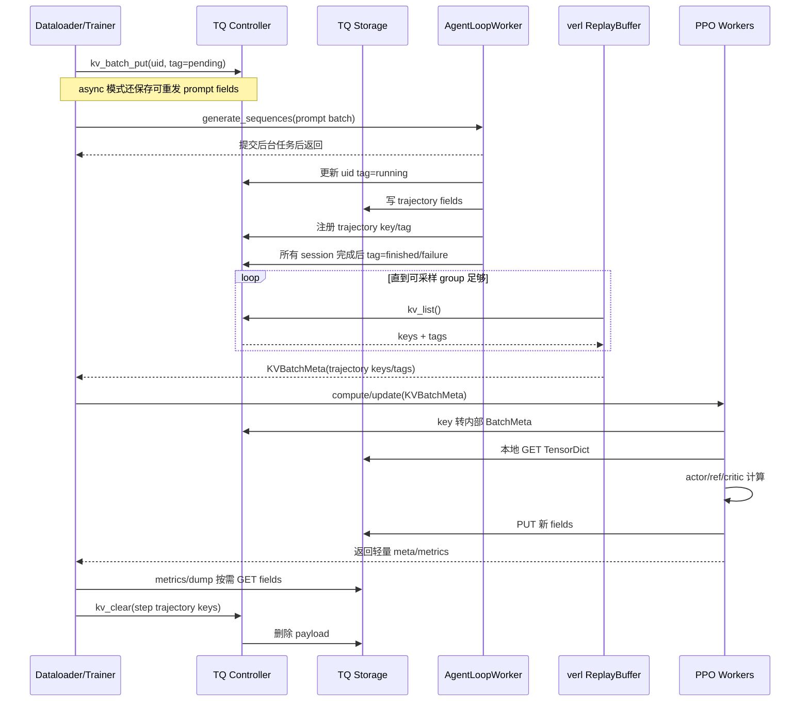

# verl 中 TransferQueue（TQ）的接入与使用流程

> 本文基于当前工作区中的 verl `3c62a15d1`（2026-08-24）整理，重点解释 **verl 自己如何接入、初始化和使用 TransferQueue**。
>
> TransferQueue 和 Mooncake 的内部实现只讲到足以理解 verl 数据流的程度。更深入的库内原理可参考：
>
> - `/mnt/shared-storage-user/huanghaian/code/TransferQueue/TQ_DEEP_DIVE_ZH.md`
> - `/mnt/shared-storage-user/huanghaian/code/Mooncake/MOONCAKE_BEGINNER_GUIDE_CN.md`

## 快速开始：普通 verl 开发者先看这里

如果只是运行或扩展 verl V1，先记住下面四句话就够了：

1. **verl Driver 只需要初始化一次 Ray。**
2. **第一个 TQ 初始化者携带完整配置执行 `tq.init(config)`，创建全局 TQ 服务。**当前 verl 中这个角色是 `TaskRunnerV1`。
3. **每个真正调用 TQ API 的独立进程，都要先在本进程执行一次 `tq.init()`。**后续进程不再创建新服务，只连接已经存在的 TQ。
4. **普通开发者不需要获取 Controller、创建 ZMQ 连接或操作 StorageManager。**这些都由 `tq.init()` 和 TQ client 自动完成。

### A. 当前 verl 的标准启动顺序

当前 V1 主路径已经把初始化过程接好了：

```text
verl Driver 进程
  |
  | 1. ray.init(...)
  |    建立或连接 Ray 集群
  v
TaskRunnerV1（Ray Actor，实际是另一个进程）
  |
  | 2. tq.init(config.transfer_queue)
  |    第一次完整初始化：创建全局 Controller 和存储后端
  |
  | 3. 创建 AgentLoop、actor、reference、critic 等 worker
  v
各个需要直接使用 TQ 的 Worker 进程
  |
  | 4. tq.init()
  |    不传配置，连接已经存在的 Controller 和存储
  v
tq.put/get 或 tq.kv_* API
```

这里的“第一个初始化者”只是初始化顺序上的主节点，不一定是操作系统意义上的主进程。当前 verl 中：

- Driver 在 `verl/trainer/main_ppo.py` 中负责 `ray.init()`；
- `TaskRunnerV1.run()` 使用完整的 `config.transfer_queue` 首次调用 `tq.init(config)`；
- `AgentLoopWorkerTQ` 在自己的 Ray Actor 进程中调用 `tq.init()`；
- 使用 `tqbridge` 的其他 worker 会在第一次需要访问 TQ 时按进程懒初始化。

因此，运行当前标准 V1 trainer 时，用户通常**不需要在业务代码里手动写任何初始化代码**。

### B. `ray.init()` 和 `tq.init()` 不要混为一谈

两者的作用范围不同：

| 初始化 | 作用 | 谁调用 |
| --- | --- | --- |
| `ray.init(...)` | 让普通 Python Driver 建立或连接 Ray 集群 | 通常只由 verl Driver 调用一次 |
| `tq.init(config)` | 首次创建 Controller、存储后端和本进程 TQ client | 当前由 `TaskRunnerV1` 调用 |
| `tq.init()` | 在另一个进程创建本地 TQ client，并连接已有 TQ | 每个直接使用 TQ 的独立进程一次 |

不要在每个 Ray Actor 里再次手动执行 `ray.init()`。Ray Actor 本身已经运行在 Ray 管理的 worker 进程中，可以直接执行 `tq.init()`。

只有一个**不受 Ray 管理的普通外部 Python 进程**需要访问同一套 TQ 时，它才需要先连接 Ray，再初始化本地 TQ client：

```python
import ray
import transfer_queue as tq

ray.init(address="auto")  # 外部进程先连接同一个 Ray 集群
tq.init()                  # 再连接已经初始化好的全局 TQ

# 然后才能调用 tq.put/get 或 tq.kv_* API
```

### C. 普通用户推荐怎样配置

初次使用建议保留默认的 `SimpleStorage`，不需要单独启动存储服务：

```yaml
trainer:
  use_v1: true

transfer_queue:
  enable: true
  backend:
    storage_backend: SimpleStorage
    SimpleStorage:
      # 所有 StorageUnit 合计的目标样本上限，用于防止未消费样本无限堆积；不会预分配同等内存
      total_storage_size: 100000
      num_data_storage_units: 8
```

也可以通过 Hydra 命令行覆盖：

```bash
trainer.use_v1=true \
transfer_queue.enable=true \
transfer_queue.backend.storage_backend=SimpleStorage \
transfer_queue.backend.SimpleStorage.total_storage_size=100000 \
transfer_queue.backend.SimpleStorage.num_data_storage_units=8
```

普通用户主要需要理解两个参数：

- `total_storage_size`：整套 SimpleStorage 中所有 unit 合计的目标样本上限，用于在生产快于消费时阻止样本无限堆积；它按唯一 sample/global index 计数，不是字节数，启动时也不会据此预分配 payload 内存；
- `num_data_storage_units`：分布式存储 actor 数量，每个 unit 需要一个 Ray CPU。

当前 `trainer.use_v1=true` 时，V1 trainer 的主流程会使用 TQ。建议显式设置 `transfer_queue.enable=true`，使 Driver 在 `ray.init()` 之前就把 TQ 所需环境传给各个 Ray worker。

### D. 自定义代码什么时候需要手动初始化

如果只是使用 verl 已有的 V1 trainer、`AgentLoopWorkerTQ` 和 `tqbridge`，初始化已经由框架完成。

只有新增一个直接调用 TQ API 的独立 Ray Actor 时，才需要在该 Actor 进程里初始化一次：

```python
import ray
import transfer_queue as tq


@ray.remote
class MyWorker:
    def __init__(self):
        # 不需要 ray.init()；这个 Actor 已经处在 Ray 集群中。
        tq.init()

    def process(self, meta):
        # 此后可以调用 tq.get/put 或 tq.kv_* API。
        ...
```

同一个进程中的多个 Python 对象共享本进程的 TQ client，不需要每个对象分别执行 `tq.init()`。判断标准始终是“是否跨了进程边界”，而不是“创建了多少个类实例”。

### E. 普通开发者需要关心到哪一层

```text
通常需要关心：
  transfer_queue 配置
  trajectory key / tag / field
  put / get / clear 的调用时机

通常不需要关心：
  TransferQueueController 的获取
  TransferQueueClient 的创建
  StorageManager / StorageClient
  ZMQ 地址和 socket
  SimpleStorageUnit 的创建过程
```

后续章节会解释这些内部对象，是为了帮助理解数据流、资源占用和故障排查，不代表普通使用 TQ 时必须直接操作它们。

---

## 1. 先说结论

在当前 verl 的 V1 trainer 中，TQ 不是一个普通 FIFO 队列，而更像：

> **一张分布式的“样本表”，外加一份轻量的样本状态索引。**

一条 rollout trajectory 最初只有 prompt 和生成结果，之后 reward、old log-prob、reference log-prob、value、advantage 等阶段会不断给它增加新字段。TQ 保存这些真实数据，verl 的 trainer 主要传递 key、tag、partition 等轻量元数据。

传统思路大致是：

```text
rollout worker
    │ 大 Tensor/DataProto
    ▼
trainer/driver
    │ 再分发大 Tensor/DataProto
    ├──► reward worker
    ├──► actor worker
    ├──► reference worker
    └──► critic worker
```

V1 + TQ 的思路是：

```text
                         key / tag / KVBatchMeta
trainer/driver  ─────────────────────────────────► compute workers
      │                                                  │
      │ 编排算法，不中转全部大 Tensor                     │ 本进程按 key 读取
      │                                                  ▼
      └──────────── TQ Controller                 TQ Storage Backend
                   管状态与索引                    保存真实 payload
                                                        ▲
                                                        │ 直接写入
                                                   rollout workers
```

因此，TQ 在 verl 中主要解决三件事：

1. 避免所有大对象反复经过单一 trainer/driver；
2. 让 rollout 生产与 PPO 消费通过状态和 key 解耦；
3. 让同一批 trajectory 在不同 PPO 阶段逐步追加字段，而不是反复构造和搬运完整 batch。

当前默认的 `trainer.use_v1=true` 会走 V1 trainer，而 **V1 trainer 的 sync、colocate_async、separate_async 三种模式全部使用 TQ**。

---

## 2. 阅读本文前先分清三个容易混淆的概念

### 2.1 TQ 与底层存储后端不是一回事

verl 面向的是 TQ API：

```python
tq.kv_batch_put(...)
tq.kv_batch_get(...)
tq.kv_list(...)
tq.kv_clear(...)
```

这些 API 下面可以换不同存储后端。当前 verl 配置直接给出的选择是：

- `SimpleStorage`：默认后端，TQ 自己启动分布式 CPU 内存 storage units；
- `MooncakeStore`：实验性后端，用 Mooncake Store 保存和传输 payload。

因此：

```text
verl PPO / ReplayBuffer
        │
        ▼
TransferQueue KV API
        │
        ├── SimpleStorage
        └── MooncakeStore
```

切换到 MooncakeStore 后，verl 的 key、tag、ReplayBuffer 和 PPO 阶段顺序都不需要改变；主要变化发生在 TQ 的数据面。

### 2.2 verl 里出现的 Mooncake 不一定是 TQ 后端

当前 verl 里至少有三种不同语境下的 Mooncake：

| 语境 | 配置位置 | 搬的是什么 | 与本文关系 |
| --- | --- | --- | --- |
| TQ 的 `MooncakeStore` | `transfer_queue.backend` | trajectory、reward、log-prob、advantage 等训练数据 | **本文重点** |
| checkpoint engine 的 `mooncake` | `actor_rollout_ref.rollout.checkpoint_engine.backend` | actor 到 rollout 的模型权重 | 只做边界说明 |
| rollout PD 的 `mooncake` | `actor_rollout_ref.rollout.disaggregation.transfer_backend` | Prefill 到 Decode 的 KV Cache | 不是本文重点 |

三者可能同时使用，但它们不是同一条数据流，也不能用一处配置替代另一处配置。

### 2.3 V1 的 ReplayBuffer 是 verl 自己实现的

TQ 本身有 native sampler 和 StreamingDataLoader 等能力，但当前 verl V1 的主路径是：

```text
TQ 的 KV API
    + TQ tag 作为状态索引
    + verl.trainer.ppo.v1.replay_buffer.ReplayBuffer
```

换句话说，TQ 负责保存 key、tag 和 payload；“哪些 prompt 已完成、哪些过期、这一步挑哪些组训练”主要由 verl 的 ReplayBuffer 决定。

---

## 3. verl 中最重要的 TQ 数据对象

### 3.1 Partition：逻辑命名空间

当前 V1 固定使用两个主要 partition：

- `train`：训练 prompt 和 trajectory；
- `val`：验证 prompt 和 trajectory。

相同 key 可以存在于不同 partition 中，两个 partition 的状态和数据互不影响。

### 3.2 Prompt key：一个 GRPO/PPO prompt group 的状态标记

Trainer 从 dataloader 取到一条 prompt 后，为它生成一个 UUID：

```text
uid = 例如 3a4f...c912
```

随后把 `uid` 自身作为 prompt key。这个 key 的主要作用不是保存最终 trajectory，而是跟踪整组 rollout session 的状态。

典型 tag 是：

```python
{
    "is_prompt": True,
    "status": "pending",
    "global_steps": current_step,
}
```

状态变化为：

```text
pending → running → finished
                  ↘ failure
```

含义如下：

| 状态 | 含义 |
| --- | --- |
| `pending` | trainer 已取出 prompt，但 AgentLoop 尚未正式运行这一组 |
| `running` | 这一 prompt 对应的多个 rollout session 正在运行 |
| `finished` | 所有 session 都结束且没有异常 |
| `failure` | 所有 session 已经收敛结束，但至少一个 session 失败 |

### 3.3 Trajectory key：真正训练样本的 key

每个 prompt 通常会采样 `rollout.n` 条 response。AgentLoop 还允许一次 session 产生多个 output，因此 trajectory key 格式是：

```text
{uid}_{session_id}_{output_index}
```

例如：

```text
3a4f...c912_0_0
3a4f...c912_1_0
3a4f...c912_2_0
3a4f...c912_3_0
```

这里：

- `uid` 标识原始 prompt group；
- `session_id` 通常对应第几次采样，范围约为 `[0, rollout.n)`；
- `output_index` 用于 multi-output agent loop。

当前 ReplayBuffer 会用 `key.split("_")[0]` 找回 uid，所以 **uid 不能包含下划线**。verl 自己用 UUID 字符串生成 uid，满足这一约束。自定义数据生产者也必须遵守。

### 3.4 Field：trajectory 上逐步增加的数据列

一个 trajectory key 下不是只有一个不可拆分对象，而是多个字段。常见字段包括：

```text
prompts
responses
input_ids
position_ids
response_mask
loss_mask
rollout_log_probs
rm_scores
old_log_probs
entropy
ref_log_prob
values
advantages
returns
extra_fields
```

rollout 先写第一批字段，后续 PPO 阶段继续向同一个 key 追加新字段。

### 3.5 Tag 与 Field 的区别

这是理解 verl ReplayBuffer 的关键：

| 数据 | 保存内容 | 典型访问方式 | 是否承载大 Tensor |
| --- | --- | --- | --- |
| tag | `status`、`seq_len`、`global_steps`、是否 padding 等轻量状态 | `tq.kv_list()` | 否 |
| field/value | token、mask、log-prob、reward、advantage 等 | `tq.kv_batch_get()` | 是 |

#### 3.5.1 Tag 和 fields 使用同一个 key 吗

是。更准确地说，TQ 用：

```text
(partition_id, key)
```

共同定位一行样本，然后这一行可以同时拥有两类内容：

```text
partition_id="train", key="abc_0_0"
  ├── tag
  │     ├── status = success
  │     ├── seq_len = 1024
  │     └── global_steps = 10
  │
  └── fields/value
        ├── prompts
        ├── responses
        ├── rollout_log_probs
        └── rm_scores
```

同一个字符串 key 放在不同 partition 中，仍然是两行不同的数据。例如：

```text
(train, abc_0_0) != (val, abc_0_0)
```

需要注意，prompt marker 和 trajectory 本来就是两种不同的 key：

```text
prompt marker key:  uid
trajectory key:     {uid}_{session_id}_{output_index}
```

所以“同一个 key 同时绑定 tag 和 fields”指的是某一行内部的关系，不是说 prompt marker 和它下面的 trajectory 共用一个 key。

#### 3.5.2 存的时候怎样区分 tag 和 value

通过不同参数区分。TQ KV API 没有单独的 `value=` 参数；一行的真实 value 被拆成多个命名列，通过 `fields=` 传入：

```python
tq.kv_put(
    key="abc_0_0",
    partition_id="train",
    fields={
        "responses": response_tensor,
        "rollout_log_probs": logprob_tensor,
    },
    tag={
        "status": "success",
        "seq_len": 1024,
    },
)
```

这一次调用把 tag 和 fields 绑定到同一个 `(train, abc_0_0)`。它们的职责和存储路径不同：

```text
tag
  → Controller 的 custom metadata
  → 数据小，适合 list/polling/调度判断

fields
  → Storage backend 的真实 payload
  → Controller 只记录字段 schema 和 ready 状态
```

因此，“key 相同”不表示 tag 和大 Tensor 被混装进同一个 Python 对象，也不表示 `kv_list()` 会把大 Tensor 一起返回。

#### 3.5.3 可以只更新 tag，不动 fields

可以。verl 更新 prompt 状态时就是这样做的：

```python
tq.kv_put(
    key=uid,
    partition_id="train",
    fields=None,
    tag={"status": "running"},
)
```

已有 fields 不会因为这次 tag-only update 被删除。新 tag 会与该 key 已有 tag 做字典式更新：新提供的同名项被覆盖，没有提供的旧项保留。因此最初注册的：

```python
{
    "is_prompt": True,
    "status": "pending",
    "global_steps": 10,
}
```

只更新 `status` 后，逻辑结果是：

```python
{
    "is_prompt": True,
    "status": "running",
    "global_steps": 10,
}
```

这正是 AgentLoopWorker 能只写 `{"status": "running"}`，而 ReplayBuffer 之后仍能看到 `is_prompt` 和 `global_steps` 的原因。

#### 3.5.4 可以只追加 fields，不动 tag

也可以。例如 reward 阶段在原 trajectory 上追加 `rm_scores`：

```python
tq.kv_put(
    key="abc_0_0",
    partition_id="train",
    fields={"rm_scores": rm_scores},
    tag=None,
)
```

已有 tag 保留；已有 `prompts/responses` 等 fields 也保留。新的 `rm_scores` 成为同一行上的新列。后面的 old log-prob、reference、critic 和 advantage 阶段都采用类似的“沿同一个 key 继续长列”模式。

#### 3.5.5 最常用的几个接口

| 接口 | 作用 | tag/fields 行为 |
| --- | --- | --- |
| `tq.kv_put(key, partition_id, fields=None, tag=None)` | 写或更新一个 key | 可只写 tag、只写 fields，或两者一起写；二者不能同时为 `None` |
| `tq.kv_batch_put(keys, partition_id, fields=None, tags=None)` | 批量写多个 key | `fields` 的 batch size 和 `tags` 数量必须与 `len(keys)` 对齐 |
| `tq.kv_batch_get(keys, partition_id, select_fields=None)` | 读取真实 value | 返回 `TensorDict`；可用 `select_fields` 只读取指定列，不返回 tag |
| `tq.kv_list(partition_id=None)` | 列出 key 和 tag | 返回 `{partition: {key: tag}}`，不读取 fields payload |
| `tq.kv_clear(keys, partition_id)` | 删除 key | 同时删除 Controller 中的 key/tag/字段状态和 Storage 中的 fields payload |

其中单条 `kv_put()` 的 `fields` 可以传普通 dict 或单样本 `TensorDict`；批量 `kv_batch_put()` 的 `fields` 应传 batched `TensorDict`，并满足：

```python
fields.batch_size[0] == len(keys)
```

这些接口都有对应的异步版本：

```python
await tq.async_kv_put(...)
await tq.async_kv_batch_put(...)
await tq.async_kv_batch_get(...)
await tq.async_kv_list(...)
await tq.async_kv_clear(...)
```

AgentLoopWorker 处在 asyncio 并发生成路径中，所以主要使用异步接口；trainer 和 ReplayBuffer 的同步编排代码主要使用同步接口。

#### 3.5.6 一个最小的完整例子

```python
from tensordict import TensorDict
import torch
import transfer_queue as tq

key = "abc_0_0"
partition = "train"

# 1. 同时写初始 fields 和 tag。
tq.kv_put(
    key=key,
    partition_id=partition,
    fields={"responses": torch.tensor([1, 2, 3])},
    tag={"status": "success", "seq_len": 3},
)

# 2. 只追加新 field；responses 和 tag 都保留。
tq.kv_put(
    key=key,
    partition_id=partition,
    fields={"rm_scores": torch.tensor([0.0, 0.0, 1.0])},
    tag=None,
)

# 3. 只更新 tag；fields 都保留。
tq.kv_put(
    key=key,
    partition_id=partition,
    fields=None,
    tag={"consumed_by_demo": True},
)

# 4. 轻量查看 key/tag，不会取回 responses 和 rm_scores。
index_snapshot = tq.kv_list(partition_id=partition)
print(index_snapshot[partition][key])

# 5. 只读需要的 field。
data: TensorDict = tq.kv_batch_get(
    keys=[key],
    partition_id=partition,
    select_fields=["rm_scores"],
)

# 6. 生命周期结束后，tag 和 fields 一起删除。
tq.kv_clear(keys=[key], partition_id=partition)
```

所以当前 verl 的使用方式可以浓缩为：

```text
ReplayBuffer 高频 kv_list() 看 tag
PPO 各阶段按需 kv_batch_get() 取 fields
计算完成后 kv_put()/kv_batch_put() 追加 fields
生命周期结束后 kv_clear() 两边一起删
```

### 3.6 `KVBatchMeta` 与 `BatchMeta`

verl controller 最常传递的是 `KVBatchMeta`：

```text
KVBatchMeta
  ├── partition_id
  ├── keys
  ├── tags
  ├── fields        # 可选字段选择
  └── extra_info    # 不适合作为逐样本 field 的调用参数
```

TQ 内部和底层 storage 更接近 `BatchMeta`，其中包含 key 映射后的 global indexes、字段 schema、partition 等信息。

可以简单理解为：

```text
KVBatchMeta：verl/controller 友好的“业务地址”
BatchMeta：TQ/storage 友好的“内部地址”
TensorDict：计算函数真正看到的 payload
```

---

## 4. verl 是怎样把 TQ 接进现有 worker API 的

### 4.1 依赖和配置入口

TQ 已经进入 verl 的核心依赖：

- `pyproject.toml` 的 `transferqueue` extra 指向 Ascend/TransferQueue 的 `main` 分支；
- `verl-core` 会包含这个 extra；
- `requirements.txt` 也包含 TransferQueue。

因此当前代码不是把 TQ 当成 V1 的可选小插件。正常使用项目的 `uv sync` 流程安装训练和 rollout backend 时，会一起安装 TQ。

Hydra 配置入口位于：

```text
verl/trainer/config/ppo_trainer.yaml
  └── transfer_queue@transfer_queue: transfer_queue

verl/trainer/config/transfer_queue/transfer_queue.yaml
  ├── enable
  ├── metrics
  └── backend
```

### 4.2 `@register` 自动套上 `tqbridge`

verl 的分布式 worker 方法通常用 `@register(...)` 装饰，例如：

```python
@register(dispatch_mode=...)
def compute_log_prob(self, data: TensorDict) -> TensorDict:
    ...
```

`verl/single_controller/base/decorator.py` 中的 `register()` 会再给函数套一层：

```python
func = tqbridge(dispatch_mode=dispatch_mode)(func)
```

这使已有 worker 函数不需要改成直接调用 TQ。函数本体仍然使用熟悉的 `TensorDict -> TensorDict` 接口。

### 4.3 `tqbridge` 的输入转换

如果函数收到普通 `TensorDict`，`tqbridge` 基本不做额外处理，直接调用原函数。

如果函数收到 `KVBatchMeta` 或 `BatchMeta`，它会：

1. 在当前 worker 进程中按需执行 `tq.init()`；
2. 将 `KVBatchMeta` 转为 TQ 内部 `BatchMeta`；
3. 从 storage 读取真实 payload；
4. 把 non-tensor `extra_info` 补回 `TensorDict`；
5. 调用原 worker 函数。

所以原 worker 看到的仍是：

```python
def compute_log_prob(self, data: TensorDict) -> TensorDict:
    ...
```

它不需要知道调用方传来的其实只是 meta。

### 4.4 `tqbridge` 的输出转换

如果原函数输出一个与输入样本数一致的非空 `TensorDict`，bridge 会：

1. 把 tensor / `NonTensorStack` 输出作为新字段写回原 BatchMeta 对应的样本；
2. 把 `NonTensorData` 放入 `extra_info`；
3. 返回更新后的 meta，而不是通过 Ray 返回大 Tensor。

如果某个并行 rank 不负责 collect，bridge 会返回空 meta，避免冗余写入和回传。

完整心智模型是：

```text
controller
  │ KVBatchMeta
  ▼
RayWorkerGroup dispatch
  │ KVBatchMeta → BatchMeta → 按并行度切分
  ▼
worker rank
  │ tqbridge: BatchMeta → 本地 GET → TensorDict
  │ 原计算函数: TensorDict → TensorDict
  │ tqbridge: 本地 PUT 新字段 → BatchMeta
  ▼
RayWorkerGroup collect
  │ 合并 BatchMeta → KVBatchMeta
  ▼
controller
```

driver 仍能像过去一样编排 worker 方法，但大 payload 不再作为这些 RPC 的主要返回值来回搬运。

### 4.5 一个需要注意的字段选择细节

TQ 支持 `select_fields`，当前 trainer 自己执行的 reward、advantage、metrics 等步骤会显式只读所需字段。

但 worker RPC bridge 是否只读取必要字段，取决于传入 `KVBatchMeta.fields`。当前内置 ReplayBuffer 返回的 `KVBatchMeta` 通常没有设置 `fields`，因此 bridge 会解析这批 key 的共同可用字段，而不是自动根据 Python 函数代码推断最小字段集合。

所以应准确理解为：

- **TQ 有列式按需读取能力**；
- **verl 的部分 controller 阶段已经显式使用它**；
- **通用 worker bridge 并不会自动做静态字段依赖分析**。

这也是后续做极致内存/带宽优化时值得继续收紧的地方。

---

## 5. 启动流程：V1 是怎样初始化 TQ 的

### 5.1 入口选择

标准入口是：

```bash
python3 -m verl.trainer.main_ppo ...
```

`main_ppo.py` 根据：

```yaml
trainer:
  use_v1: true
```

选择 `TaskRunnerV1`。当前默认值就是 `true`。

### 5.2 为什么配置默认 `transfer_queue.enable=false`，V1 却仍使用 TQ

配置文件中默认写的是：

```yaml
transfer_queue:
  enable: false
```

但 `TaskRunnerV1.run()` 内部会执行：

```python
config.transfer_queue.enable = True
tq.init(config.transfer_queue)
```

因此，在当前代码中：

> **只要使用 V1 trainer，TQ 就会被强制启用；`sync` 模式也不例外。**

不要把 `transfer_queue.enable=False` 当作“V1 不使用 TQ”的开关。若真的切到不使用 V1 TQ 的旧路径，需要 `trainer.use_v1=false`，但 V0 已经被标记为 deprecated。

实际启动脚本仍建议显式写：

```bash
trainer.use_v1=True \
transfer_queue.enable=True
```

这样配置意图更清楚，而且 `run_ppo()` 会在 `ray.init()` 前把 `TRANSFER_QUEUE_ENABLE=1` 放进默认 Ray runtime environment。当前 verl 主路径的 bridge 主要依赖 meta 类型触发，而不是依赖这个环境变量，但显式开启更符合现有 E2E 脚本和自定义组件的预期。

### 5.3 `tq.init()` 流程：第一次创建与后续进程接入

在 TaskRunner 进程中首次调用：

```python
tq.init(config.transfer_queue)
```

高层效果是：

1. 创建整个 Ray 集群共享的 `TransferQueueController`；
2. 按配置创建或连接 storage backend；
3. 保存最终 TQ 配置，供其他进程复用；
4. 如启用 metrics，启动 metrics endpoint；
5. 在当前进程创建 TQ client。

Controller 管理 key、tag、partition 和字段状态；真实 tensor/Python payload 由 storage backend 保存。

#### 5.3.1 初始化顺序不是“先有 client，再慢慢启动 storage”

第一次 `tq.init(config)` 是一个同步 bootstrap 过程。按当前 TQ 实现，顺序大致是：

```text
TaskRunner 调用 tq.init(config)
  │
  ├─ 1. 合并 TQ 默认配置与 verl 的 transfer_queue 配置
  │
  ├─ 2. 创建命名 Ray Actor：TransferQueueController
  │      TQ 内部全局唯一；Actor 构造时同时启动 Controller ZMQ 服务
  │      namespace = transfer_queue
  │      name      = TransferQueueController
  │
  ├─ 3. 取得 Controller 的 ZMQ 地址
  │      地址在 TransferQueueController 初始化时已经创建
  │
  ├─ 4. 根据 backend.storage_backend 选择 bootstrap provider
  │      ├── SimpleStorage
  │      │     ├── 先创建分布式 SimpleStorageUnit actors
  │      │     ├── 每个 unit 启动 ZMQ 服务并公布 endpoint
  │      │     └── 收集全部 endpoints 到 backend.SimpleStorage.zmq_info
  │      └── MooncakeStore：启动或复用外部 Mooncake 服务
  │
  ├─ 5. 把 storage endpoints 等最终配置保存到 Controller
  │
  ├─ 6. 可选启动 metrics exporter
  │
  └─ 7. 在当前 TaskRunner 进程创建并缓存 TransferQueueClient
         └── 创建本进程的 StorageManager
             ├── SimpleStorage：Manager 直接连接 StorageUnit
             └── MooncakeStore：再创建 StorageClient 连接后端
```

对 SimpleStorage 来说，最关键的先后关系是：

```text
一次性的全局存储 bootstrap：

创建 StorageUnit #0 ... #N-1
        |
        v
每个 unit 启动 ZMQ，并返回自己的 endpoint
        |
        v
汇总为 backend.SimpleStorage.zmq_info
        |
        v
保存到全局 Controller

每个使用 TQ 的进程：

取得同一份 backend.SimpleStorage.zmq_info
        |
        v
创建本进程的 TransferQueueClient
        |
        v
创建本进程的 AsyncSimpleStorageManager
        |
        v
Manager 持有 endpoints，并按 global index 访问对应 StorageUnit
```

所以确实是**先有全局 StorageUnit 和 endpoints，后有本进程的 StorageManager**。但这里的“Manager”不是 StorageUnit 的全局管理服务，它只是每个进程里的存储访问适配器和路由器：它不负责创建、关闭或扩缩 StorageUnit，只负责根据 endpoints 把 `PUT/GET/CLEAR` 请求发到正确的 unit。

第 7 步表示 `tq.init()` 在模块内部创建进程级 `_TQ_CLIENT` 单例，**不表示 `tq.init()` 把 `TransferQueueClient` 作为返回值返回**。当前接口行为是：

```python
result = tq.init(config)   # 首次初始化时，result 是合并后的配置，不是 client
client = tq.get_client()   # 确实需要底层 client 时才这样获取

# 普通 verl 代码通常不需要 get_client()，直接调用公开 API 即可
tq.kv_batch_put(...)
tq.kv_batch_get(...)
```

其他进程使用无参数的 `tq.init()` 连接已有 Controller 时，也不应该依赖它的返回值；调用完成后，本进程的公开 TQ API 和 `tq.get_client()` 才进入可用状态。

所以对默认 SimpleStorage 来说，`tq.init()` 返回时，storage-unit actors、它们的 ZMQ 服务和当前进程的 StorageManager 已经初始化完成，可以立即执行 `kv_put()`。这不是训练到第一次 PUT 时才异步创建的一组服务。

不过，storage unit 此时只是空容器。真实 fields payload 是后续 `kv_put()` / `kv_batch_put()` 时才按样本写入的；`total_storage_size` 是容量约束，不代表启动时就预分配同等大小的 Tensor 内存。

#### 5.3.2 第二次及后续 `tq.init()` 做什么

这里的“第二次”主要指：`TaskRunnerV1` 已经完成第一次全局初始化后，另一个需要使用 TQ 的 Worker 进程第一次调用 `tq.init()`。它不会重新创建一套 TQ，而是加入已有的 TQ：

```text
某个 Worker 进程调用 tq.init()
  │
  ├─ 1. 当前进程已经处在同一个 Ray 集群中
  │      Ray Actor 已自动接入，不需要再次 ray.init()
  │
  ├─ 2. 查找全局唯一的 Controller Ray Actor
  │      namespace = transfer_queue
  │      name      = TransferQueueController
  │
  ├─ 3. 通过 Ray RPC 读取 Controller 保存的最终配置
  │      如果首次初始化尚未完成，则等待配置写入
  │
  ├─ 4. 从配置中取得已有服务的连接信息
  │      ├── controller.zmq_info
  │      └── SimpleStorage endpoints 或 Mooncake 配置
  │
  ├─ 5. 在当前 Worker 进程创建并缓存 TransferQueueClient
  │
  ├─ 6. 在当前进程创建 StorageManager 并建立连接
  │      ├── SimpleStorage：连接已有 StorageUnit endpoints
  │      └── MooncakeStore：创建 StorageClient 并连接 Mooncake
  │
  └─ 7. 完成 Controller handshake，本进程可以调用 TQ API
         tq.put/get 或 tq.kv_*
```

第一次与后续进程初始化的区别可以压缩为：

```text
第一次 tq.init(config)：
  创建全局 Controller + 全局存储 + TaskRunner 本地 Client/Manager

其他进程第一次 tq.init()：
  复用全局 Controller + 全局存储，只创建本进程 Client/Manager
```

因此，后续进程不会再次创建 `TransferQueueController`、`SimpleStorageUnit` 或 Mooncake Master。第一位 initializer 的配置决定本次作业的后端；已有 Controller 存在时，后续传给 `tq.init(new_config)` 的新配置会被忽略，不能借此动态更换后端或 StorageUnit 数量。

如果是**同一个进程重复调用** `tq.init()`，则连 Client/Manager 也不会重复创建：模块级 `_TQ_CLIENT` 已经存在，TQ 会继续复用它。所以不需要在每次 `put/get` 前初始化，按进程成功初始化一次即可。

如果多个进程同时抢第一次初始化，命名 Ray Actor 的唯一性会保证只有一个进程成功创建 Controller；其他进程发现名称冲突后会转为连接该 Controller，并等待首次初始化者写入最终配置。正常使用不需要用户额外添加跨进程锁。

#### 5.3.3 一张图先理清这些对象

先把这些名字分成两组：

- **集群共享的服务**：`TransferQueueController`，以及真正承载数据的 SimpleStorage StorageUnit 或 Mooncake 存储服务。
- **每个使用 TQ 的进程中的本地对象**：`TransferQueueClient`、`StorageManager`，以及 MooncakeStore 等 KV 后端才有的 `StorageClient`。

它们的整体关系如下。图中的 SimpleStorage 和 MooncakeStore 是两条**二选一**的后端路径，并不是一次初始化会同时创建两套存储。

```text
+------------------------ 每个使用 TQ 的 verl 进程 ------------------------+
|                                                                         |
|  verl 业务代码                                                          |
|  tq.kv_* / tqbridge                                                     |
|       |                                                                 |
|       v                                                                 |
|  TransferQueueClient                                                    |
|       |                                                                 |
|       v                                                                 |
|  StorageManager                                                         |
|       |                                                                 |
+-------|-----------------------------------------------------------------+
        |
        | 控制面：Controller ZMQ 地址
        | key / tag / field 状态、握手、就绪通知
        +-----------------------> TransferQueueController
                                  （集群共享一个命名 Ray Actor）

        数据面根据后端二选一：

        1. SimpleStorage

           StorageManager
                |
                | StorageUnit ZMQ 地址
                | PUT / GET / CLEAR payload
                v
           SimpleStorageUnit #0 ... #N-1
           （集群共享，真正保存数据）

        2. MooncakeStore

           MooncakeStorageManager
                |
                v
           MooncakeStoreClient（StorageClient）
                |
                | Mooncake SDK / Transfer Engine
                v
           Mooncake Master + 数据 Segment
           （集群共享的分布式存储）
```

把图压缩成两条实际数据路径，就更容易记了：

```text
SimpleStorage：
verl -> TransferQueueClient -> AsyncSimpleStorageManager -> SimpleStorageUnit × N
              |                    |
              +--------------------+----> TransferQueueController（控制面）

MooncakeStore：
verl -> TransferQueueClient -> MooncakeStorageManager -> MooncakeStoreClient -> Mooncake
              |                    |
              +--------------------+----> TransferQueueController（控制面）
```

这里尤其要注意，文档和配置里会出现两类不同的 ZMQ 地址：

| 地址 | 谁监听 | 主要传什么 |
| --- | --- | --- |
| Controller ZMQ 地址，即 `controller.zmq_info` | `TransferQueueController` | key 注册与查询、tag、field 状态、握手和通知等控制信息 |
| SimpleStorage ZMQ 地址，即 `backend.SimpleStorage.zmq_info` | 多个 `SimpleStorageUnit` | tensor、对象等真正的 payload，以及 `PUT/GET/CLEAR` 请求 |

所以，“ZMQ 地址”本身不是一个存储对象，它只是其他进程找到某个服务并与其通信所需的 endpoint 信息。Controller 地址和 StorageUnit 地址也不能混用。

各对象可以先用一句话理解：

| 对象 | 生命周期/数量 | 一句话职责 |
| --- | --- | --- |
| `TransferQueueController` | 整个 TQ 实例共享一个 | 管 key、tag、field 状态等控制面元数据，不直接承载大块 payload。TQ 内部代码，用户无需操作  |
| `TransferQueueClient` | 每个调用 `tq.init()` 的进程一个 | 给 verl 暴露统一 API，并把控制请求和数据请求送往正确对象。TQ 内部代码，用户无需操作 |
| `StorageManager` | 每个进程一个 | 适配所选后端，负责数据路由、序列化及就绪通知等。TQ 内部代码，用户无需操作  |
| `StorageClient` | 每个进程可选一个；KV 后端才需要 | 封装具体外部存储 SDK；MooncakeStore 中对应 `MooncakeStoreClient`。TQ 内部代码，用户无需操作  |
| `SimpleStorageUnit` | 集群共享多个 | SimpleStorage 中真正保存 payload 的 Ray Actor，并监听各自的 ZMQ 地址。TQ 内部代码，用户无需操作  |
| Mooncake Master / Segment | 集群共享 | Master 管理存储元信息和放置，数据 Segment 承载实际数据 |

还有一个容易混淆的点：Ray 主要负责首次创建、命名和发现 Controller/StorageUnit；初始化完成后，高频的控制面通信走 Controller ZMQ，SimpleStorage 数据通信走 StorageUnit ZMQ，MooncakeStore 数据通信则走 Mooncake SDK/Transfer Engine。

#### 5.3.4 SimpleStorage 的“分布式存储单元”怎样创建

当配置为：

```yaml
backend:
  storage_backend: SimpleStorage
```

TQ 会调用 SimpleStorage bootstrap provider，并读取：

```yaml
SimpleStorage:
  total_storage_size: 100000
  num_data_storage_units: 8
```

随后执行：

1. 从 `ray.nodes()` 找出当时已经加入集群且处于 Alive 状态的节点；
2. 按 node id 排序；
3. 用 round-robin 为每个 storage unit 选择节点；
4. 创建 `num_data_storage_units` 个命名 Ray actor：

```text
TransferQueueStorageUnit#0
TransferQueueStorageUnit#1
...
TransferQueueStorageUnit#7
```

每个 `SimpleStorageUnit`：

- 是一个 `@ray.remote(num_cpus=1)` actor；
- 通过 hard node affinity 固定到选中的节点；
- 在构造函数中创建自己的内存数据容器；
- 启动 ZMQ ROUTER socket、worker thread 和 proxy thread；
- 对外公布 IP 和随机可用端口。

例如 4 个 alive Ray 节点、8 个 storage units 时，正常会近似这样分布：

```text
node A: StorageUnit#0, StorageUnit#4
node B: StorageUnit#1, StorageUnit#5
node C: StorageUnit#2, StorageUnit#6
node D: StorageUnit#3, StorageUnit#7
```

`total_storage_size` 会按 unit 数量向上取整，形成每个 unit 的最大样本数：

```text
per_unit_capacity
  = ceil(total_storage_size / num_data_storage_units)
```

创建完成后，bootstrap 收集所有 unit 的 ZMQ 地址，写入：

```text
config.backend.SimpleStorage.zmq_info
```

再把这份最终配置保存到共享 Controller。后续其他进程就是通过这份 `zmq_info` 找到同一组 storage units。

注意，此时还没有一个“全局 StorageManager”。第一次初始化会在 storage bootstrap 完成后，为 TaskRunner 进程创建一个本地 `AsyncSimpleStorageManager`；后续每个 worker 调用 `tq.init()` 时，也会各自创建本地 Manager，并把同一份 `zmq_info` 交给它。所有 Manager 共同访问同一组 StorageUnit。

#### 5.3.5 样本怎样路由到不同 SimpleStorageUnit

创建多个 unit 后，`AsyncSimpleStorageManager` 使用稳定规则路由：

```text
target_unit = global_index % num_storage_units
```

同一 global index 的 PUT、GET、CLEAR 会落到同一个 unit。不同样本由此分散到多个节点/进程，达到分摊内存和数据传输压力的效果。

当前没有“新增 storage unit 后自动迁移旧数据”的机制。因此：

- storage-unit 数量在一次 TQ 生命周期中应保持不变；
- Ray 节点最好在第一次 `tq.init()` 前全部加入；
- 后加入的节点不会让已有数据自动重新均衡；
- 不能把动态扩 unit 当成无状态水平扩容。

#### 5.3.6 StorageUnit、StorageManager 和 Client 不要混淆

SimpleStorage 路径中有三类不同对象：

| 对象 | 数量/位置 | 主要职责 |
| --- | --- | --- |
| `SimpleStorageUnit` | 全局创建 `num_data_storage_units` 个，分布在 Ray 节点 | 真正保存 fields payload，提供 ZMQ Put/Get/Clear 服务 |
| `TransferQueueClient` | 每个使用 TQ 的进程一个 | 提供 KV/native API，与 Controller 通信 |
| `AsyncSimpleStorageManager` | 每个 TQ client 进程一个 | 本地访问适配器/路由器；持有所有 unit endpoints，按 global index 访问 storage units，但不管理 unit 生命周期 |

也就是说：

```text
全局共享的一组 StorageUnits
        ▲           ▲
        │           │
进程 A 的 Manager   进程 B 的 Manager
        ▲           ▲
进程 A 的 Client    进程 B 的 Client
```

后续 worker 执行 `tq.init()` 时，只会创建右侧这种“本进程 Client + Manager”，不会再次创建一组 `TransferQueueStorageUnit#N`。

因此，不要把类名中的 `Manager` 理解成“全局 StorageUnit 管理中心”：

```text
StorageUnit 的创建、放置和 endpoint 收集：StorageBootstrapProvider 负责
数据应该发给哪个 StorageUnit：        本进程 StorageManager 负责
StorageUnit 真正保存和删除 payload：   StorageUnit 自己负责
```

StorageManager 初始化时还会和 Controller 做 ZMQ handshake。后续某个 manager 成功写完 payload 后，由它通知 Controller 对应 fields 已 ready。

#### 5.3.7 SimpleStorage 需要用户配置或手动启动吗

通常不需要手动启动单独服务。verl 已提供默认配置：

```yaml
transfer_queue:
  backend:
    storage_backend: SimpleStorage
    SimpleStorage:
      total_storage_size: 100000
      num_data_storage_units: 8
```

用户主要按集群规模和容量调整两个参数即可：

- `num_data_storage_units`：决定 storage actors 数量、CPU 消耗和并行服务能力；
- `total_storage_size`：决定最多容纳多少条 experience sample，而不是字节数。

还要给这些 actor 留出 Ray CPU 资源：每个 unit 声明 `num_cpus=1`。如果 `num_data_storage_units=8`，整个 Ray 集群至少需要能再调度 8 个 CPU actor；否则 bootstrap 可能长期等待资源。

当前 TQ 还支持用 `backend.SimpleStorage.required_node_resource` 把 units 限制到带指定 Ray custom resource 的节点，但这个字段没有直接列在 verl 当前的 transfer_queue YAML 中。确实需要专用存储节点时，可以在确认安装的 TQ 版本后用 Hydra `+` 参数补充；普通用户不需要配置它。

#### 5.3.8 MooncakeStore 的初始化时机不同

MooncakeStore 没有创建 `SimpleStorageUnit` 这一组 Ray actors。第一次接触 Mooncake 时，可以先把它理解成：

```text
一个集群共享的 Mooncake Store Master
  └── 管 object key、位置、租约等控制信息，不承载大块 payload

多个 TQ client process
  └── 每个进程创建 MooncakeStoreClient，并注册自己的内存 Segment/Buffer

真实 payload
  └── 由 Mooncake Transfer Engine 在各 client/segment 之间直接传输
```

这里有两个很容易混淆的地址：

| 配置 | 作用 | 是否是 Master 地址 |
| --- | --- | --- |
| `master_server_address` | Mooncake Store Master 的 RPC 地址，负责 object/replica/lease 等控制面 | 是 |
| `metadata_server` | Transfer Engine 用来发现其他节点 Segment、Buffer 和传输端点的机制 | 不是 |

`metadata_server` 有两种常用写法：

- `P2PHANDSHAKE`：节点之间直接握手，不需要额外启动 HTTP metadata 服务，最适合先跑通；
- `<host>:<port>`：连接 HTTP metadata endpoint。当前 `mooncake_master` 可以内嵌提供这个 endpoint，因此也不一定需要第二个独立进程。

##### 5.3.8.1 推荐入门方式：外部 Master + TCP + P2P

当前 verl 默认 `auto_init=false`。它的含义是：**TQ 不负责启动 Mooncake Master，用户或平台需要在启动 verl 前把 Master 启动好**。

第一步，在选定的 Master 节点安装 Mooncake，并启动一个所有训练节点都能访问的 `mooncake_master`。下面只是连通性测试用的最小示例；生产环境应交给 systemd、Kubernetes 或其他进程管理器维护：

```bash
mooncake_master \
  --rpc_address=0.0.0.0 \
  --rpc_port=50124
```

这里 `0.0.0.0` 是监听地址。假设该机器对训练集群可见的 IP 是 `10.0.0.10`，verl 应连接 `10.0.0.10:50124`，而不是把 `0.0.0.0` 写进 client 配置。

第二步，在 verl 配置中选择 MooncakeStore。第一次测试建议先用 TCP 和 P2P：

```yaml
transfer_queue:
  enable: true
  backend:
    storage_backend: MooncakeStore
    MooncakeStore:
      # false：Master 由用户/平台提前启动，TQ 只负责连接
      auto_init: false

      # TE 使用点对点握手，不需要单独的 HTTP metadata 服务
      metadata_server: P2PHANDSHAKE

      # 所有 TQ client 都必须能访问的 Mooncake Master RPC 地址
      master_server_address: 10.0.0.10:50124

      # 留空时，每个进程尝试使用所在 Ray 节点的 IP
      local_hostname: ""

      # 第一次先用 TCP；确认功能正确后再切 RDMA
      protocol: tcp
      device_name: ""

      # 以下都是每个 TQ client process 的容量，不是整个作业的总容量
      global_segment_size: 4294967296  # 4 GiB
      local_buffer_size: 1073741824    # 1 GiB
```

第三步，正常启动 verl。标准 V1 流程不要求用户自己在训练脚本里调用 `tq.init()`：

```text
用户先启动 mooncake_master
        |
        v
用户启动 verl V1 训练
        |
        v
Driver 执行 ray.init()
        |
        v
TaskRunnerV1 自动执行 tq.init(config.transfer_queue)
        |
        ├── auto_init=false，因此不启动新的 Master
        └── 创建本进程 MooncakeStoreClient，连接 10.0.0.10:50124
        |
        v
其他 Worker 执行 tq.init()
        └── 各自创建 MooncakeStoreClient，连接同一 Master
```

如果 Master 没启动、地址不可达或端口被防火墙拦截，`MooncakeDistributedStore.setup()` 会失败，相关进程的 `tq.init()` 也无法完成。

##### 5.3.8.2 使用 Master 内嵌的 HTTP metadata endpoint

如果不使用 `P2PHANDSHAKE`，可以让同一个 `mooncake_master` 同时监听 Master RPC 和 HTTP metadata 两个端口：

```bash
mooncake_master \
  --rpc_address=0.0.0.0 \
  --rpc_port=50124 \
  --enable_http_metadata_server=true \
  --http_metadata_server_host=0.0.0.0 \
  --http_metadata_server_port=50123
```

对应配置为：

```yaml
MooncakeStore:
  auto_init: false
  master_server_address: 10.0.0.10:50124
  metadata_server: 10.0.0.10:50123
  local_hostname: ""
  protocol: tcp
  device_name: ""
  global_segment_size: 4294967296
  local_buffer_size: 1073741824
```

虽然配置中有两个地址，这里仍然只有一个 `mooncake_master` 进程：`50124` 是 Store Master RPC，`50123` 是它内嵌的 HTTP metadata endpoint。

##### 5.3.8.3 `auto_init=true`：让第一次 `tq.init(config)` 启动 Master

本地单机测试也可以让 TQ 自动启动 Master：

```yaml
MooncakeStore:
  auto_init: true
  metadata_server: P2PHANDSHAKE
  master_server_address: 127.0.0.1:50124
  local_hostname: 127.0.0.1
  protocol: tcp
  device_name: ""
  global_segment_size: 4294967296
  local_buffer_size: 1073741824
```

对应流程是：

```text
TaskRunnerV1 第一次 tq.init(config)
  ├── TQ 在 TaskRunner 所在机器启动 mooncake_master
  ├── 创建 TaskRunner 本地 MooncakeStoreClient
  └── 把最终配置保存到 Controller

后续 Worker tq.init()
  └── 连接这个 Master，并注册各自的 Segment/Buffer
```

这种方式主要适合单机、独占环境的功能验证，原因有两个：

- 当前 TQ 在自动启动前会查找并尝试终止本机已有的 `mooncake_master`；
- 多节点若把地址写成 `127.0.0.1` 或 `localhost`，其他节点会连接到自己而不是 TaskRunner 所在节点。

因此，多节点或生产环境通常使用 `auto_init=false`，由平台维护 Master 生命周期并提供稳定、所有节点可达的地址。

##### 5.3.8.4 每个配置项到底影响什么

| 参数 | 初学者可以怎样理解 | 常见错误 |
| --- | --- | --- |
| `auto_init` | TQ 是否负责启动 Master | 误以为 `false` 时仍会自动启动 |
| `master_server_address` | 所有 client 访问 Store 控制面的地址 | 多节点仍写 `localhost` |
| `metadata_server` | TE 发现其他 Segment/Buffer 的方式 | 把它误当成 Master RPC 地址 |
| `local_hostname` | 当前 client 对其他节点可见的本机地址 | 多节点硬编码成同一个节点 IP |
| `protocol` | payload 使用 `tcp` 还是 `rdma` 传输 | 没跑通 TCP 就直接打开 RDMA |
| `device_name` | RDMA 设备名；TCP 下保持空字符串 | TCP 模式填写无关网卡 |
| `global_segment_size` | 每个 TQ client 注册的共享数据 Segment 大小 | 当成整个集群的总容量 |
| `local_buffer_size` | 每个 TQ client 的本地传输工作区大小 | 忽略 client 数量导致内存预留过大 |

MooncakeStore 的容量模型因此更接近：

```text
一个共享 Mooncake Master
    + 多个 TQ client process 各自注册的 Segment/Buffer
```

`global_segment_size` 和 `local_buffer_size` 都是 **per TQ client process**。例如一个节点有 8 个会使用 TQ 的进程，配置 4 GiB + 1 GiB 时，不能简单理解为该节点只需要 5 GiB；规划内存前必须先统计实际 client process 数量。

### 5.4 关闭流程

`TaskRunnerV1.run()` 使用 `try/finally`：

```python
tq.init(...)
try:
    trainer.fit(...)
finally:
    tq.close()
```

因此无论训练正常结束还是抛异常，owner 进程都会尝试关闭 TQ 资源。

要注意：`tq.close()` 是进程/系统生命周期操作，不等于清理某一步的业务样本。每个训练 step 仍必须显式 `kv_clear()`，否则 storage 会不断增长。

---

## 6. 一条训练数据的完整生命周期

下面按真实时间顺序走一遍当前 V1 主流程。

### 6.1 Trainer 从 dataloader 取 prompt

`PPOTrainer._fetch_one_gen_batch()` 从 StatefulDataLoader 取一批原始数据，并为每条 prompt 生成 UUID：

```python
batch_dict["uid"] = [uuid4(), uuid4(), ...]
```

`_next_train_batch()` 还会附加当前 `global_steps`。

在 async 模式、DAPO group filtering 或 sync failure refill 场景中，verl 会把：

```yaml
data.gen_batch_size: 1
```

作为精确 refill 的粒度。即便 dataloader 每次取 1 条，`_next_train_batch()` 也会把所需数量的 chunk 合并后一次提交给 AgentLoopManager。

### 6.2 先在 TQ 注册 prompt marker

`_submit_batch_to_rollout()` 先写 prompt key 和 tag：

```python
tags = [
    {
        "is_prompt": True,
        "status": "pending",
        "global_steps": self.global_steps,
    }
]
```

同步与异步模式在这里有一个重要区别：

- `sync`：prompt key 只写 tag；
- `colocate_async` / `separate_async`：还把可重发的 prompt fields 存入 prompt key，用于 checkpoint 恢复。

异步模式不会把 scalar `NonTensorData` 原样存为 field；`global_steps` 可由 tag 重建。

### 6.3 把 prompt 分发给 AgentLoopManager

注册 marker 后，trainer 调用：

```python
self.agent_loop_manager.generate_sequences(batch)
```

`AgentLoopManagerTQ` 将 batch 按 AgentLoop worker 数量切块，然后调用每个 Ray worker 的 `generate_sequences.remote()`。

这里等待的是“任务已经提交到 worker”，不是等待所有 LLM 生成完成。

### 6.4 AgentLoopWorker 使用 fire-and-forget 生成

`AgentLoopWorkerTQ.generate_sequences()` 为 batch 中每条 prompt 创建后台 asyncio task：

```text
generate_sequences()
  └── 每条 prompt 创建 _run_prompt() task
      └── 立即返回，不等待完整 rollout
```

因此 rollout 可以和 trainer 的等待、采样甚至异步训练重叠。

### 6.5 Prompt 状态从 pending 变为 running

`_run_prompt()` 开始时执行：

```python
await tq.async_kv_put(
    key=uid,
    partition_id="train" 或 "val",
    tag={"status": "running"},
)
```

随后根据：

- 训练时的 `rollout.n`；
- 验证时的 `rollout.val_kwargs.n`；
- 或 prompt 中的动态 `__rollout_n__`；

并行启动多个 session。

### 6.6 每个 session 生成并计算可前置的 reward/teacher 信息

AgentLoop 负责实际 LLM 生成、多轮工具调用等工作。完成后，TQ adapter 的 `_agent_loop_postprocess()` 会：

1. 调用 `_compute_score()`；
2. 需要时计算 teacher log-prob；
3. 把 AgentLoopOutput 规范化为 TQ fields；
4. 为每个 output 生成 trajectory key 和 tag；
5. 一次 `async_kv_batch_put()` 写入 TQ。

典型 rollout fields 包括：

- `prompts`、`responses`；
- `response_mask`、`loss_mask`；
- `input_ids`、`position_ids`；
- `rollout_log_probs`（启用时）；
- `rm_scores`（reward 已在 rollout/reward loop 路径算出时）；
- `num_turns`、`extra_fields`；
- 多模态预处理后的 `multi_modal_inputs`。

原始 image/video 不直接存入 trajectory，避免重复保存大对象。

Trajectory tag 中还会保存：

```python
{
    "status": "success",
    "prompt_len": ...,
    "response_len": ...,
    "seq_len": ...,
    "global_steps": ...,
    "min_global_steps": ...,
    "max_global_steps": ...,
}
```

其中 `min_global_steps` / `max_global_steps` 用于判断一条 trajectory 跨了多少个模型版本，以及它相对当前训练权重有多旧。

### 6.7 所有 session 收敛后再发布 terminal 状态

`_run_prompt()` 会等待同一 prompt 的所有 session 都结束。这样可以保证 ReplayBuffer 一旦看到 prompt terminal，就不会再有同组 sibling trajectory 在之后写入。

最终：

- 全部成功：prompt tag 变成 `finished`；
- 任一 session 异常：记录错误并把 prompt tag 变成 `failure`。

正确顺序是：

```text
先写完整 trajectory fields
        ↓
再把 prompt marker 改成 finished/failure
```

这相当于 verl 在业务层建立了一个“完成发布”边界。

### 6.8 ReplayBuffer 只轮询轻量 metadata

`ReplayBuffer._sync_metadata_from_transfer_queue()` 调用：

```python
tq.kv_list()
```

它把 tag 快照整理为：

```text
pending prompt uids
running prompt uids
finished prompt uids
failure prompt uids
trajectory key → tag
prompt uid → global_steps
```

这里不会为了判断状态就读取全部 token Tensor。

### 6.9 ReplayBuffer 选择 prompt group

当 terminal prompt group 数量达到 `batch_size` 后，ReplayBuffer 选择一批 uid，再找出属于这些 uid 的所有 trajectory keys。

返回给 PPO pipeline 的是：

```python
KVBatchMeta(
    partition_id="train",
    keys=[trajectory_key_0, trajectory_key_1, ...],
    tags=[trajectory_tag_0, trajectory_tag_1, ...],
)
```

注意 `batch_size` 表示 prompt group 数量，而最终 `KVBatchMeta` 的 key 数量是 trajectory 数量。使用 GRPO 且 `rollout.n=4` 时，8 个 prompt group 通常会对应约 32 个 trajectory keys；multi-output 或失败场景会让数量变化。

被选中的 prompt marker 会被清掉，但 trajectory payload 会继续保留，供后续 PPO 阶段使用。

### 6.10 Batch balance 和必要的 padding

`_balance_batch()` 主要在轻量 meta 上工作：

1. 从 tag 中读取 `seq_len`；
2. 计算各 DP rank 的 token workload；
3. 重排 `KVBatchMeta.keys/tags`；
4. 必要时补 synthetic padding trajectory，使总量可被 DP size 和 PPO mini-batch size 整除。

Padding trajectory 会真正写入 TQ，但 reward、mask 等被构造成不参与有效训练的最小值，tag 中有：

```python
{"is_padding": True, ...}
```

指标统计时会排除这些 padding 样本。

### 6.11 PPO 各阶段不断给同一批 key 追加字段

`PPOTrainer._step_once()` 的典型顺序是：

```text
ReplayBuffer sample
    ↓
可选 colocated reward
    ↓
balance / padding
    ↓
old_log_prob
    ↓
可选 ref_log_prob
    ↓
可选 critic values
    ↓
advantage / returns
    ↓
可选 update_critic
    ↓
update_actor
```

各阶段与 TQ 的关系可以概括如下：

| 阶段 | TQ 读取/输入 | 计算结果写回 |
| --- | --- | --- |
| rollout | 原始 prompt batch 由 trainer 直接 dispatch | trajectory 初始 fields、tag |
| colocated reward | 显式 GET `prompts/responses/raw_prompt` | `rm_scores` 和 reward extra fields |
| old log-prob | worker bridge 解析 meta；或 bypass 时显式读 `rollout_log_probs` | worker 先写 `log_probs/entropy`，controller 再写 `old_log_probs/entropy` |
| reference | worker bridge 解析 meta | worker 写 `log_probs`，controller 转成 `ref_log_prob` |
| critic inference | worker bridge 解析 meta | worker 写 `values`，controller整理后写回 response 对齐的 `values` |
| advantage | 显式读取 reward、mask、log-prob、value 等字段 | `advantages`、`returns`，以及可选校正字段 |
| critic update | worker bridge 解析 meta | 主要返回轻量 metrics，不新增训练样本字段 |
| actor update | worker bridge 解析 meta | 主要返回轻量 metrics，不新增训练样本字段 |
| metrics/dump | 显式按字段 GET | 不改变主要训练数据 |

这里的核心不是每阶段创建新 batch，而是：

```text
同一组 trajectory keys
  rollout 后拥有 A/B/C 字段
  reward 后增加 D
  old-log-prob 后增加 E/F
  critic 后增加 G
  advantage 后增加 H/I
```

### 6.12 Step 结束后显式清理

训练、metrics 和可选 dump 都完成后：

```python
tq.kv_clear(
    keys=batch.keys,
    partition_id=batch.partition_id,
)
```

这会清理本 step 已消费的真实 trajectory，包括临时 padding key。

验证流程同样使用 `val` partition，并在每个 validation batch 结束后清理 trajectory keys。

必须记住：

> **“被采样/被消费”不等于“自动删除”。verl 在业务生命周期末尾主动 clear。**

---

## 7. 三种 V1 trainer 模式怎样使用 TQ

### 7.1 `sync`

```bash
trainer.use_v1=True \
trainer.v1.trainer_mode=sync \
transfer_queue.enable=True
```

特点：

- trainer 与 rollout 资源 colocate；
- 每一步提交 prompt，然后 ReplayBuffer 等待本步足够的 group 完成；
- 使用 `ReplayBuffer`；
- 不启用 partial rollout；
- rollout 完成采样后，rollout replicas sleep，释放资源给训练；
- step 结束后更新 rollout 权重。

即使叫 sync，数据也仍写入和读取 TQ。“同步”描述的是 rollout/training 的执行节奏，不是“绕过 TQ”。

### 7.2 `colocate_async`

```bash
trainer.use_v1=True \
trainer.v1.trainer_mode=colocate_async \
trainer.v1.colocate_async.num_warmup_batches=1 \
transfer_queue.enable=True
```

特点：

- trainer 和 rollout 仍共享 GPU pool；
- 使用 `ReplayBufferAsync`；
- 训练开始前先提交 warmup batches，让 buffer 预热；
- partial rollout 开启；切换到训练时未完成请求可 abort，已生成前缀保留并在之后续跑；
- 可处理 staleness、失败 refill 和 DAPO group filtering。

TQ 在这里不仅减少数据中转，还承担异步生产和消费之间的共享缓冲区角色。

### 7.3 `separate_async`

```bash
trainer.use_v1=True \
trainer.v1.trainer_mode=separate_async \
trainer.v1.separate_async.num_warmup_batches=1 \
trainer.v1.separate_async.parameter_sync_step=4 \
transfer_queue.enable=True
```

特点：

- trainer/hybrid GPU 与 standalone rollout GPU 分离；
- rollout 持续生产并写 TQ，trainer 按 mini-batch 粒度从 TQ 取样训练；
- 使用 `ReplayBufferAsync`；
- 一个 global step 内会执行 `parameter_sync_step` 次 `_step_once()`；
- 每个小批完成 PPO 流程后即可继续下一个小批，以增加 rollout/training 重叠；
- standalone rollout 需要非 `naive` checkpoint engine 同步权重。

必须满足：

```text
data.train_batch_size
  = trainer.v1.separate_async.parameter_sync_step
  × actor_rollout_ref.actor.ppo_mini_batch_size
```

例如 `train_batch_size=64`、`ppo_mini_batch_size=16` 时，`parameter_sync_step=4`。

这里的 checkpoint engine `backend=nccl/nixl/mooncake/...` 是 **权重同步后端**，不要与 `transfer_queue.backend.storage_backend=MooncakeStore` 混淆。

---

## 8. ReplayBuffer 的采样、丢弃和 refill 规则

### 8.1 Sync 与 Async 使用不同实现

Trainer 初始化时：

```text
trainer_mode == sync
    → ReplayBuffer

trainer_mode == colocate_async / separate_async
    → ReplayBufferAsync
```

也可以通过配置替换为用户自定义 ReplayBuffer 子类。

### 8.2 Async off-policy 阈值

主要配置：

```yaml
trainer:
  v1:
    sampler:
      max_off_policy_threshold: 8
      max_off_policy_strategy: drop
```

模型版本跨度的基本计算是：

```text
global_steps - prompt_global_steps + 1
```

策略含义：

- `drop`：已 terminal 且超过阈值的 prompt group 被清理，并补一个新 prompt；
- `wait`：不丢旧 group；当接近阈值的 group 仍在运行时暂停采样，等它完成后训练。

这两个 off-policy 策略主要对 async trainer 生效；sync 本身按同步节奏采样。

### 8.3 Failure 处理

Async trainer 会把 `failure` group 清理，然后一对一 refill。

Sync 默认可能把有可用 trajectory 的 failure group 继续作为可采样组；若要替换完全没有 trajectory 的失败组，可启用：

```bash
trainer.v1.sampler.sync_refill_failed_groups=True
```

该模式需要 `data.gen_batch_size=1`，verl 会把它覆盖为 1 以支持精确数量的 refill。

### 8.4 DAPO group filtering

启用 `algorithm.filter_groups` 后，ReplayBuffer 可以读取 `extra_fields.reward_extra_info` 中指定 metric，过滤同组所有 trajectory reward 完全一致、没有学习信号的 group。

过滤发生在 sampling 时，因此 reward 必须在这之前可用。当前 trainer 会检查 reward 路径是否支持这一点。

Async 模式下，被过滤 `k` 个 group 就 refill `k` 个新 prompt。

### 8.5 为什么按 prompt group 而不是单 trajectory 处理

GRPO 等算法的相对优势依赖同一 prompt 的多条 response。若只丢其中一条，group 结构会被破坏。因此 staleness、failure 和 DAPO filtering 的基本处理单元是 uid 对应的整个 prompt group。

### 8.6 自定义 ReplayBuffer

配置入口：

```bash
trainer.v1.sampler.custom_sampler.path=/abs/path/to/custom_sampler.py \
trainer.v1.sampler.custom_sampler.name=MyReplayBuffer
```

补充参数放在：

```yaml
trainer.v1.sampler.sampler_kwargs: {}
```

自定义 sampler 负责自己的 polling 和采样语义。如果还启用 `separate_async.hybrid_rollout.enable_switch=True`，custom sampler 必须实现：

```python
wait_for_sampleable(...)
get_sampleable_count(...)
```

否则 trainer 无法判断何时把 hybrid replicas 从 rollout 切回 training。

---

## 9. SimpleStorage：先跑通 verl TQ 的推荐方式

### 9.1 默认配置

verl 的默认 TQ backend 是：

```yaml
transfer_queue:
  backend:
    storage_backend: SimpleStorage
    SimpleStorage:
      total_storage_size: 100000
      num_data_storage_units: 8
```

其中：

- `total_storage_size` 是所有 storage units 合计最多容纳的 experience sample 数；
- `num_data_storage_units` 是分布式 storage unit 数量；
- 当前注释建议至少约为节点数的 2 倍，以获得更好的负载分布。

### 9.2 最小启动思路

先在已有可运行的 V1 PPO 脚本上显式加入：

```bash
trainer.use_v1=True \
trainer.v1.trainer_mode=sync \
transfer_queue.enable=True \
transfer_queue.backend.storage_backend=SimpleStorage \
transfer_queue.backend.SimpleStorage.total_storage_size=100000 \
transfer_queue.backend.SimpleStorage.num_data_storage_units=8
```

不建议为了验证 TQ 重新手写一整套模型和数据参数；应在已经能跑的 verl recipe/E2E 命令上只增加或确认这些 override。

### 9.3 安装方式

按照本仓库工作流使用 `uv`。例如实际使用 FSDP + vLLM 时，先同步相应 extras：

```bash
uv sync --extra fsdp --extra vllm
```

之后仍通过仓库已有启动脚本或：

```bash
uv run --frozen --all-packages --extra vllm --extra fsdp \
  python3 -m verl.trainer.main_ppo ...
```

当前 `pyproject.toml` 的 TQ 依赖跟踪 TransferQueue `main`，不是稳定版本精确锁定在文档文字里。部署时应以项目 lockfile/镜像中实际安装版本为准，并在多节点保证所有 Ray 进程使用同一 Python 环境。

### 9.4 为什么先从 SimpleStorage 开始

它不要求额外 Mooncake master、RDMA、NIC 和注册内存配置，可以优先验证：

- key/tag 生命周期是否正常；
- prompt 是否能从 pending 走到 finished；
- ReplayBuffer 是否能采满；
- worker bridge 是否能 GET/PUT；
- step 结束是否 clear；
- async checkpoint/reissue 是否符合预期。

只有这条业务链稳定后，再替换 MooncakeStore，故障定位会简单很多。

---

## 10. 在 verl 中把 TQ 后端换成 MooncakeStore

### 10.1 哪些代码不变

切换后以下 verl 逻辑保持不变：

- prompt uid 和 trajectory key 格式；
- `train` / `val` partition；
- pending/running/finished/failure 状态机；
- ReplayBuffer 的采样和 refill；
- `KVBatchMeta` 在 controller 与 worker group 之间的流转；
- PPO 阶段顺序；
- step 末尾 `kv_clear()`。

变化的是 TQ storage backend 如何实际保存和搬运各 field payload。

### 10.2 当前 verl 直接暴露的 MooncakeStore 配置

`verl/trainer/config/transfer_queue/transfer_queue.yaml` 当前包含：

```yaml
transfer_queue:
  backend:
    storage_backend: MooncakeStore
    MooncakeStore:
      auto_init: false
      metadata_server: localhost:50123
      master_server_address: localhost:50124
      local_hostname: localhost
      protocol: tcp
      global_segment_size: 4294967296
      local_buffer_size: 1073741824
      device_name: ""
```

这是一组配置模板，不代表默认就有服务在 `localhost:50124` 运行。由于 `auto_init=false`，如果用户选择 `MooncakeStore`，必须先启动外部 Master，并把这里的地址改成实际可达地址；否则 `tq.init()` 会在创建 Mooncake client 时失败。

含义如下：

| 参数 | verl 中的含义 |
| --- | --- |
| `auto_init` | 是否让首次 `tq.init(config)` 启动 `mooncake_master`；非 P2P 模式下该进程同时提供内嵌 HTTP metadata endpoint |
| `metadata_server` | Mooncake Transfer Engine 元数据协调地址；TQ 新版本也支持 `P2PHANDSHAKE` |
| `master_server_address` | Mooncake Store Master 的 RPC 地址 |
| `local_hostname` | 当前 client 对集群可见的本机地址；空字符串时尝试用 Ray node IP |
| `protocol` | `tcp` 或 `rdma` |
| `global_segment_size` | **每个 TQ client process** 向 Mooncake 挂载的 segment 容量 |
| `local_buffer_size` | **每个 TQ client process** 的本地 buffer 大小 |
| `device_name` | RDMA 网卡设备；空字符串让 Mooncake 尝试自动选择 |

### 10.3 推荐先用外部 master + TCP

生产或多节点环境更建议让平台单独管理 Mooncake 服务，并保持：

```yaml
auto_init: false
```

第一次接入建议先用 `P2PHANDSHAKE`，避免额外配置 HTTP metadata endpoint。在 Master 节点先启动服务：

```bash
mooncake_master \
  --rpc_address=0.0.0.0 \
  --rpc_port=50124
```

然后让 verl 连接明确、所有节点可访问的 Master 地址：

```bash
transfer_queue.backend.storage_backend=MooncakeStore \
transfer_queue.backend.MooncakeStore.auto_init=False \
transfer_queue.backend.MooncakeStore.metadata_server=P2PHANDSHAKE \
transfer_queue.backend.MooncakeStore.master_server_address=<master-host>:50124 \
transfer_queue.backend.MooncakeStore.local_hostname='' \
transfer_queue.backend.MooncakeStore.protocol=tcp
```

这里 `<master-host>` 必须替换为训练节点可达的真实主机名或 IP，不能填 `0.0.0.0`。如果希望使用 HTTP metadata endpoint，则按 5.3.8.2 的方式给 `mooncake_master` 增加 `--enable_http_metadata_server` 等参数，并把 `metadata_server` 改成对应的可达地址。

`auto_init=true` 更适合受控的单机实验。当前 TQ 实现可能会先查找并终止已有 `mooncake_master` 进程，所以共享机器和生产环境不要轻率打开。

### 10.4 多节点不能照抄 localhost

默认配置中的 `localhost` 只适用于所有相关服务都在同一机器的最小实验。

多节点时必须保证：

- 使用 HTTP metadata endpoint 时，`metadata_server` 可被所有 TQ client 访问；使用 `P2PHANDSHAKE` 时则没有这个独立 endpoint；
- `master_server_address` 可被所有 TQ client 访问；
- `local_hostname` 是其他节点能够反向访问的数据网地址；
- 防火墙、容器网络和 Ray 网络没有把控制地址与数据地址隔离错。

如果机器有多张网卡，空 `local_hostname` 得到的 Ray node IP 不一定就是期望的数据网 IP，必须实际检查。

### 10.5 容量要按 client process 计算

这是 MooncakeStore 最容易造成误判的地方。

`global_segment_size=4GB` 和 `local_buffer_size=1GB` 是 **per TQ client process**，不是“每节点一次”，也不是“整个作业总共 5GB”。

需要调用 TQ 的进程可能包括：

- TaskRunner/trainer 进程；
- 多个 AgentLoopWorker；
- actor/ref/critic 的多个 worker rank；
- 其他自定义 reward/teacher worker。

粗略规划前应先统计每个节点实际会创建多少 TQ client，再估算：

```text
节点内存预留
  ≈ client_process_count
    × (global_segment_size + local_buffer_size + 序列化/临时峰值)
```

这只是上界心智模型，实际 segment 是否全部常驻、Mooncake 如何分配还取决于版本和配置，但按“每进程”思考比按“每节点”思考安全得多。

### 10.6 从 TCP 到 RDMA 的推荐顺序

不要一开始同时打开多机、RDMA、GDR 和大规模训练。推荐顺序：

1. 单节点 TCP 跑通一两个完整 verl step；
2. 多节点 TCP，确认地址、容量和 clear；
3. `protocol=rdma`，但先只验证 host RDMA；
4. 明确配置/验证 `device_name`、memlock、驱动、GID 和端口；
5. 再研究 TQ/Mooncake 版本支持的 GDR 高级配置；
6. 最后扩大 batch、context length 和多模态负载。

当前 verl 自带的 transfer_queue YAML 没有直接列出 TQ 的 `use_gdr`、staging、SSD offload、pinning 等全部高级项。它们属于 TQ/Mooncake 版本相关能力；若通过 Hydra `+` override 扩展，必须同时核对实际安装的 TQ schema 和 Mooncake 版本，不能只根据另一份仓库文档假定 verl 当前配置已完整支持。

### 10.7 MooncakeStore 不是持久数据库

Mooncake Store 更接近高性能分布式对象缓存/存储数据面，不应默认理解为完整持久数据库。

尤其在 checkpoint 恢复时，要区分：

- TQ Controller 的 key/tag/field metadata；
- storage backend 中的真实 payload；
- Mooncake master/segment 是否跨故障继续存在。

只有 metadata 恢复但真实 payload 已丢失时，恢复出来的 key 仍可能指向不存在的数据。生产容灾需要把 TQ checkpoint 能力与 Mooncake backend 的实际持久/恢复能力一起验证。

在本文参考的 TransferQueue `d58019a` 中，Mooncake manager 没有实现完整的 TQ storage checkpoint；这条路径可能只保存 Controller metadata。除非外部 Mooncake Store 在恢复后仍保留完全相同的 objects，否则不能把这份 metadata 单独视为可恢复的完整训练数据。

---

## 11. Checkpoint 与异步 in-flight prompt 恢复

### 11.1 版本门槛

当前 verl 只有在以下条件同时满足时才启用 TQ checkpoint：

```text
TransferQueue version >= 0.1.9
且 tq.save_checkpoint 可调用
且 tq.load_checkpoint 可调用
```

否则 trainer 会跳过 TQ state 保存/加载。

### 11.2 为什么 sync 不保存 TQ checkpoint

当前 `_save_checkpoint()` 只对非 sync trainer 保存 TQ state。Async 模式中，checkpoint 时可能仍有 prompt：

- 已从 dataloader 取出；
- 已写入 TQ；
- 但还在 pending/running，尚未进入训练。

如果只恢复模型和 dataloader，这些 prompt 会被“消费过但没有训练”，所以需要恢复 TQ 状态。

### 11.3 Async 保存什么

Trainer 在 async 模式提交 prompt 时把可重发 prompt fields 一起保存到 prompt key。checkpoint 时调用：

```python
tq.save_checkpoint(
    checkpoint_dir / "transfer_queue",
    metadata={"global_steps": self.global_steps},
)
```

具体能否包含 storage payload 取决于 TQ 版本和 backend，不能把所有 backend 都假定为同等完整。特别是本文参考的 TQ `d58019a` 中，MooncakeStore 路径没有完整的 storage snapshot，需由外部 Mooncake 生命周期保证 payload 仍然存在。

### 11.4 Resume 后如何处理不同状态

加载 checkpoint 后：

- 已完成 trajectory 保留，继续作为可采样数据；
- pending/running prompt 会读取此前保存的 prompt fields 并重新提交；
- 这些 uid 下已有的半成品 trajectory keys 会先清理；
- prompt tag 重置为 `pending`，`global_steps` 更新为恢复后的 step；
- generation 从头重跑，而不是依赖半条 trajectory 精确续跑。

原因是 checkpoint 恢复要保证 group 一致性；半生成 token 并不被当作可靠的 durable state。

### 11.5 验证 checkpoint 时应检查什么

至少检查：

1. `global_step_x/transfer_queue` 是否生成；
2. 实际安装 TQ 版本和两个 checkpoint API；
3. finished trajectory 是否无需重生成即可采样；
4. pending/running prompt 是否只重发一次；
5. 旧半成品 trajectory 是否清理；
6. 恢复后 dataloader 没有永久漏掉 prompt；
7. 使用 MooncakeStore 时，真实 payload 在服务重启边界上是否仍存在。

---

## 12. 可观测性与调优

### 12.1 打开 TQ metrics

```bash
transfer_queue.metrics.enabled=True \
transfer_queue.metrics.port=0
```

`port=0` 表示自动选择可用端口。

若使用 RL-Insight：

```bash
trainer.logger='["console","rl_insight"]' \
actor_rollout_ref.rollout.disable_log_stats=False \
transfer_queue.metrics.enabled=True
```

verl 的 RL-Insight logger 会读取 `tq.get_metrics_endpoint()`，把 TQ endpoint 注册到 Prometheus 配置。

### 12.2 首先观察 trainer 侧哪些指标

Async 模式优先关注：

- `timing_s/gen`：trainer 等待足够可训练数据的时间；
- `timing_s/update_actor`：actor update 时间；
- `timing_s/update_weights`：权重同步时间；
- `training/off_policy/*`：丢弃数、staleness 和 trajectory model-version span；
- failure/DAPO refill 相关指标；
- separate_async switch 相关指标（启用时）。

如果 `timing_s/gen` 很大，可能是 rollout 资源不足、response 太长、失败/refill 多或 TQ 生产不足；如果 trainer 很快但 TQ active keys 持续上涨，则要检查 clear 或消费速度。

### 12.3 TQ/存储侧应观察什么

建议至少关注：

- active prompt/trajectory keys 数；
- put/get/clear 吞吐和延迟；
- pending/running/finished/failure group 数；
- Controller metadata 更新与 clear 速率；
- storage 容量和 host memory 峰值；
- 长时间运行时 active keys 是否单调上涨。

MooncakeStore 还要关注：

- 每个 client/segment 的内存；
- master/client 心跳和 lease；
- RDMA 注册失败、memlock、NIC/GID；
- Store Put/Get/Remove 错误与重试；
- 如使用 GDR，额外的 GPU staging 占用。

### 12.4 调优顺序

推荐按以下顺序：

1. 先确认 correctness：状态机、字段、采样、清理正确；
2. 比较 `timing_s/gen` 和训练时间，判断瓶颈在 rollout 还是 trainer；
3. 调整 sync/async 模式和资源比；
4. 调整 `num_warmup_batches` 和 off-policy 阈值；
5. 检查 `num_data_storage_units` 或 Mooncake client 容量；
6. 再优化 TCP/RDMA/GDR；
7. 最后做长稳、故障恢复和峰值容量验证。

---

## 13. 常见故障与排查顺序

### 13.1 `transfer_queue is not installed`

表现：worker import 或 bridge 首次使用时报错。

检查：

1. driver 与所有 Ray worker 是否使用同一个 uv/venv；
2. `ray_kwargs.ray_init.runtime_env.py_executable` 是否指向正确环境；
3. 实际环境能否 `import transfer_queue`；
4. 项目 lockfile/镜像中安装的是哪个 TQ commit/version。

### 13.2 ReplayBuffer 一直等不到数据

检查顺序：

1. `kv_list()` 中是否出现 prompt uid；
2. 状态是否从 pending 变成 running；
3. 是否产生 `{uid}_{session}_{index}` trajectory keys；
4. prompt 最终是否变成 finished/failure；
5. AgentLoop 后台 task 是否有异常；
6. reward/teacher loop 是否卡住导致 postprocess 没完成；
7. storage put 是否成功。

### 13.3 Prompt 已 finished，但没有可训练 trajectory

正常实现要求先写 trajectory，再发布 finished。若自定义 AgentLoopManager 违反顺序，就可能出现这个问题。

还要检查：

- 自定义 key 是否符合 `{uid}_{session_id}_{index}`；
- uid 是否意外包含 `_`；
- trajectory tag 是否错误写了 `is_prompt=True`；
- 是否过早 `kv_clear()`。

### 13.4 TQ 内存持续增长

检查：

- step 结束的 `tq.kv_clear(batch.keys)` 是否执行；
- validation trajectory 是否清理；
- stale/failure/DAPO group 是否连同 prompt 和 trajectory 一起清理；
- 异常中断是否留下 orphan keys；
- 自定义代码是否只删 prompt marker、忘了删 trajectory；
- Mooncake Remove/Clear 是否失败或持续重试。

### 13.5 Worker 收到的字段缺失

检查：

1. 上游阶段是否真的 PUT 了该 field；
2. 是否在 prompt terminal 之前完成写入；
3. `KVBatchMeta.fields` / `select_fields` 是否把它裁掉；
4. 不同 keys 是否拥有不一致字段，导致批量读取只能重建共同字段；
5. nested tensor 与 non-tensor 是否由当前 TQ backend/version 支持。

### 13.6 Mooncake setup 失败

先退回 TCP 并按顺序检查：

1. Mooncake Python 包和二进制版本；
2. master 进程是否存在、端口是否监听；
3. metadata/master 地址是否从所有节点可达；
4. `local_hostname` 是否可被其他节点访问；
5. 每进程 segment/buffer 是否导致 host memory 不足；
6. 再检查 RDMA device、驱动、memlock、GID 和防火墙。

不要在基本 TCP 路径未通时直接调 GDR。

### 13.7 Checkpoint 后恢复出空数据或坏 key

检查：

- TQ 是否达到 `>=0.1.9` 且 API 可用；
- checkpoint 目录是否完整；
- backend 是否真正保存/保留 payload；
- Mooncake 服务是否被重启并丢失 segment/object；
- pending/running prompt fields 是否在提交时持久到 TQ；
- reissue 是否清理旧 trajectory 后重新 dispatch。

---

## 14. 面向开发者：怎样扩展 verl 的 TQ 路径

### 14.1 自定义 AgentLoopManager 的最低合同

`TaskRunnerV1.init_agent_loop_manager()` 支持通过：

```yaml
actor_rollout_ref:
  rollout:
    agent:
      agent_loop_manager_class: your.module.YourManager
```

加载自定义 manager。

代码注释给出的最低要求是：

1. 实现 `generate_sequences()`；
2. 把 AgentLoop 输出写入 TQ。

实际还必须遵守 V1 ReplayBuffer 期待的数据协议：

- prompt marker 使用 uid key；
- prompt tag 有 `is_prompt/status/global_steps`；
- trajectory key 遵守 `{uid}_{session_id}_{index}`；
- trajectory tag 至少提供 balance/staleness 所需信息；
- 先写完所有 trajectory，再把 prompt 置 terminal；
- 失败时最终发布 `failure`，不能永远停在 running。

### 14.2 给 PPO pipeline 增加一个新阶段

若新阶段运行在 controller 中，可以直接：

```python
data = tq.kv_batch_get(
    keys=batch.keys,
    partition_id=batch.partition_id,
    select_fields=[...],
)

# 计算

tq.kv_batch_put(
    keys=batch.keys,
    partition_id=batch.partition_id,
    fields=output,
)
```

若新阶段运行在分布式 worker 中，优先复用：

```python
@register(dispatch_mode=...)
def my_stage(self, data: TensorDict) -> TensorDict:
    ...
```

让 `tqbridge` 负责 meta 与真实数据转换。

设计时要明确：

- 输入依赖哪些 fields；
- 输出新增哪些 fields；
- 输出 batch size 是否与输入一致；
- 哪些 rank 真正 collect/写回；
- 是否需要通过 `extra_info` 传递 per-call 参数；
- step 末尾谁负责清理。

### 14.3 `extra_info` 应放什么

当前 trainer 会把温度、mini-batch size、epochs、shuffle、是否计算 entropy 等调用级信息放入 `KVBatchMeta.extra_info`。

它适合：

- 整批共享的控制参数；
- 不应作为每条 trajectory 独立存储的调用上下文。

逐样本且需要跨阶段保留的数据，应该成为 TQ field 或 tag，而不是只放 `extra_info`。

### 14.4 新增 field 时的兼容性检查

至少验证：

- Tensor、nested Tensor、`NonTensorStack` / `NonTensorData` 的类型是否被 bridge/backend 支持；
- batch 第一维是否等于 meta size；
- 不同 trajectory 是否都产生该字段；
- `select_fields` 与 worker 输入是否一致；
- MooncakeStore 序列化和清理是否支持该类型；
- padding trajectory 是否也需要补这个字段。

---

## 15. 推荐验证清单

### 15.1 代码级 CPU 测试

与 TQ 主链直接相关的测试包括：

```bash
uv run pytest -q tests/utils/test_transferqueue_utils_on_cpu.py
uv run pytest -q tests/trainer/ppo/v1/test_replay_buffer_on_cpu.py
uv run pytest -q tests/trainer/ppo/v1/test_reissue_inflight_on_cpu.py
uv run pytest -q tests/trainer/ppo/v1/test_streaming_feed_on_cpu.py
uv run pytest -q tests/trainer/ppo/v1/test_compute_reward_colocate_on_cpu.py
```

这些测试分别覆盖 bridge event-loop 复用、ReplayBuffer、async checkpoint reissue、精确 refill feed 和 colocated reward 数据转换等逻辑。

### 15.2 E2E 入口

可参考：

```text
tests/special_e2e/run_v1_colocate_async_disrm.sh
tests/special_e2e/run_v1_separate_async.sh
tests/special_e2e/run_v1_separate_async_opd.sh
```

先缩小模型、batch、response length 和总 step，在 SimpleStorage 上验证一到两个完整 step，再切换 MooncakeStore。

### 15.3 每次改动后最少核对的 invariants

1. 每个 prompt uid 最终进入 finished 或 failure；
2. prompt terminal 后不再出现新的 sibling trajectory 写入；
3. ReplayBuffer 返回的每个 trajectory key 都能读取；
4. 同一阶段输出的样本数与输入 meta size 一致；
5. 训练 batch 的 DP/mini-batch 整除约束满足；
6. padding 不进入有效 loss 和 metrics；
7. step/validation 结束后相关 trajectory 被 clear；
8. async resume 不丢 prompt、不重复训练 finished group；
9. backend 切换不改变上层 key/tag 协议；
10. 多节点所有 worker 使用同一 TQ/Mooncake 版本和可达地址。

---

## 16. 常见误解

### 误解一：TQ 就是一条先进先出的队列

不是。verl 把它当作带 key、tag、partition 和多字段 value 的分布式样本存储；ReplayBuffer 自己决定采样顺序。

### 误解二：`sync` trainer 不需要 TQ

当前 V1 sync 同样依赖 TQ。sync/async 区别是训练节奏与 staleness/partial-rollout 语义，不是有没有 TQ。

### 误解三：设置 `transfer_queue.enable=False` 就能关闭 V1 TQ

不能。`TaskRunnerV1` 会把它强制设为 `True`。关闭 V1 意味着走 deprecated V0，不是 V1 内部换成本地 DataProto。

### 误解四：Controller 会中转所有 Tensor

不会。Controller 主要维护 metadata 和状态，真实 payload 由 storage backend 保存，worker 通过本地 TQ client 访问。

### 误解五：ReplayBuffer 使用的是 TQ native sampler

当前主路径不是。verl 用 KV API + tag，并在自己的 ReplayBuffer 中实现 group、staleness、DAPO 和 refill 逻辑。

### 误解六：worker 总是只读取函数所需的最小字段

不一定。controller 显式 GET 的阶段通常使用 `select_fields`；通用 `tqbridge` 读取范围由 `KVBatchMeta.fields` 决定，当前内置 ReplayBuffer 返回值通常不填写它。

### 误解七：看到 Mooncake 就是在传 trajectory

不一定。还可能是 actor-rollout 权重同步，或 rollout PD 的 KV Cache 传输。必须看配置路径。

### 误解八：`protocol=rdma` 等于已经启用 GPUDirect

不是。GDR 还涉及额外开关、CUDA context、staging buffer、GPU/NIC/驱动能力。当前 verl 默认 YAML 只直接暴露基础 MooncakeStore 参数。

### 误解九：读取或训练后 TQ 会自动删数据

不会。verl 必须在 step/validation/eviction 生命周期中显式 `kv_clear()`。

### 误解十：TQ checkpoint 一定能恢复 Mooncake payload

不能一概而论。要同时验证 TQ 版本、Controller metadata、storage backend snapshot/持久性和 Mooncake 服务生命周期。

---

## 17. 代码阅读地图

### 17.1 启动与配置

| 文件 | 作用 |
| --- | --- |
| `verl/trainer/main_ppo.py` | 选择 V1、初始化/关闭 TQ、创建 trainer 和 AgentLoopManager |
| `verl/trainer/config/ppo_trainer.yaml` | V1 mode、sampler、filter 等主配置 |
| `verl/trainer/config/transfer_queue/transfer_queue.yaml` | TQ metrics、SimpleStorage、MooncakeStore 配置 |
| `pyproject.toml` | TQ 依赖和 uv extras |

### 17.2 Rollout 生产

| 文件 | 作用 |
| --- | --- |
| `verl/trainer/ppo/v1/agent_loop_tq.py` | prompt 状态机、fire-and-forget、trajectory key/tag/field 写入 |
| `verl/experimental/agent_loop/agent_loop.py` | AgentLoopOutput 数据结构和 rollout/reward 处理 |

### 17.3 采样与 PPO 消费

| 文件 | 作用 |
| --- | --- |
| `verl/trainer/ppo/v1/replay_buffer.py` | tag 同步、group sampling、staleness、DAPO、failure、refill |
| `verl/trainer/ppo/v1/trainer_base.py` | prompt 提交、PPO 各阶段 GET/PUT、checkpoint、metrics、clear |
| `verl/trainer/ppo/v1/trainer_sync.py` | sync 的 rollout/training 切换 |
| `verl/trainer/ppo/v1/trainer_colocate_async.py` | colocate async warmup、abort/resume |
| `verl/trainer/ppo/v1/trainer_separate_async.py` | separate async mini-batch 流水和资源切换 |
| `verl/trainer/ppo/padding_utils.py` | TQ batch 的 synthetic padding |

### 17.4 Worker bridge

| 文件 | 作用 |
| --- | --- |
| `verl/utils/transferqueue_utils.py` | `tqbridge`、KVBatchMeta/BatchMeta/TensorDict 转换 |
| `verl/single_controller/base/decorator.py` | `@register` 自动应用 `tqbridge` |
| `verl/protocol.py` | `BatchData` 对 meta 的 chunk/concat 支持 |
| `verl/workers/engine_workers.py` | actor/ref/critic 的原始 TensorDict worker API |

### 17.5 官方仓内说明与测试

```text
docs/data/transfer_queue.md
docs/advance/v1_async_trainer.md
docs/advance/rl_insight.md
docs/advance/determinism.md
tests/utils/test_transferqueue_utils_on_cpu.py
tests/trainer/ppo/v1/test_replay_buffer_on_cpu.py
tests/trainer/ppo/v1/test_reissue_inflight_on_cpu.py
```

---

## 18. 最后用一张图串起来



可以把整套流程浓缩为一句话：

> **verl 用 TQ 的 tag 管“这组 rollout 到哪一步了”，用 key/meta 管“这次 PPO 要处理谁”，用 storage fields 管“真实训练数据在哪里”，再由 `tqbridge` 让原有 TensorDict worker 几乎无感地接入这条数据流。**
